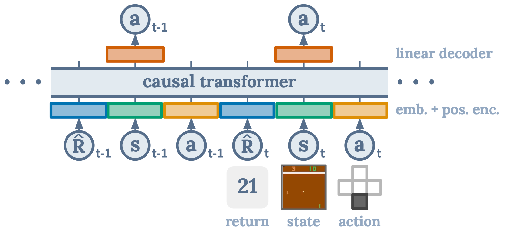
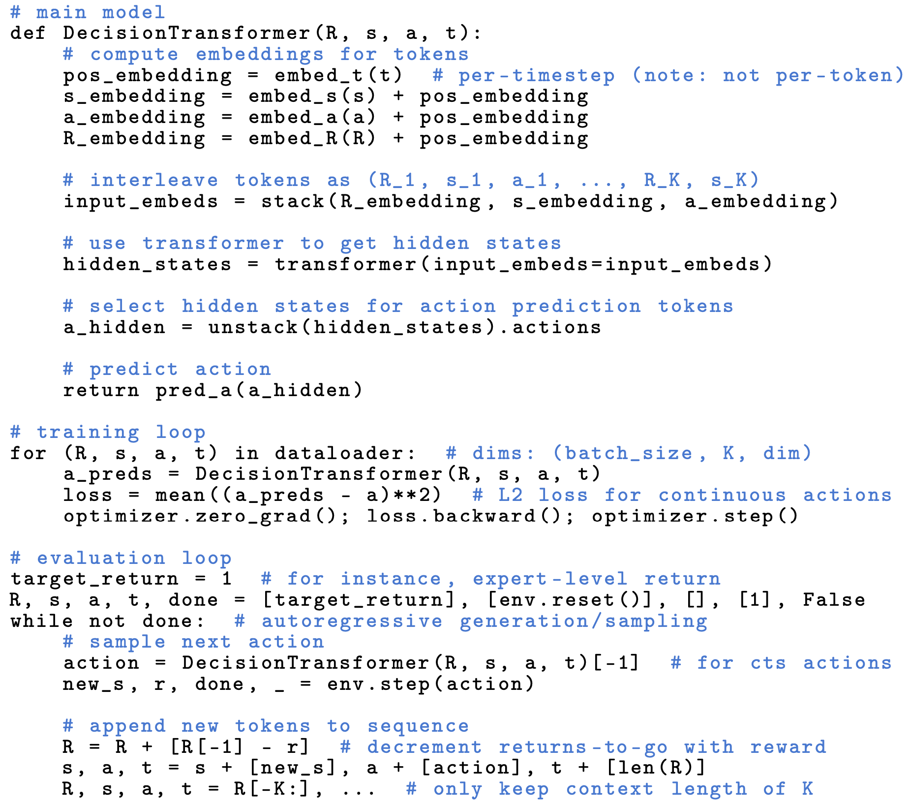
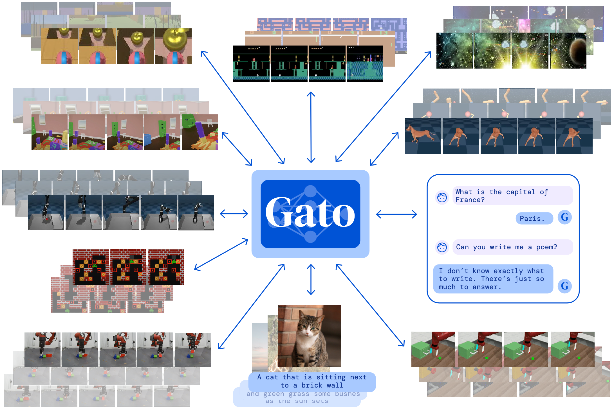
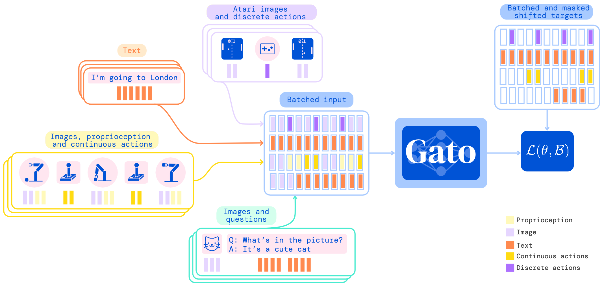
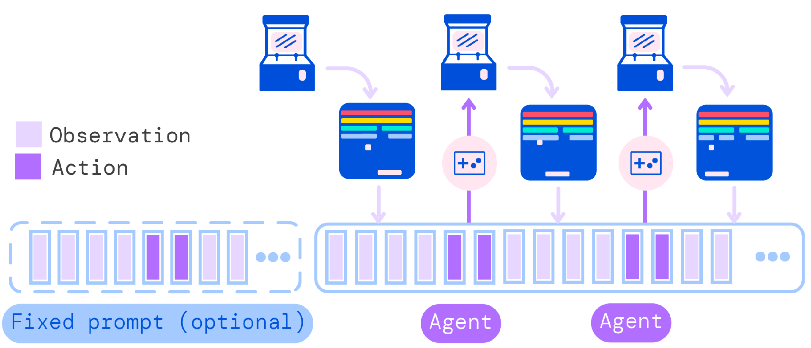
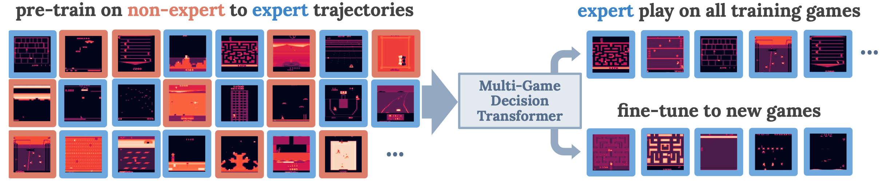

## Decision Transformer

- Paper: [Decision Transformer: Reinforcement Learning via Sequence Modeling - NeurIPS 2021](https://proceedings.neurips.cc/paper_files/paper/2021/file/7f489f642a0ddb10272b5c31057f0663-Paper.pdf)
- [[Website]](https://sites.google.com/berkeley.edu/decision-transformer)
[[Code]](https://github.com/kzl/decision-transformer)

_Illustration from the corresponding paper._

_Illustration from the corresponding paper. Decision Transformer Pseudocode for continuous actions._

The following statements from the paper are key to understand this model:
- "Unlike prior approaches to RL that fit value functions or compute policy gradients, Decision Transformer simply outputs the optimal actions by leveraging a causally masked Transformer. By conditioning an autoregressive model on the desired return (reward), past states, and actions, our Decision Transformer model can generate future actions that achieve the desired return. Despite its simplicity, Decision Transformer matches or exceeds the performance of state-of-the-art model-free offline RL baselines on Atari, OpenAI Gym, and Key-to-Door tasks."
- "States, actions, and returns are fed into modality- specific linear embeddings and a positional episodic timestep encoding is added. Tokens are fed into a GPT architecture which predicts actions autoregressively using a causal self-attention mask."
- "We will train transformer models on collected experience using a sequence modeling objective."

In my understanding, training a decision transformer is a supervised learning. By using offline data, the model is trained to anticipate an action that shares the same pattern in the offline data, given the current history.

## Trajectory Transformer

- Paper: [Offline Reinforcement Learning as One Big Sequence Modeling Problem - NeurIPS 2021](https://proceedings.neurips.cc/paper/2021/file/099fe6b0b444c23836c4a5d07346082b-Paper.pdf)
- [[Website]](https://trajectory-transformer.github.io/)
[[Code]](https://github.com/JannerM/trajectory-transformer)
[[Blog]](https://bair.berkeley.edu/blog/2021/11/19/trajectory-transformer/)

## A Generalist Agent: Gato

- Paper: [A Generalist Agent - Transactions on Machine Learning Research 2022](https://arxiv.org/pdf/2205.06175.pdf?fs=e&s=cl)

_Illustration from the corresponding paper_

_Illustration from the corresponding paper. Training phase of Gato._

_Illustration from the corresponding paper. Running Gato as a control policy._

The following statements from the paper are key to understand this work:
- "The same network with the same weights can play Atari, caption images, chat, stack blocks with a real robot arm and much more, deciding based on its context whether to output text, joint torques, button presses, or other tokens."
- "Gato was trained on 604 distinct tasks with varying modalities, observations and action specifications."
- "Gato consumes a sequence of interleaved tokenized observations, separator tokens, and previously sampled actions to produce the next action in standard autoregressive manner. The new action is applied to the environment a game console in this illustration, a new set of observations is obtained, and the process repeats."

In my understanding, Gato is a decision transformer trained on various tasks using offline data. In different tasks, the tokenization is different but the core of the network shares the same one.

## Multi-Game Decision Transformer

- Paper: [Multi-Game Decision Transformers - NeurIPS 2022](https://proceedings.neurips.cc/paper_files/paper/2022/file/b2cac94f82928a85055987d9fd44753f-Paper-Conference.pdf)
- [[Website]](https://sites.google.com/view/multi-game-transformers)
[[Code]](https://github.com/google-research/google-research/tree/master/multi_game_dt)
[[Blog]](https://blog.research.google/2022/07/training-generalist-agents-with-multi.html)

_Illustration from the corresponding paper. An overview of the training and evaluation setup._

The following statements from the paper are key to understand this work:
- "We observe expert-level game-play in the interactive setting after offline learning from trajectories ranging from beginner to expert."
