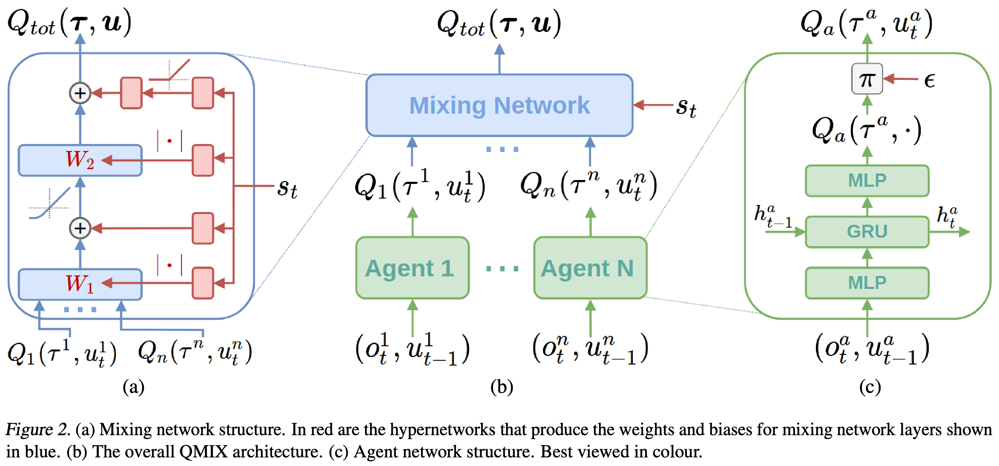

## Introduction
[[Paper]](https://arxiv.org/abs/1609.09106): HyperNetworks

> The following part has not been finished yet.
{: .prompt-warning }

## Application in QMIX

_Illustration from the corresponding paper._

The following statements from the paper are key to understand this application:
- "The weights of the mixing network are produced by separate hypernetworks. Each hypernetwork takes the state s as input and generates the weights of one layer of the mixing network. Each hypernetwork consists of a single linear layer, followed by an absolute activation function, to ensure that the mixing network weights are non-negative. The output of the hypernetwork is then a vector, which is reshaped into a matrix of appropriate size. The biases are produced in the same manner but are not restricted to being non-negative. The final bias is produced by a 2 layer hypernetwork with a ReLU non-linearity."
- "QMIX relies on a neural network to transform the centralised state into the weights of another neural network, in a manner reminiscent of hypernetworks (Ha et al., 2017). This second neural network is constrained to be monotonic with respect to its inputs by keeping its weights positive."
- "The state is used by the hypernetworks rather than being passed directly into the mixing network because Qtot is allowed to depend on the extra state information in non-monotonic ways. Thus, it would be overly constraining to pass some function of s through the monotonic network alongside the per-agent values. Instead, the use of hypernetworks makes it possible to condition the weights of the monotonic network on s in an arbitrary way, thus integrating the full state s into the joint action-value estimates as flexibly as possible."

So in my understanding, the map of $Q^i,\forall i$ to $Q_{tot}$ should be monotonic and be dependent on the current state. If the current state is inputed directly into the net then it is monotonic, too. And this is not what we want.