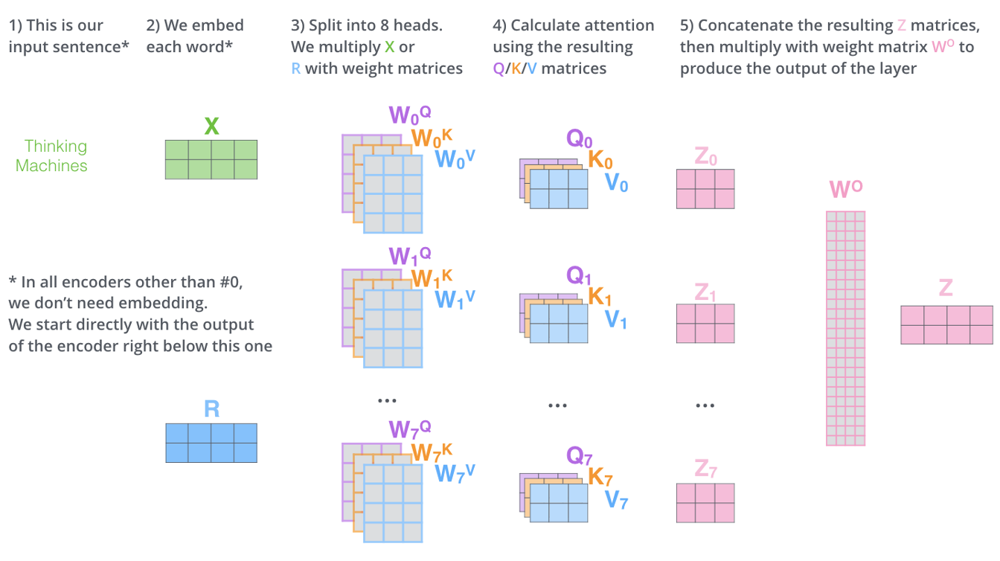

## [Encoder-Decoder](https://d2l.ai/chapter_recurrent-modern/seq2seq.html)

### Variable-length inputs

- Truncation and Padding
  - [Dive Into Deep Learning 10.5.3](https://d2l.ai/chapter_recurrent-modern/machine-translation-and-dataset.html#loading-sequences-of-fixed-length)
- Relation Network
  - [A blog](https://medium.com/@andre.holzner/learning-a-function-with-a-variable-number-of-inputs-with-pytorch-c487e35d4dba)
  - [ICLR 2017](https://arxiv.org/pdf/1702.05068.pdf)
- Embedding.
- **Encoder-decoder.**

> In general sequence-to-sequence problems like machine translation (Section 10.5), inputs and outputs are of varying lengths that are unaligned. The **standard** approach to handling this sort of data is to design an encoder–decoder architecture (Fig. 10.6.1) ... *— Dive into Deep Learning.*

### The structure

{: width="600" height="600" }
_Illustration of the encoder-decoder architecture from the book "Dive into Deep Learning"._

- Encoder: `"Hello, world."` $\to$ a hidden state (or context variable) of fixed-shape.
- Decoder 1: the state $\to$ `"你好，世界。"`
- Decoder 2: the state $\to$ `"Hola mundo"`

{: width="700" height="700" }
_Illustration of the encoder-decoder architecture (teacher forcing) from the book "Dive into Deep Learning"._

{: width="700" height="700" }
_Illustration of the encoder-decoder architecture (prediction) from the book "Dive into Deep Learning"._

The encoder and the decoder are usually RNNs.
- `<eos>` means the end of the sequence. 
  - Inputting `<eos>` into the encoder indicates the end of this sentence. 
  - In prediction: When the decoder outputs `<eos>`, it will automatically stop and no longer continue generating output.
- `<bos>` means the beginning of the sequence, used to signal the decoder when to begin generating a new sequence.
- The input of the encoder is a variable-length sequence, but its output is of fixed-length, named as the state or the context variable $c$.
-  $c = q(h_1, \ldots, h_t)$, where $q$ is a customized function. In the figures, $c = h_t$.
-  The context variable will be fed into the decoder at evry time step or at the first time step.
-  Teacher Forcing: The input of the decoder is `(<bos>, sequence)`, and the target is `(sequence, <eos>)`.
-  Prediction: The input of the decoder at every time step is the output from the previous time step.
-  When calculating the loss, the padding tokens are masked.

{: width="500" height="500" }
_Illustration of the encoder-decoder architecture where the RNNs are stacked, from the book "Dive into Deep Learning"._

### Teacher forcing

Teacher Forcing: The input of the decoder is `(<bos>, sequence)`, and the target is `(sequence, <eos>)`.

> Without using teacher forcing, the model at each timestep would receive the output from the previous timestep and use this output to predict the next timestep. However, this approach has an inherent problem: early in training, the model is likely to produce incorrect predictions, leading the next timestep prediction to be based on this incorrect output. Such mistakes can accumulate in subsequent timesteps.
> 
> To combat this, the Teacher Forcing technique is introduced during training. Specifically, instead of the model receiving its prediction from the previous timestep, it directly receives the actual output from the previous timestep. In this way, even if the model makes an error at a particular timestep, it can continue making predictions based on the actual data, preventing error accumulation.
> 
> *— ChatGPT-4*


#### Advantages
1. **Faster Convergence:** Using actual data as input can help the model learn and converge more quickly because it consistently receives accurate information.
2. **Reduced Cumulative Error:** In sequence generation tasks, if there is an error early in the predictions, this error can accumulate through the sequence. Using teacher forcing reduces this cumulative error, as the training does not depend on previous predictions.

#### Disadvantages
1. **Reality Mismatch:** In practical use, the model must rely on its own predictions to generate outputs, which can be quite different from the real data received during training. If the model is always fed with actual data, it might not learn how to recover from its own mistakes.
2. **Exposure Bias:** This refers to the inconsistency between the data "seen" by the model during training and inference. If real data is always used as input during training, then the model might not know how to correct itself in real-world applications once an error is made, because it has never experienced such situations during training.

#### Practical Recommendations
- **Gradually Reduce Teacher Forcing:** It may be effective to use a higher teacher forcing ratio early in training to facilitate quick learning and convergence, but as training progresses, gradually reduce this ratio to allow the model to rely more on its own predictions, thus better simulating the inference process.
- **Random or Dynamic Adjustment:** Some studies suggest adjusting the use of teacher forcing dynamically based on training progress or model performance, for example, by setting a probability to randomly decide whether to use teacher forcing, or adjusting the frequency based on the model’s current performance and stability.

E.g., note the variable `teacher_forcing_ratio` in the following part:

```python
class Seq2Seq_model(torch.nn.Module):
    def __init__(
        self, encoder, decoder, state_embedding, action_embedding, EOS_embedding
    ):
        super(Seq2Seq_model, self).__init__()
        self.encoder = encoder
        self.decoder = decoder
        self.state_embedding = state_embedding
        self.action_embedding = action_embedding
        self.EOS_embedding = EOS_embedding

    def forward(self, src_tuple, trg=None, teacher_forcing_ratio=0.5):
        # states_sim_onehot_masked, actions_sim_onehot_masked, mask_EOS = src_tuple
        src = generate_model_input(self, *src_tuple)
        batch_size, sequence_length, state_action_embedding_size = src.shape
        decoder_outputs = torch.zeros(
            batch_size, sequence_length, vocab_size, dtype=torch.float64
        )

        encoder_outputs, hidden = self.encoder(src)
        # encoder_outputs size: (batch_size, sequence_length, embedding_dim)
        # hidden: (rnn_num_layers, batch_size, embedding_dim)

        input = torch.ones(batch_size) * BOS_TOKEN
        input = input.to(torch.long)
        for t in range(0, sequence_length):
            decoder_output, hidden = self.decoder(input.unsqueeze(dim=1), hidden)
            decoder_outputs[:, t, :] = decoder_output
            teacher_force = torch.rand(1).item() < teacher_forcing_ratio
            top1 = decoder_output.argmax(1)
            if teacher_force:
                input = trg[:, t]
            else:
                input = top1

        return decoder_outputs
```

## [Transformer](https://d2l.ai/chapter_attention-mechanisms-and-transformers/index.html)

### Background

1. "Attention is all you need." Google. 2017.6
2. Drawbacks of RNN, LSTM, and GRU:
   1. They need the output of the previous data to produce the next one, which makes them cannot be handled by parallelization.
   2. They perform bad in tasks with long sequence length.
   3. They require a lot of memory.

> The **Transformer**, **BERT**, and **GPT** architectures do not use **RNNs**. Instead, they rely on the **self-attention** mechanism to process sequences.  *— ChatGPT-4*
{: .prompt-info }

### Queries, Keys, and Values

- A data set $\mathcal{D}:=\{ (k_i, v_i) \mid i\in \{1, \ldots, n\} \}$.
  - $k$ is the key, $v$ is the value.
  - It is a dictionary (in python).
- We input the query $q$ to search the data set.
- The program returns the value most relevant $v_{i^\*}$, where $i^\* = \arg\min_{i} \Vert q - x_i \Vert$.

```python
keys = range(1, 8, 3)  # [1, 4, 7]
values = ["xixi", "haha", "wuwu"]

data_set = dict(zip(keys, values))
# {1: 'xixi', 4: 'haha', 7: 'wuwu'}

def search(query: int):
    distances = [abs(query - key_i) for key_i in keys]
    idx_optimal = distances.index(min(distances))
    key_optimal = keys[idx_optimal]
    value_optimal = data_set[key_optimal]
    return value_optimal

print(search(query=3))  # haha
```


### Attention

$$
\mathrm{Attention}(q, \mathcal{D}) := \sum\limits_{i=1}^n v_i \cdot \alpha(q, k_i)
$$

- $\alpha(q, k_i)$ is usually a function of the distance between $q$ and $k_i$, reflecting their similarity.
- $\boldsymbol\alpha = (\alpha(q, k_1), \ldots, \alpha(q, k_n))$ should be a convex combination.
  - $\alpha(q, k_i) \ge 0, \forall i$
  - $\sum\limits_{i=1}^n \alpha(q, k_i) = 1$
- If $\boldsymbol\alpha$ is one-hot, then the attention mechanism is just like the traditional database query.


{: width="500" height="500" }
_Illustration of the attention mechanism from the book "Dive into Deep Learning"._

#### Common similarity kernels

$$
\boldsymbol\alpha(q, \boldsymbol{k}) = \mathrm{softmax}(\textcolor{blue}{(}f(\Vert q - k_1 \Vert), \ldots, f(\Vert q - k_n \Vert)\textcolor{blue}{)})
$$

$f$ is the similarity kernel (or Parzen Windows).
- $f(\Vert q - k \Vert) = \exp\left(-\frac{1}{2}\Vert q-k \Vert^2\right)$ (Gaussian)
- $f(\Vert q - k \Vert) = 1 \mathrm{if} \Vert q-k \Vert \le 1$ (Boxcar)
- $f(\Vert q - k \Vert) = \max(0, 1- \Vert q-k \Vert )$ (Epanechikov)

#### Attention Scoring Functions

Calculating the distances between queries and keys costs a lot. So we should find another efficient way to quantify the similarity between them. The function that measures this similarity is named the scoring function.

{: width="500" height="500" }
_Illustration of the attention mechanism from the book "Dive into Deep Learning"._

#### Self-Attention in Transformer

{: width="300" }
_https://jalammar.github.io/illustrated-transformer/_

{: width="200" }
_Figure 2 in "Attention is all you need"._

$$
\operatorname{Attention}(Q, K, V)=\operatorname{softmax}\left(\frac{Q K^T}{\sqrt{d_k}}\right) V
$$

- $q, k$ and $v$ here are been embedded, and are matrices. $x$ is the input.
- Input quieries, and then find the most similar keys.
  - The multiplication of $q$ and $k$ is equivalent to the vector dot product in the embedding space; the closer the directions, the larger the value.
  - The results should be normalized (here they are normalized by $\mathrm{softmax}$). Because there are different dimensions (here $d_k$ is the dimension of $k$) and the results will be used as weights.
- Then return the corresponding values of those keys.
  - The normalized results can be seen as a kind of weight. And we use these weights to emphasize all parts of the matrics $v$ differently.
  - It means we pay different attention to every part of the matrics $v$.


#### Mask in Attention

> In the decoder, the self-attention layer is only allowed to attend to earlier positions in the output sequence. This is done by masking future positions (setting them to $\mathrm{-inf}$) before the softmax step in the self-attention calculation.

- This technique is used in the decoder.
- See the figure above. Figure 2 in "Attention is all you need".

#### Multi-Head Attention

{: width="200" }
_Figure 2 in "Attention is all you need"._

{: width="500" }
_https://jalammar.github.io/illustrated-transformer/_

{: width="500" }
_https://jalammar.github.io/illustrated-transformer/_

- I would say the step 3 is also an embedding operation. See the discussion in "Self-Attention in Transformer" above.
- Multi-head means there are several weights for $q,k$ and $v$ in step 3. 
- Step 2, 3, and 4 can be done in parallel.

$$
\begin{aligned}
\text { MultiHead }(Q, K, V)=& \operatorname{Concat}\left(\text { head }_1, \ldots, \text { head }_{\mathrm{h}}\right) W^O \\
\text { where head }_{\mathrm{i}}=& \operatorname{Attention}\left(Q W_i^Q, K W_i^K, V W_i^V\right)
\end{aligned}
$$

### Encoder

{: width="300" }
_https://jalammar.github.io/illustrated-transformer/_

#### Positional Encoding

$$
\begin{aligned}
P E_{(p o s, 2 i)} & =\sin \left(p o s / 10000^{2 i / d_{\text {model }}}\right) \\
P E_{(p o s, 2 i+1)} & =\cos \left(p o s / 10000^{2 i / d_{\text {model }}}\right)
\end{aligned}
$$

where $pos$ means the position of the word in the sentence. $i$ indicates the dimision of $x.$

In my understanding: 
- The calculation in multi-head attention does not account for the sequence order. The "distance" are calculated for every two pairs.
- Having this, the sequence order of the inputs can be shuffled, as long as each of the input keep its corresponding positional encoding.
- Introducing the period is to handle longer sequence lengths which may not be seen in the training phase.

This positional encoding can be added directly to the input because of the embedding. They can be seen as linearly independent quantities in the same space, so they can be added directly. The insight is the same as the one [here]({{baseurl}}/posts/RL-Toolbox/#embedding-for-the-q-value-critic).

#### Skip Connection

I think the insight is the same as the one in RNNs: It is used to keep some information in the data.

#### Normalization

There are many layers there. Without normalization, the number will grow exponentially.

### Decoder

{: width="600" }
_https://jalammar.github.io/illustrated-transformer/_

- The Queries matrix are created from the layer below it.
- The Keys and Values matrix are from the output of the encoder stack.
- There is the mask technique in the decoder. See above.

#### Output

1. Greedy decoding. "The model is selecting the word with the highest probability from that probability distribution and throwing away the rest." So the results are not sampled from the distribution.
2. Beam search.

{: width="400" }
_wikimedia_

### Time Complexity

{: width="600" }
_Table 1 in "Attention is all you need"._

- Complexity per Layer
  - Self-Attention 
    - $QK^T$ is a multiplication of a $n\times d$ matrix and a $d\times n$ matrix. There are $n^2 d$ times multiplication of real numbers. So the complexity here is $O(n^2 d).$
    - Softmax for $QK^T$ ($n\times n$), the complexity is $O(n\times n).$ Because the complexity of softmax for a $n$ dimension vector is $O(n).$
    - The complexity of $(QK^T)V$ ($n\times n$ mulplicate $n\times d$) is $O(n^2 d).$
  - RNN
    - The weight is a $d\times d$ matrix. The complexity of multiplication of input ($d$) and weight ($d\times d$) is $O(d^2).$
    - We will sequentially input $n$ times. So the complexity is $O(nd^2).$
  - CNN
    - Just like the case of RNN, but it should calculate $k$ times for each convolution.
- Sequential Operations: Discussed above.
- Max Path Length
  - “可以理解为相距最远的两个信息结点发生沟通所需要的网络层数” （[知乎文章](https://zhuanlan.zhihu.com/p/666282350)）
  - “比如，你的计算能够 involve 到两个最远 tokens 需要多久。RNN 正比于序列长度，attention 第一次就可以。RNN 不能处理长序列其实更多是因为这个依赖距离太差。”

{: width="600" }
_https://zhuanlan.zhihu.com/p/666282350_

## Code Practice of Encoder-Decoder

```python
import os  # print_separator
import sys  # overwrite print
import time  # running time
from rx import start
import torch
import torch.optim as optim

# ========================================

horizon = 2  # s, a | s, a | s; EOS
max_sequence_length = (2 * horizon + 1) + 1  # <EOS>

state_size = 3
action_size = 3

EOS_TOKEN = max(state_size, action_size)  # with gradient
PAD_TOKEN = EOS_TOKEN + 1  # no gradient
BOS_TOKEN = EOS_TOKEN + 2  # only used as the initial input of the decoder
vocab_size = max(state_size, action_size) + 3  # <BOS>, <EOS>, padding
decoder_embedding_dim = 7
# hidden_dim = 8
hidden_dim = 16
state_action_embedding_size = 5

sample_size = 2**8
# sample_size = 2**9
minibatch_size = 32
N_EPOCHS = 500
CLIP = 1
lr = 5e-3

sample_size_test = 2**7
print_size = 10

# ========================================


def print_elapsed_time(func):

    def wrapper():
        start_time = time.time()
        func()
        end_time = time.time()
        elapsed_time = end_time - start_time
        print(f"Elapsed Time: {elapsed_time}s")

    return wrapper


def print_separator(separator="="):
    size = os.get_terminal_size()
    width = size.columns
    print(separator * width)


# index
def generate_histories_index(sample_size, horizon, state_size, action_size):
    # ===== No need of gradients here =====

    states_sim = torch.randint(
        0, state_size, [sample_size, horizon + 1]
    )  # simulated states
    actions_sim = torch.randint(0, action_size, [sample_size, horizon])

    # cat & add EOS position
    histories_sim_raw = states_sim[:, 0].unsqueeze(dim=-1)
    for t in range(1, horizon + 1):
        histories_sim_raw = torch.cat(
            [histories_sim_raw, actions_sim[:, t - 1].unsqueeze(dim=-1)], dim=-1
        )
        histories_sim_raw = torch.cat(
            [histories_sim_raw, states_sim[:, t].unsqueeze(dim=-1)], dim=-1
        )
    extend_for_EOS = torch.zeros(sample_size, 1)
    histories_sim = torch.cat([histories_sim_raw, extend_for_EOS], dim=-1)

    # EOS & padding (mask)
    history_half_length = torch.randint(
        0,
        horizon + 1,
        [sample_size],
    )  # how many states in each trajectory
    history_lengths = 2 * history_half_length + 1
    mask_PAD = torch.arange(max_sequence_length).expand(
        len(history_lengths), max_sequence_length
    ) >= history_lengths.unsqueeze(1)
    mask_EOS = (
        mask_PAD.cumsum(dim=1) == 1
    ) & mask_PAD  # 用.cumsum(dim=1)来累积每一行的True值

    histories_sim[mask_PAD] = PAD_TOKEN
    histories_sim[mask_EOS] = EOS_TOKEN

    return (
        states_sim,
        actions_sim,
        histories_sim,
        history_half_length,
        mask_PAD,
        mask_EOS,
    )


# index -> onehot
def generate_simulated_tensor(states_sim, actions_sim, history_half_length):
    # Simulate the scenario: generate the tensor with the gradient
    # ===== No need of gradients during training =====

    sample_size = history_half_length.size()[0]
    states_length = horizon + 1
    actions_length = horizon

    mask_states = torch.arange(states_length).expand(
        sample_size, states_length
    ) <= history_half_length.unsqueeze(1)
    mask_actions = torch.arange(actions_length).expand(
        sample_size, actions_length
    ) < history_half_length.unsqueeze(1)

    # size: (batch_size, num_states_in_history,embedding_dim)
    states_sim_onehot = torch.nn.functional.one_hot(states_sim, num_classes=state_size)
    actions_sim_onehot = torch.nn.functional.one_hot(
        actions_sim, num_classes=action_size
    )

    states_sim_onehot, actions_sim_onehot = states_sim_onehot.to(
        torch.float64
    ), actions_sim_onehot.to(torch.float64)
    # states_sim_onehot.requires_grad = True
    actions_sim_onehot.requires_grad = True

    mask_states = mask_states.unsqueeze(dim=-1).expand(
        sample_size, states_length, state_size
    )
    mask_actions = mask_actions.unsqueeze(dim=-1).expand(
        sample_size, actions_length, action_size
    )

    states_sim_onehot_masked = states_sim_onehot * mask_states
    actions_sim_onehot_masked = actions_sim_onehot * mask_actions

    return (
        states_sim_onehot,
        actions_sim_onehot,
        states_sim_onehot_masked,
        actions_sim_onehot_masked,
    )


# ========================================

# These embedding layers are part of the Seq2Seq model.

state_embedding = torch.nn.Sequential(
    torch.nn.Linear(
        state_size, state_action_embedding_size, bias=False, dtype=torch.float64
    ),
    # torch.nn.Tanh(),
    # torch.nn.Linear(state_action_embedding_size, state_action_embedding_size, bias=False, dtype=torch.float64)
)

action_embedding = torch.nn.Sequential(
    torch.nn.Linear(
        action_size, state_action_embedding_size, bias=False, dtype=torch.float64
    ),
    # torch.nn.Tanh(),
    # torch.nn.Linear(state_action_embedding_size, state_action_embedding_size, bias=False, dtype=torch.float64)
)

EOS_embedding = torch.nn.Sequential(
    torch.nn.Linear(
        state_action_embedding_size,
        state_action_embedding_size,
        bias=False,
        dtype=torch.float64,
    ),
)


class EncoderRNN(torch.nn.Module):
    def __init__(self, state_action_embedding_size, hidden_dim):
        super(EncoderRNN, self).__init__()
        self.rnn = torch.nn.GRU(
            state_action_embedding_size,
            hidden_dim,
            batch_first=True,
            dtype=torch.float64,
        )

    def forward(self, input_seq):
        outputs, hn = self.rnn(input_seq)
        return outputs, hn


class DecoderRNN(torch.nn.Module):
    def __init__(self, embedding_dim, hidden_dim, vocab_size):
        super(DecoderRNN, self).__init__()
        self.embedding = torch.nn.Embedding(
            vocab_size, embedding_dim, padding_idx=PAD_TOKEN, dtype=torch.float64
        )
        self.rnn = torch.nn.GRU(
            embedding_dim, hidden_dim, batch_first=True, dtype=torch.float64
        )
        self.out = torch.nn.Linear(hidden_dim, vocab_size, dtype=torch.float64)

    def forward(self, input_step, last_hidden):
        embedded = self.embedding(input_step)
        rnn_output, hidden = self.rnn(embedded, last_hidden)
        output = self.out(rnn_output.squeeze(1))
        return output, hidden


class Seq2Seq_model(torch.nn.Module):
    def __init__(
        self, encoder, decoder, state_embedding, action_embedding, EOS_embedding
    ):
        super(Seq2Seq_model, self).__init__()
        self.encoder = encoder
        self.decoder = decoder
        self.state_embedding = state_embedding
        self.action_embedding = action_embedding
        self.EOS_embedding = EOS_embedding

    def forward(self, src_tuple, trg=None, teacher_forcing_ratio=0.5):
        # states_sim_onehot_masked, actions_sim_onehot_masked, mask_EOS = src_tuple
        src = generate_model_input(self, *src_tuple)
        batch_size, sequence_length, state_action_embedding_size = src.shape
        decoder_outputs = torch.zeros(
            batch_size, sequence_length, vocab_size, dtype=torch.float64
        )

        encoder_outputs, hidden = self.encoder(src)
        # encoder_outputs size: (batch_size, sequence_length, embedding_dim)
        # hidden: (rnn_num_layers, batch_size, embedding_dim)

        input = torch.ones(batch_size) * BOS_TOKEN
        input = input.to(torch.long)
        for t in range(0, sequence_length):
            decoder_output, hidden = self.decoder(input.unsqueeze(dim=1), hidden)
            decoder_outputs[:, t, :] = decoder_output
            teacher_force = torch.rand(1).item() < teacher_forcing_ratio
            top1 = decoder_output.argmax(1)
            if teacher_force:
                input = trg[:, t]
            else:
                input = top1

        return decoder_outputs


encoder = EncoderRNN(state_action_embedding_size, hidden_dim)
decoder = DecoderRNN(decoder_embedding_dim, hidden_dim, vocab_size)
seq2seq_model = Seq2Seq_model(
    encoder, decoder, state_embedding, action_embedding, EOS_embedding
)


# ========================================


def generate_model_input(
    model, states_sim_onehot_masked, actions_sim_onehot_masked, mask_EOS
):
    sample_size = states_sim_onehot_masked.size()[0]
    states_length = horizon + 1
    actions_length = horizon

    states_embedded = model.state_embedding(states_sim_onehot_masked).chunk(
        dim=1, chunks=states_length
    )
    actions_embedded = model.action_embedding(actions_sim_onehot_masked).chunk(
        dim=1, chunks=actions_length
    )

    histories_embedded_list = [states_embedded[0]]
    for t in range(1, horizon + 1):
        histories_embedded_list.append(actions_embedded[t - 1])
        histories_embedded_list.append(states_embedded[t])

    histories_embedded = torch.cat(histories_embedded_list, dim=1)
    # grad_test = torch.autograd.grad(histories_embedded.sum(), actions_sim_onehot)

    state_action_embedding_size = histories_embedded.size()[-1]
    extend_for_EOS = torch.zeros(sample_size, 1, state_action_embedding_size)
    histories_embedded = torch.cat([histories_embedded, extend_for_EOS], dim=1)

    EOS_tensor = (
        torch.ones_like(histories_embedded)
        * EOS_TOKEN
        * mask_EOS.unsqueeze(dim=-1).expand(
            sample_size, histories_embedded.size()[1], state_action_embedding_size
        )
    )
    EOS_embedded = model.EOS_embedding(
        EOS_tensor.view(-1, state_action_embedding_size)
    ).view(EOS_tensor.size())

    histories_embedded_EOS = histories_embedded + EOS_embedded
    return histories_embedded_EOS


# ========================================

optimizer = optim.Adam(seq2seq_model.parameters(), lr=lr)
criterion = torch.nn.CrossEntropyLoss(ignore_index=PAD_TOKEN, reduction="mean")


def train(model, src, trg, optimizer, criterion, clip):
    model.train()
    epoch_loss = 0
    minibatch_num = sample_size // minibatch_size

    for i in range(minibatch_num):
        mini_src = (
            src[0][i * minibatch_size : (i + 1) * minibatch_size],
            src[1][i * minibatch_size : (i + 1) * minibatch_size],
            src[2][i * minibatch_size : (i + 1) * minibatch_size],
        )
        mini_trg = trg[i * minibatch_size : (i + 1) * minibatch_size]

        optimizer.zero_grad()
        output = model(mini_src, mini_trg)
        output = output.view(-1, vocab_size)
        mini_trg = mini_trg.view(-1)
        loss = criterion(output, mini_trg)
        loss.backward()
        torch.nn.utils.clip_grad_norm_(model.parameters(), clip)
        optimizer.step()
        epoch_loss += loss.item()

    return epoch_loss / minibatch_num


@print_elapsed_time
def main():
    for epoch in range(N_EPOCHS):
        (
            states_sim,
            actions_sim,
            histories_sim,
            history_half_length,
            mask_PAD,
            mask_EOS,
        ) = generate_histories_index(sample_size, horizon, state_size, action_size)
        # without gradients, used to generate the phase1 samples.

        (
            states_sim_onehot,
            actions_sim_onehot,
            states_sim_onehot_masked,
            actions_sim_onehot_masked,
        ) = generate_simulated_tensor(states_sim, actions_sim, history_half_length)
        # The input of the embedding layer. We want to keep the gradient of the actions.

        src_tuple = (
            states_sim_onehot_masked.detach(),
            actions_sim_onehot_masked.detach(),
            mask_EOS.detach(),
        )
        trg = histories_sim.to(torch.long)

        train_loss = train(seq2seq_model, src_tuple, trg, optimizer, criterion, CLIP)
        print(f"Epoch: {epoch + 1:03} / {N_EPOCHS} | Train Loss: {train_loss:.5f}")
        if epoch < N_EPOCHS - 1:  # 防止最后一次迭代也清除
            overwrite_stdout(lines=1)


def overwrite_stdout(lines=1):
    sys.stdout.write(f"\033[{lines}A")  # 向上移动光标`lines`行
    sys.stdout.write("\033[K")  # 清除光标所在行


def evaluate(model, src, trg, criterion, histories_sim):
    model.eval()

    with torch.no_grad():
        optimizer.zero_grad()
        output = model(src, trg)
        output_viewed = output.view(-1, vocab_size)
        trg_viewed = trg.view(-1)
        loss = criterion(output_viewed, trg_viewed)

    # ==========

    output_toprint = output[0:print_size, :]
    histories_predicted = []

    for i in range(output_toprint.size()[0]):
        predicted_classes = torch.argmax(output_toprint[i], dim=-1).squeeze()
        predicted_classes_list = list(predicted_classes)

        predicted_classes_cut = []
        for i in range(len(predicted_classes_list)):
            if predicted_classes_list[i] != EOS_TOKEN:
                predicted_classes_cut.append(int(predicted_classes_list[i]))
            else:
                break
        histories_predicted.append(predicted_classes_cut)

    histories_sim = histories_sim[0:print_size].to(torch.long).tolist()
    for i in range(print_size):
        print_separator()
        print(f"Test example: {i+1}")
        history_fed = histories_sim[i]
        history_fed_cut = []
        for j in range(len(history_fed)):
            if history_fed[j] != EOS_TOKEN:
                history_fed_cut.append(int(history_fed[j]))
            else:
                break

        print(f"History fed:\t\t{history_fed_cut}")
        print(f"History predected:\t{histories_predicted[i]}", end="  ")
        if history_fed_cut == histories_predicted[i]:
            print("✔")
        else:
            print("✘")

    print_separator()

    return loss


def main_test():
    states_sim, actions_sim, histories_sim, history_half_length, mask_PAD, mask_EOS = (
        generate_histories_index(sample_size, horizon, state_size, action_size)
    )
    # without gradients, used to generate the phase1 samples.

    (
        states_sim_onehot,
        actions_sim_onehot,
        states_sim_onehot_masked,
        actions_sim_onehot_masked,
    ) = generate_simulated_tensor(states_sim, actions_sim, history_half_length)
    # The input of the embedding layer. We want to keep the gradient of the actions.

    src_tuple_test = (
        states_sim_onehot_masked.detach(),
        actions_sim_onehot_masked.detach(),
        mask_EOS.detach(),
    )
    trg_test = histories_sim.to(torch.long)

    test_loss = evaluate(
        seq2seq_model, src_tuple_test, trg_test, criterion, histories_sim
    )
    print(f"Test Loss: {test_loss:.5f}")


if __name__ == "__main__":
    main()
    main_test()
    print("All done.")
```