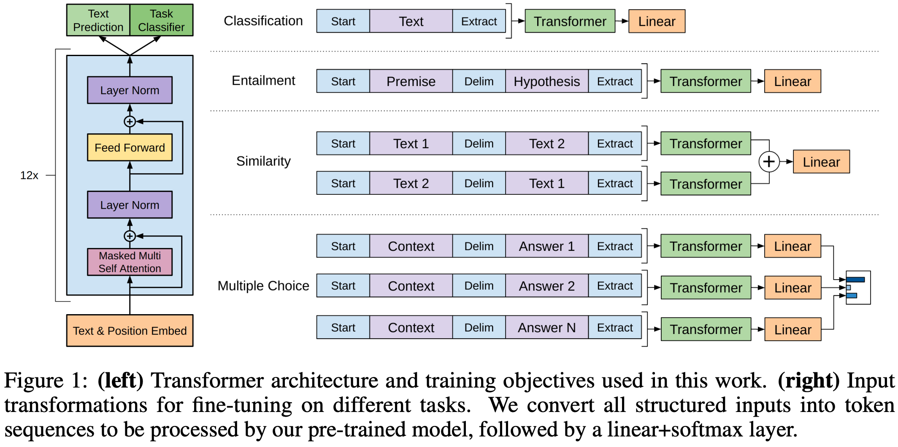
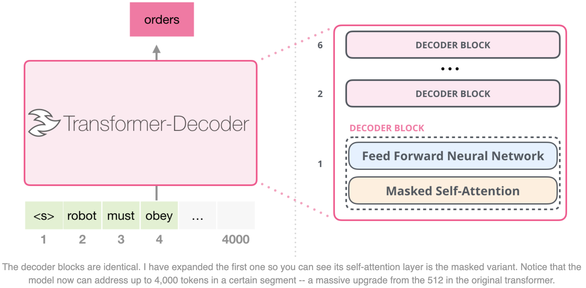
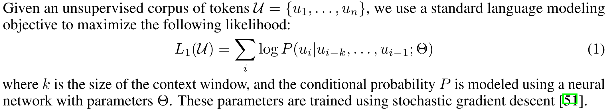
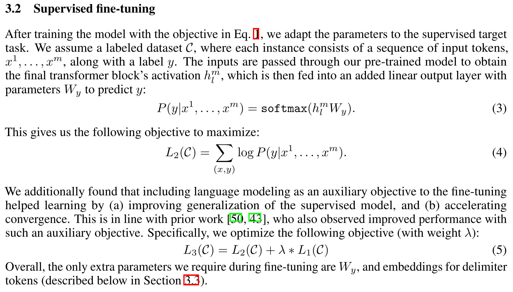

## GPT-1

### Resources

> Radford, Alec, et al. (OpenAI) "Improving language understanding by generative pre-training." (2018).

GPT-1 = Decoder (in Transformer) + Pre-Training + Fine-Tuning.

### Model Architecture

GPT uses the decoder part of Transformer. 

_Figure 1 in "Improving language understanding by generative pre-training."_

_https://jalammar.github.io/images/xlnet/transformer-decoder-intro.png_

### Pre-Training

The pre-training phase uses unsupervised learning: The model is trained to predict the next word in a sentence.

_Section 3.1 in "Improving language understanding by generative pre-training."_

- This requires extensive text data, typically sourced from books, articles, etc.
- This does not require manually annotated data; the model learns language patterns through self-learning.
- This can make the model learn about common knowledge, e.g. English grammar and human common sense.

### Fine-Tuning

After pre-training, GPT can be fine-tuned for specific NLP tasks: By training on small amounts of task-specific data, the model can adjust its weights to optimize performance for that task.

_Section 3.2 in "Improving language understanding by generative pre-training."_

<!-- GPT can be fine-tuned for various tasks such as 
- text classification, 
- summarization, 
- question-answering, 
- and translation.

#### Task 1: Textual Entailment

**Textual entailment** is a task in natural language processing that focuses on determining the logical relationship between two text fragments. Specifically, it examines whether one text fragment (known as the premise) can logically imply another text fragment (known as the hypothesis).

This task is generally divided into three possible relationships:
1. **Entailment**: If the hypothesis can be logically inferred from the premise, then the premise entails the hypothesis.
2. **Contradiction**: If the premise and hypothesis logically conflict with each other, meaning the truth of the premise implies the hypothesis cannot be true, then they are contradictory.
3. **Neutral**: If there is no clear logical relationship between the premise and the hypothesis, meaning the truth or falsehood of the premise does not directly affect the truth of the hypothesis, then they are considered neutral.

Textual entailment is crucial in many NLP applications, such as question answering systems, text summarization, and information retrieval. By understanding and analyzing the logical relationships between texts, machines can better process and understand natural language. -->

### My Questions

#### Has GPT lost the advantage of attention?

GPT is used for NLG, so it has to use its own output as input. Does this mean that the time complexity is high, like RNNs? Doesn't this negate the advantage of attention?

Answer: Complexity per layer 确实会比Transformer更差，但“RNN 不能处理长序列其实更多是因为依赖距离太差”，attention的 max path length 的那个优势还是在的

#### What's the difference between unsupervised pre-training and supervised fine-tuning?

The loss functions are almost the same. The only difference I can figure out is the training data. It seems that fine-tuning is a kind of "pre-training" that provides specific training data for specific tasks. 

So why is pre-training unsupervised, while fine-tuning is supervised? 

Answer:
- Pre-training: 有x1到xn，把x1到xn-1做输入，然后输出是vocabulary上的概率，要提高是xn的那个概率，就是把xn的那个概率索引出来再求导做梯度上升
- Fine-tuning: 有x1到xn，并且得有一个标签y，这个y也是在vocabulary中，然后也是用softmax和刚刚一样做梯度上升
- 是不是 supervised learning 就是看有没有这个 y
- 其实本质上是一样的，所以 GPT-2 把 fine-tuning 任务转化成了 pre-training的数据，把 y 藏到了 xn+1 中去了

## GPT-2

> Radford, Alec, et al. (OpenAI) "Language models are unsupervised multitask learners." OpenAI blog 1.8 (2019): 9.

1. GPT-2 = Decoder (in Transformer) + Pre-Training + Turning Fine-tuning to Pre-Training + More Parameters.
2. Enhanced pre-training. Eliminated fine-tuning.
  1. The unsupervised objective of the earlier pre-training is demonstrated to be the same as the supervised objective of the later fine-tuning.
  2. The downstream tasks can be reconstructed to be descripted in the form used in pre-training.
  3. A competent generalist is not an agregation of narrow experts.
3. The scaling law is initially emerging: The more parameters, the better the performance, and the improvement is very stable.
4. The Number of Parameters: 1.5B

### Multi-Task Learning

Multi-Task Learning (MTL) is a machine learning method that can improve the performance and generalization ability of a model by learning multiple related tasks simultaneously. 

Unlike single-task learning, which trains a model only for a single task, multi-task learning learns multiple tasks at the same time by sharing parts of the model's parameters. This allows for more effective use of data, enhancing the model's predictive capabilities and efficiency.

### Zero-Shot Learning

### Prompt: