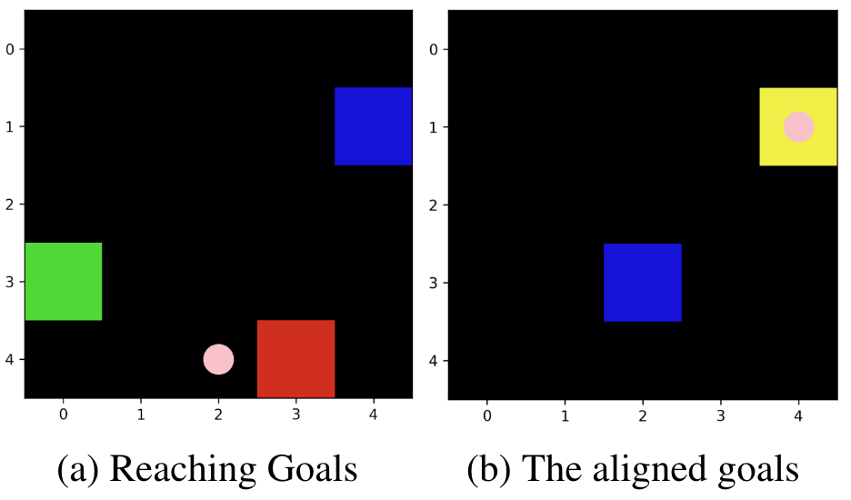

## Resources
- Information Design in Multi-Agent Reinforcement Learning.  
    Yue Lin, Wenhao Li, Hongyuan Zha, Baoxiang Wang.  
    *Neural Information Processing Systems (NeurIPS) 2023. Poster.*
    > 
    [[Paper]](https://arxiv.org/abs/2305.06807) 
    [[Code]](https://github.com/YueLin301/InformationDesignMARL) 
    [[Blog]]({{site.baseurl}}/posts/IDMARL/) 
    [[Slides]]({{site.baseurl}}/posts/IDMARL/#slides) 
    [[Talk en]](https://www.youtube.com/watch?v=yhVlpv_1Pg4) 
    [[Talk cn]](https://www.bilibili.com/video/BV1e94y177Dj/?share_source=copy_web&vd_source=b3cf9eb7cfe43c730613c5158a38e978&t=2825)  

**Key Words:** Information Design, Bayesian Persuasion, Sequential Social Dilemma, Multi Agents, Reinforcement Learning, Communication, Policy Gradient, Obedience Constraints, Bayesian Correlated Equilibrium.

**What do we do:** We want to design a model-free RL algorithm for the sender, to use signals to manipulate the receiver's behavior, whose interest may not be fully aligned with the sender, thereby improving its (the sender's) own expected utility, in a Markov sequential communication setting.

## Focus
- **Our Proposed Model:** Markov Signaling Game (A Markov Model)
- **Our Proposed Techniques:** Signaling Gradient, Extended Obedience Constraints.
- **Our Proposed Experimental Environment:** Reaching Goals (A Sequential Social Dilemma)
- **Highlights**
  - The sequential persuasion process is modeled as a Markov model.
  - A sender and a receiver meet multiple times. Not a stream of receivers.
  - The commitment assumption is canceled.
  - The analysis analogous to the revelation principle is canceled.
  - The receiver is a model-free RL agent, learning from scratch.
  - The sender is also a model-free RL agent, learning from scratch. It does not know the environment model. It has no prior knowledge.
  - We have tested our algorithm in challenging MARL sequential social dilemma.
  - Our algorithm can use the Actor-Critic framework, which can make it incorporates modern RL techniques.

## Preliminaries

- Information Design / Bayesian Persuasion [[my blog]]({{site.baseurl}}/posts/Information-Design-10min/)
- RL Basics: 
  - Markov Models
  - Policy Gradient [[my blog]]({{site.baseurl}}/posts/Policy-Gradient-Details/)
- MARL communication: DIAL/RIAL
- MARL Mechanism Design: LIO

## Markov Signaling Game

### Definition

{: width="500"}
_Illustration of the Markov signaling game. The arrows symbolize probability distributions, whereas the nodes denote the sampled variables._

A Markov signaling game (MSG) is defined as a tuple
$$
\mathcal{G} = \left(\ i, j, S, O, \Sigma, A, R^i, R^j, p, q \ \right).
$$
- $i$: The sender. **The sender can only sent message, it cannot take the environment action, but it can access the global state.**
- $j$: The receiver. **The receiver can take the environment action, but it cannot see the full state.**
- $S$: The state set. The state can only be seen by the sender. It is just like the state set in MDPs.
- $O$: The receiver's observation set. The receiver's observation can be seen by both agents. It is just like the state set in POMDPs.
- $q$: The emission function $q: S\to O$.
- $\Sigma$: The sender's signal set.
- $\varphi_{\eta}$: The sender's stochastic signaling scheme. **The sender sends messages based on the current state and the receiver's current observation.** $\varphi_{\eta}: S\times O \to \Delta(\Sigma)$.
- $A$: The receiver's environment action set.
- $\pi_{\theta}$: The receiver's stochastic action policy. **The receiver takes actions based on the current observation and its currently received signal from the sender.** $\pi_{\theta}:O \times\Sigma \to \Delta(A)$.
- $R^i$: The sender's reward function. **The reward is only dependent on the state and the receiver's action.** $R^i: S\times A\to\mathbb{R}$.
- $R^j$: The receiver's reward function. $R^j: S\times A\to\mathbb{R}$.
- $p$: The state transition function. **The transition of states is only dependent on the current state and the receiver's action.** $p: S\times A \to \Delta(S)$.

**Note that:**
- The sender can only optimize its expected utility by influencing what the receiver can see.
- There are two reward functions. The sender's reward function can be different from the receiver's. Thus they can be mixed-motive, not fully cooperative.

**A constraint of MSGs:** By the sender's informational advantage of the problem setting, we assume that $$\set{s_t - o_t}_{t\ge 0}$$ affects the receiver's payoff. This ensures that the sender has information that the receiver wants to know but does not know. Thus the sender has the power to influence the receiver's behavior.

And there are several extensions of MSGs, which are discussed in Appendix B.

### A Challenging Task: Reaching Goals

{: width="400"}
- The blue square: The receiver.
- The red square: The sender's goal/apple. If **the receiver** reaches here, then **the sender** will get a positive reward.
- The green square: The receiver's goal/apple. If the receiver reaches here, then it (the receiver) will get a positive reward.
- The yellow square: The red square and the green square overlapped, meaning that the goals of agents are aligned.
- The pink dots: The message sent by the sender.
- The sender is out of the map.

**Rules:**
- The sender can see the whole map, including every objects' positions.
- The receiver can only see its position, by default. We have tested the influence of the receiver's observability, as shown in Appendix H. The more the receiver can see, the less the informational adavantage the sender has, the less the sender can manipulate.
- At any given time in the map, there is only one target goal for the sender and one for the receiver, both uniformly distributed and randomly generated. 
- Once the receiver reaches a goal, it will be regenerated. And the regenerated goal and the receiver will not be in the same position. 
- An episode will only end when the specified step limit is reached. 
- The receiver's actions consist of moving `up`, `down`, `left`, or `right` by one square. When the receiver's position coincides with a particular goal, the apple will be automatically harvested.

**Why it is challenging:**
- The sender is out of the map and cannot take actions. It can only influence what the receiver can see.
- When the receiver's decision to pursue the green apple would mean moving away from the red goal. And in a fixed-length episode, this will reduce the receiver's goal harvesting efficiency.
- Since the respawn locations of goals are randomly and uniformly distributed, the positions of goals are highly likely to be non-coincident. As the map size increases, the conflict of interest between the sender and the receiver increases.

## Difficulties

### From the Comparison Economic Works
- The agents are both learning agents.
- The agents are model-free.
- It is a sequantial persuasion problem.
- The sender cannot make commitment.

### From the RL View: Solving the Sender's Optimization Problem on MSGs

There is a serious **non-stationarity** issue here. 

The receiver is a solipsistic RL agent, meaning that it treats the observation and the signal as its environment. Thus, each time the sender updates its signaling scheme, the receiver's environment changes, too. Because the distribution of signals (the receiver's policy input) changes.

In this way, **signals should not be simply viewed as a kind of actions.**

### From the Learning View

It is hard for the sender to establish its credibility.

The agents are required to learn from scratch. In the beginning, their policies are nearly random. If the sender cannot find the proper signaling scheme efficiently, then its immature signaling scheme will make it lose the trust of the receiver.

  
### From the MARL View
The two agents have mixed-motives. 

Currently, main stream of the MARL works focus on the fully cooperative communications. Some other MARL papers use the term "mixed-motive" to describe scenarios involving two groups of agents, where agents within the same group cooperate but have conflicts with agents from the other group. While we use the term "mixed-motive" to describe the non-fully-cooperative-also-non-fully-competitive case between two agents.

### From the Comparison to LIO
Information design is far more difficult than incentive design.

1. Signal can be ignored. Incentive is compulsory. In the training beginning, the signaling scheme is almost random, the receiver will easily learn to ignore the messages, and this case is a strong equilibrium.
2. Signals immediately changes transitions (it affects both the sampling phase and the update phase of RL). Reward does not affect trajectory (it only affects the update phase of RL). So the hyper-gradient method used in LIO is not applicable here (the first-order gradient from the sampling phase is dominant).
3. The sender cannot take environmental actions. It only can get feedback from the receiver's actions. It is a indirect feedback flow.

## Insights of Methods

### Signaling Gradient

The sender is to optimize its expected utility in an MSG. 

We can define value functions and Bellman equations in MSGs just like what we did in MDPs. Then the sender derives $\nabla_{\theta} \mathbb{E}\left[V^i(s_0)\right]$ in MSGs. We can expand the equations using Bellman equations, again, just like what we did in MDPs. And it can be easily seen that the gradient chain through the decision processes of both agents, meaning that the sender takes "its signal's influence on the receiver's policy through the Markov model" into account. And once we have finished the derivation of the gradient, we can get its unbiased estimation way.

Please kindly refer to the derivation of policy gradient first.

If the sender's signal is treated as a kind of action, then its gradient will lose a part of chain, and thus being biased.

**Note that:**
Signaling Gradient is not only suitable for mixed-motive communication, but is also suitable for fully-cooperative communication. Because the derivation does not use any mixed-motive assumption.

### Extended Obedience Constraints

Incentive compatibility in MSGs. The receiver takes actions only based on its current received message, not including the previously received messages, so it can be easily be adapted form the obedience constraints in Bayesian persuasion.

<!-- - The sender and the receiver are rational (in a sense of RL), self-interested, and risk-neutral.
- The receiver's policy is Markovian, not history-dependent. At every timestep, it takes actions based on the current estimation of the future payoffs. So the obedience constraint can be easily extended in MSGs. -->

### Applicable Scenarios

Applicable scenarios should contains these elements:
1. Communication
2. Mixed-Motive (Signaling Gradient with the Extended Constraints) or Fully Cooperative (Signaling Gradient)
3. Informational Advantage: The sender should know something that the receiver does not know but wants to know.
   1. $o^i - o^j\ne \varnothing$,
   2. $o^i - o^j$ affects the receiver's payoff expectation.

## Interesting Experimental Results
1. In the simple Recommendation experiment, the extended obedience constraints imporve the performance a lot.
2. In the challenging Reaching Goals experiment, the Signaling Gradient improves the performance a lot.
3. The DIAL sender does not concern about itself at all.
4. Symmetricity. There emerges different languages across different random seeds. As shown in Section 5.3.1.
5. Honesty of the sender can be manipuated by the hyperparameters of the Lagrangian method, as shown in the heatmap in Appendix H.6.
6. The more the receiver can see, the less the informational adavantage the sender has, the less the sender can manipulate, as shown in Appendix H.

## Slides

<object data="{{ site.baseurl }}/assets/img/2024-03-14-IDMARL/IDMARL_slides.pdf" type="application/pdf" width="100%" height="1000px">
</object>

