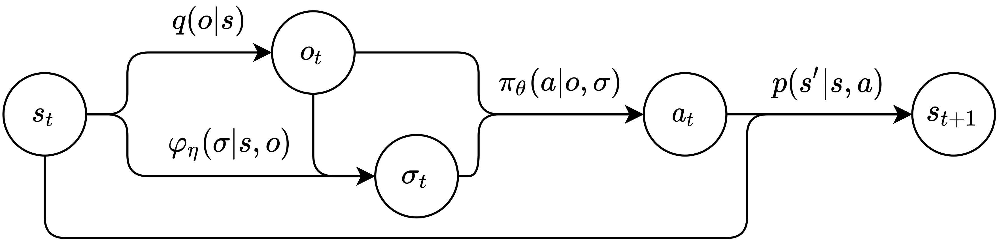
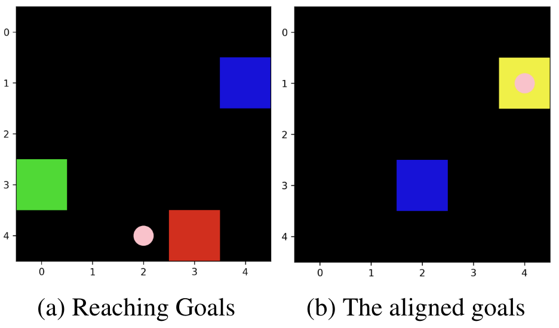
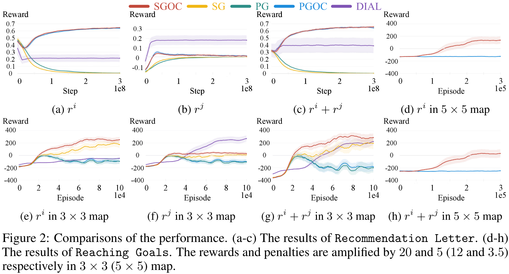
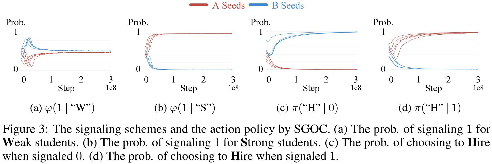
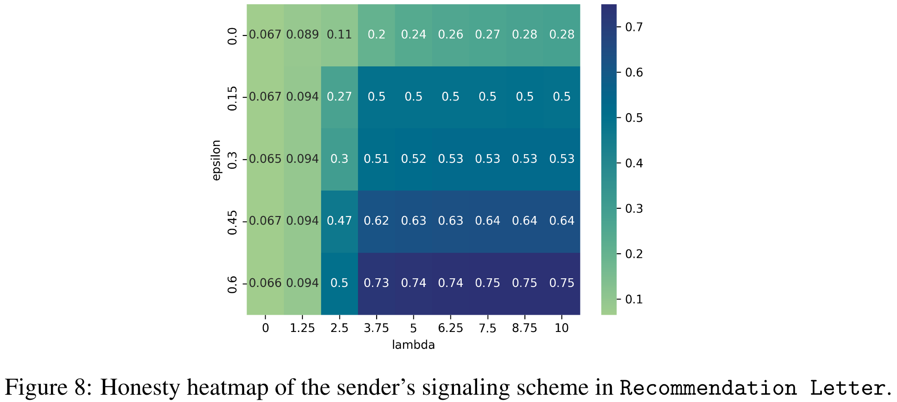
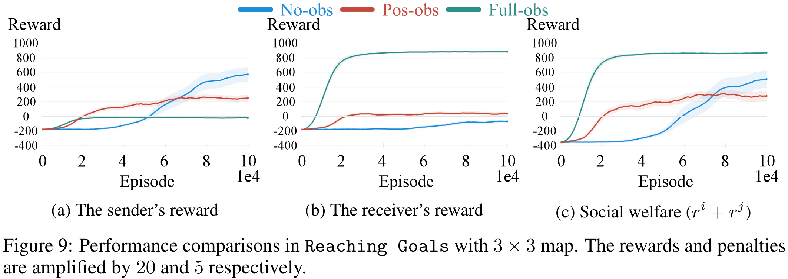

<!-- > 在被风暴和神话笼罩的海洋中，一个几乎被遗忘的宝藏引来了海盗的贪婪。一位对财富漠不关心但渴望进行最后一次航行的**老海盗**，握有通往这宝藏的地图。他希望重温过去的辉煌并向旧敌复仇，但因身体虚弱无法独自旅行，他需要一个无畏的**年轻海盗船长**的力量。这位船长渴望宝藏和名声，能够航行穿越这些危险的水域，但他没有宝藏的地图。
> 
> 老海盗意识到，如果透露宝藏的位置，他将一无所有，因为船长和他的船员会毫不犹豫地因为他是累赘而抛弃他。于是他设计了一个计划，用散布线索的故事误导船长，以保护他在探险中的位置。一路上，船员偶尔会发现老海盗年轻时留下的小宝藏，也逐渐地对老海盗的指引深信不疑。而随着他们从一个岛屿跳到另一个岛屿，老海盗也如愿以偿地实现了自己的愿望——重游了许多故地、并将他无知的伙伴们引入与自己过去仇人的冲突中以此实现了复仇。
> 
> 他们的旅程充满了危险和冒险，最终在真正的宝藏地点达到高潮，那里开了巨大的派对。船员们欢乐地庆祝，并不知道自己满足了老海盗的最后愿望。随着派对的继续，老海盗带着满意的微笑去世了，他一生的愿望通过这最后的宏大航行得到了实现。 -->

## 资源
- Information Design in Multi-Agent Reinforcement Learning.  
    Yue Lin, Wenhao Li, Hongyuan Zha, Baoxiang Wang.  
    *Neural Information Processing Systems (NeurIPS) 2023. Poster.*
    > 
    [[论文]](https://arxiv.org/abs/2305.06807) 
    [[代码]](https://github.com/YueLin301/InformationDesignMARL) 
    [[实验]](https://wandb.ai/yuelin301/IND+MARL?nw=nwuseryuelin301) 
    [[博客 英文]]({{site.baseurl}}/posts/IDMARL/) 
    [[博客 中文]]({{site.baseurl}}/posts/IDMARL-cn/) 
    [[知乎 中文]](https://zhuanlan.zhihu.com/p/687305626) 
    [[幻灯片]]({{site.baseurl}}/posts/IDMARL/#slides) 
    [[报告 英文]](https://www.youtube.com/watch?v=yhVlpv_1Pg4) 
    [[报告 RLChina]](https://www.bilibili.com/video/BV1t142117Km?vd_source=b3cf9eb7cfe43c730613c5158a38e978)  
    <!-- [[报告 中文]](https://www.bilibili.com/video/BV1e94y177Dj/?share_source=copy_web&vd_source=b3cf9eb7cfe43c730613c5158a38e978&t=2825)   -->

**关键词：** Information Design, Bayesian Persuasion, Sequential Social Dilemma, Multi Agents, Reinforcement Learning, Communication, Policy Gradient, Obedience Constraints, Bayesian Correlated Equilibrium.

**我们想干啥：** 我们希望为马尔可夫序列通信的情景中的发送方设计一个无模型强化学习算法。这个算法将使发送方能够策略性地利用信号，从而操纵接收方的行为，而接收方的利益可能与发送方的不完全一致。最终目标是优化发送方自己的预期效用。

## 聚焦
- **我们提出的模型：** 马尔可夫传信博弈（一个马尔可夫模型） Markov Signaling Game
- **我们提出的技术：** 传信梯度 Signaling Gradient, 拓展服从约束 Extended Obedience Constraints.
- **我们提出的实验环境：** 抵达不同目的地（一个序列社会困境） Reaching Goals
- **重点**
  - 序列说服过程被建模为了一个马尔可夫模型
  - 一个发送者和一个接收者遇见很多次，不是一个发送者遇到一批接收者
  - Commitment假设被取消了
  - 和显示原理revelation principle很相近的分析被取消了
  - 接收者是个model-free RL agent，从0开始学
  - 发送者也是个model-free RL agent，从0开始学；不需要知道环境模型，没有先验知识
  - 我们在一个有挑战性的MARL序列社会困境任务中测试了我们的算法
  - 我们的算法可以使用Actor-Critic框架，这让我们可以使用modern RL技术

这里的长期有两个维度：  
第一个维度是指的是每一个episode里是长期的，receiver需要考虑长远的收益，因为他不是每一次都能获得奖励，而是要走到目标才有奖励，这个在RL中常见的假设在经济学的info design里其实是一个突破，因为之前主要聚焦于one-step的场景或repeated game的场景；  
第二个长期指的是学习的过程，他们不光要从0开始认识世界，还要从0开始建立信任，info design中一个重要的假设commitment，它的justification就是用长期交互然后发送者会注意维护自己的声誉（或者说是可信度），而RL的训练过程其实就是模拟了这个效果，因此我们可以直接取消commitment假设。

## 预备知识

- Information Design / Bayesian Persuasion [[我的博客]]({{site.baseurl}}/posts/Information-Design-10min/)
- RL基础: 
  - Markov Models
  - Policy Gradient [[我的博客]]({{site.baseurl}}/posts/Policy-Gradient-Details/)
- MARL通信: DIAL / RIAL
- MARL机制设计: LIO

## 马尔可夫传信博弈 Markov Signaling Game

### 定义

{: width="500"}
_马尔可夫传信博弈 Markov signaling game 示意图。箭头代表了概率分布，节点表示采样变量。_

一个马尔可夫传信博弈 Markov signaling game (MSG) 可以被定义为一个元组
$$
\mathcal{G} = \left(\ i, j, S, O, \Sigma, A, R^i, R^j, p, q \ \right).
$$
- $i$: 发送者。**发送者只能发送信号，不能做环境动作，但是它可以看到全局状态。**
- $j$: 接收者。**接收者可以采取环境动作，但是他看不到全局状态。**
- $S$: 状态空间。只能被发送者看到。和MDP中的一样。
- $O$: 接收者的观测空间。接收者的观测能被两个智能体看到。其他和POMDP中的一样。
- $q$: 发射函数。$q: S\to O$.
- $\Sigma$: 发送者的信号空间。
- $\varphi_{\eta}$: 发送者的随机传信模式。**发送者仅根据当前状态和发送者当前的观测来发送信号。** $\varphi_{\eta}: S\times O \to \Delta(\Sigma)$.
- $A$: 接收者的环境动作空间。
- $\pi_{\theta}$: 接收者的随机动作策略。**接收者根据当前自己的观测和自己当前从发送者那里收到的信号来选环境动作。** $\pi_{\theta}:O \times\Sigma \to \Delta(A)$.
- $R^i$: 发送者的奖励函数。**这奖励仅依赖于当前的状态和接收者的动作。** $R^i: S\times A\to\mathbb{R}$.
- $R^j$: 接收者的奖励函数。$R^j: S\times A\to\mathbb{R}$.
- $p$: 状态转移函数。**状态的转移仅依赖于当前的状态和接收者的动作。** $p: S\times A \to \Delta(S)$.

**注意**
- 发送者只能通过改变接收者能看到什么来优化自己的收益期望
- 这里有两个奖励函数，发送者的和接收者的。因此他们可以是混合动机的，而不一定似乎完全合作的

**MSGs的一个约束：** 根据这个问题的接收者的信息优势设定，我们假设$$\set{s_t - o_t}_{t\ge 0}$$这部分会影响接收者的收益。这保证了发送者知道一些接收者想知道但不知道的信息。因此发送者有能力去影响接收者。

并且我们有很多MSGs的拓展的讨论，在附录B里。

### 一个有挑战性的任务：抵达不同目的地

想象两个自私的海盗在一片海域上航行，他们在同一艘船上，但有各自想去的岛屿。他们中一个是舵手（接收者），能控制船的移动，但是他只知道船的绝对位置，不知道自己想去的岛屿的位置；另一个是航海员（发送者），他有地图和指南针，能看到所有岛屿的位置（自己想去的岛屿和舵手想去的岛屿），但不能控制船的移动。这个任务聚焦于航海员，我们想让他学到一个合适的传信模式来说服舵手，从而间接地控制船开往自己想去的岛屿。

一个可能的解：发送者总是让接收者开船去他自己想去的岛屿，但如果船离接收者的岛屿比较近的时候，就顺路过去。长此以往，接收者会发现这总比自己瞎转得到的奖励更多，因此他就听了发送者的建议。

{: width="400"}
_“抵达不同目的地”的一张地图_

- 蓝色方块：接收者的海盗船。
- 发送者在接收者的海盗船上。或者你可以认为发送者不在场景里。
- 红色方块：发送者的目标点。如果**接收者的海盗船**到达这里，那么**发送者**会获得正奖励。
- 绿色方块：接收者的目标点。如果接收者的海盗船到达这里，那么它（接收者）会获得正奖励。
- 黄色方块：红色方块和绿色方块重叠，意味着智能体的目标是一致的。
- 粉红点：发送者发送的消息。

**规则：**
- 发送者有航海图，能看到每个对象的位置。
- 接收者默认只能看到自己船的绝对位置。我们已经测试了接收者的可观测性对算法表现的影响，如附录H所示。接收者能看到的越多，发送者拥有的信息优势就越小，发送者能够操纵的空间就越小。
- 只有接收者能开海盗船。接收者的动作包括向`上`、`下`、`左`或`右`移动一个方格。
- 在地图上的任何给定时间，对于发送者和接收者来说都只有一个目标点，这些目标点都是随机生成且均匀分布的。
- 一旦接收者达到一个目标点，这个目标点将会被重新生成。并且，重新生成的目标点和接收者不会处于同一位置。
- 一个Episode只有在达到指定的步数限制时才会结束。因此，使接收者绕路会损害接收者达到其目标点的**效率**，从而影响其预期的长期收益。

**为什么这是有挑战性的：**
- 发送者无法采取环境动作。它只能影响接收者能看到的内容。
- 当接收者决定追求绿色目标时，这意味着它会远离红色目标。在固定长度的情节中，这将降低接收者的目标收集效率。
- 由于目标的重生位置是随机且均匀分布的，目标的位置很有可能不会重合。随着地图大小的增加，发送者和接收者之间的利益冲突会增加。

## 难点

### 从和经济领域工作对比的角度
- 智能体都是要学习的
- 智能体是无模型的
- 这是一个序列化说服问题，问题在于解决一个马尔可夫模型
- 发送者不做commitment

### 从强化学习RL的角度：要解决发送者在MSGs上的优化问题

这里存在一个严重的**非平稳性 non-stationarity**问题。

接收者是一个唯我论 solipsistic 的RL智能体，这意味着它将观察和信号视为其环境。因此，每次发送者更新其传信模式时，接收者的环境也会改变。因为信号的分布（接收者的策略输入）发生了变化。换句话说，发送者在设计接收者的唯我论 solipsistic 环境。

因此，信号不应仅仅被视为一种动作。

### 从学习的角度

对发送者来说，建立信用很难。

智能体需要从零开始学习。初始时，他们的策略几乎是随机的。如果发送者不能高效地找到合适的传信模式，那么它不成熟的传信模式将使其失去接收者的信任。并且这是一个很强力的均衡，一旦到达则无法再跳出。
  
### 从多智能体强化学习MARL的角度

这两个智能体有混合动机。

目前，MARL的主流研究集中在完全合作通信上。一些其他的MARL论文使用“混合动机”这一术语来描述涉及两组智能体的场景，其中同一组内的智能体合作但与另一组的智能体存在冲突。而我们使用“混合动机”这一术语来描述两个智能体之间非完全合作也非完全竞争的情况。

### 从和LIO对比的角度

信息设计远比激励设计要困难。

1. 信号可以被忽略。激励是强制性的。在训练开始时，传信模式几乎是随机的，接收者将很容易学会忽略消息，这种情况是一个强均衡。
2. 信号立即改变状态转移（它影响RL的采样阶段和更新阶段）。奖励不影响轨迹（它只影响RL的更新阶段）。因此，在LIO中使用的超梯度方法在这里不适用（采样阶段的一阶梯度是占主导影响的）。
3. 发送者不能采取环境动作。它只能从接收者的动作中获得反馈。这是一个间接的反馈流。

## 方法背后的见解

### 传信梯度 Signaling Gradient

我们要让发送者MSG中优化自己的收益期望。

我们可以在MSG中定义价值函数和贝尔曼方程，就像我们在MDP中所做的那样。然后在MSG中导出$\nabla_{\theta} \mathbb{E}\left[V^i(s_0)\right]$。我们可以使用贝尔曼方程展开这些方程，再次地，就像我们在MDP中所做的那样。可以很容易看出梯度链穿过了两个智能体的决策过程，这意味着发送者考虑了“通过马尔可夫模型对接收者策略的信号影响”。一旦我们完成了梯度的推导，我们就可以得到其无偏估计方法。

请参考策略梯度的推导。

如果将发送者的信号视为一种动作，则其梯度估计将丢失部分梯度链，因此是有偏的。

**注意：**
信号梯度不仅适用于混合动机通信，也适用于完全合作通信。因为推导没有使用任何混合动机的假设。

### 拓展服从约束 Extended Obedience Constraints
是在MSG中的激励相容性 Incentive compatibility。接收者仅根据其当前收到的消息采取行动，不包括之前收到的消息，因此可以轻松地从贝叶斯说服中的服从约束中进行拓展得到。

<!-- - The sender and the receiver are rational (in a sense of RL), self-interested, and risk-neutral.
- The receiver's policy is Markovian, not history-dependent. At every timestep, it takes actions based on the current estimation of the future payoffs. So the obedience constraint can be easily extended in MSGs. -->

### 适用场景

适用场景应包含以下元素：
1. 通信
2. 混合动机（带有扩展服从约束的信号梯度, SGOC）或完全合作（传信梯度, SG）
3. 信息优势：发送者应该知道一些接收者不知道但想要知道的事情。
   1. $o^i - o^j\ne \varnothing$,
   2. $o^i - o^j$ 影响接收者的收益期望。
4. 接收者是理性且对风险持中性态度的，在RL的意义上讲。

## 有趣的实验结果

### 主要结果
1. 在简单的推荐信实验中，扩展的服从约束大大提高了性能。
2. 在具有挑战性的抵达不同目的地实验中，传信梯度显著提高了性能。
3. DIAL发送者根本不关心自己。

### 对称性
在不同的随机种子中出现了不同的语言，如5.3.1节所示。

### 发送者的诚实度
发送者的诚实度可以通过拉格朗日方法的超参数进行操控，如附录H.6中的热图所示。

### 接收者的观测
接收者能看到的越多，发送者拥有的信息优势就越少，发送者能够操纵的空间就越小，如附录H所示。

### Gamma

在信息设计中接收者如果是长远视角则问题会很复杂（在4.5.3中讨论了），我们实验中的discounted reward factor取的是0.1，后续实验测试Gamma取0.1到0.8之间是可以的。

## 幻灯片

<object data="{{ site.baseurl }}/assets/img/2024-03-14-IDMARL/IDMARL_slides.pdf" type="application/pdf" width="100%" height="1000px">
</object>

