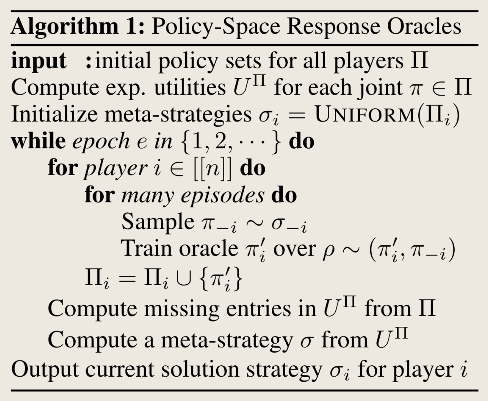

<!-- > In English, the term "oracle" has several related but distinct meanings:
> 
> 1. **Ancient Prophet**: The most traditional meaning originates from ancient Greek culture, referring to an oracle or prophet, often associated with religious or mystical rituals, capable of providing predictions about the future or wisdom to solve difficult problems. Such oracles are usually linked to a specific sacred site or temple, such as the Temple of Apollo at Delphi.
> 
> 2. **Authoritative Source**: More broadly, "oracle" can refer to any source considered authoritative in knowledge or truth. This could be a person, a book, or anything regarded as having definitive answers or profound knowledge.
> 
> 3. **Usage in Computer Science**: In computer science and related fields, "oracle" typically refers to a theoretical mechanism or device that can solve specific problems or perform certain computational tasks, especially those that current algorithms or technologies cannot handle. This usage is derived from its original meaning regarding divine prophecy, emphasizing its capability to provide decisive solutions.
> 
> For example, in algorithm theory, an oracle might refer to a black box device capable of solving specific types of problems (such as calculating optimal responses in PSRO), while in software or technological products, an oracle might refer to a component or service that provides exact answers or data.
{:.prompt-info} -->

## Definition

{: width="500" height="500" }

> Lanctot, Marc, et al. "A unified game-theoretic approach to multiagent reinforcement learning." Advances in neural information processing systems 30 (2017).

- multi agents: me vs opponents
    - joint action -> rewards + state transition; non-stationarity
    - me vs which opponents? 
        - PSRO will answer this question.
        - It provides a general framework, which generalizes independent learning, self-play, and fictitious-play
            - self-play: $\sigma_{-i}=(0,0,\ldots,1,0)$, best response to the previous strategy of its own
            - independent learning: $\sigma_{-i}=(0,0,\ldots,0,1)$
            - fictitious-play: $\sigma_{-i}=(1/K,1/K,\ldots,1/K,0)$ where $K = \vert \Pi_{-i}^{T-1} \vert$
        - Meta-strategy $\sigma$ specifies how to sample opponents' strategies.
- Oracle
    - It means the best response to the current *population*, which is a black box (my understanding)
    - $\Pi_i$ is the set of best responses.
- Compute a meta-strategy $\sigma$. This step requires an approximation tool for an equilibrium solver.
- This algorithm is a equilibrium solver.

---

## Alternative Description

> Bighashdel, Ariyan, et al. "Policy space response oracles: A survey." arXiv preprint arXiv:2403.02227 (2024).

> The following part is taken from: Li, Wenhao, et al. "Verbalized Bayesian Persuasion." arXiv preprint arXiv:2502.01587 (2025).

PSRO algorithms begin with an initial set of strategies for each agent and proceed through two alternating steps. 
- First, a normal-form meta-game (e.g., matrix game) is constructed, where each agent selects a meta-strategy to represent their overall behavior in the game. 
    - A meta-solver (e.g., Nash equilibrium solver) then computes a solution (e.g., Nash equilibrium) for this meta-game. 
- In the second step, each agent computes an approximate best response to the meta-strategy, aiming to improve their reward assuming the other agents play according to the meta-strategy. 
- This process repeats until no agent can benefit by deviating from their strategies

My understanding:
- If the meta-solver is accurate, then the two steps will only execute once.
    - Normally we use projected replicator dynamics as a meta-solver.