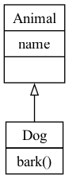

> This post was completed with the assistance of ChatGPT-4.
{: .prompt-info }


## Inheritance

Inheritance allows a class (known as a child class) to inherit attributes and methods from another class (known as a parent class). This leads to code reusability and a hierarchical organization of classes.

```python
class Animal:  # Parent class
    def __init__(self, name):
        self.name = name

    def speak(self):
        pass

class Dog(Animal):  # Child class inheriting from Animal
    def speak(self):
        return "Woof!"

class Cat(Animal):  # Another child class inheriting from Animal
    def speak(self):
        return "Meow!"
```

Here, `Animal` is the parent class, and `Dog` and `Cat` are child classes that inherit from `Animal`. The method `speak` is overridden in each child class.


### Abstract Base Class

An Abstract Base Class (ABC) in programming, particularly in object-oriented programming languages like Python, is a class that cannot be instantiated on its own and is designed to serve as a base class for other classes. The primary purpose of an ABC is to provide a common interface and set of behaviors that can be shared by multiple subclasses.

In Python, abstract base classes can be created using the `abc` module. Here's a simple example:

```python
from abc import ABC, abstractmethod

class Shape(ABC):
    @abstractmethod
    def area(self):
        pass

    @abstractmethod
    def perimeter(self):
        pass
```

In this example, `Shape` is an abstract base class with two abstract methods: `area` and `perimeter`. Any subclass of `Shape` must implement these methods to be instantiated.

Using ABCs helps in developing a more organized and modular codebase, making it easier to maintain and extend. It also helps in catching errors early in the development process, as trying to instantiate an abstract class or failing to implement an abstract method will result in an error.

**If I want to write an interface, isn't it enough to just normally inherit from `object`?**

Inheriting from the `object` class and using an Abstract Base Class (ABC) in Python have significant differences, especially when you want to define an interface. Here's an explanation of the differences and the advantages of ABCs:

1. **Enforcing Implementation of Interface Methods**:
   - Classes inheriting from `object` do not enforce the implementation of any methods in subclasses. This means that if you forget to implement a method, your code might encounter runtime errors.
   - Classes inheriting from an ABC can define abstract methods (using the `@abstractmethod` decorator). This forces any subclass to implement these methods; otherwise, they cannot be instantiated. This helps prevent runtime errors and ensures all subclasses follow the same interface.

2. **Clear Design Intent**:
   - Using an ABC clearly indicates that the class is intended to be an interface. It shows that the class defines a set of APIs that should be implemented by other classes, rather than providing concrete functional implementations.
   - In contrast, a class inheriting from `object` could be a regular class or one intended as an interface, which is not as distinctly clear.

3. **Better Organization and Modularization**:
   - ABCs help better organize code, especially in large projects. By defining a clear interface, you can ensure all classes implementing this interface follow the same structure.
   - This aids in maintaining and extending the code, as you can rely on these defined interfaces rather than specific class implementations.

4. **Early Error Detection**:
   - With ABCs, if a subclass does not implement all the abstract methods, Python will throw a TypeError when attempting to instantiate that class. This helps in detecting issues early in the development process rather than at runtime.

In summary, when you want to define an interface that should be implemented by other classes, using an ABC rather than plain `object` inheritance is a better choice. It provides strong support for ensuring interface consistency, clarity, and maintainability of the code. However, if you just need a regular base class without the need to enforce specific interfaces, then inheriting from `object` might be sufficient.

### Inheritance Visualization

```bash
pip install pylint
```

```python
# classes.py

class Animal:
    def __init__(self, name):
        self.name = name

class Dog(Animal):
    def bark(self):
        return "Woof!"
```

```bash
pyreverse -o png -p outputed_diagram classes.py
```

Here, -o png specifies the output format (PNG in this case), and -p outputed_diagram is the name of the project (used for labeling the diagram).


_classes_outputed_diagram.png_


### Polymorphism

Polymorphism in OOP refers to the ability of different classes to be treated as instances of the same class through inheritance. It allows methods to be used in a similar way for different classes.

Using the previous classes, polymorphism is demonstrated as follows:

```python
def animal_sound(animal):
    print(animal.speak())

dog = Dog("Buddy")
cat = Cat("Whiskers")

animal_sound(dog)  # Outputs: Woof!
animal_sound(cat)  # Outputs: Meow!
```

In this example, `animal_sound` is a polymorphic function that can take any object that has a `speak` method. Both `Dog` and `Cat` objects can be used here due to polymorphism.


## Decorator

In Python, a decorator is a design pattern that allows you to modify the behavior of a function or a class method. It's used to "decorate" or "wrap" a function with another function. Essentially, it allows you to add new functionality to an existing function without changing its structure.

Here's a basic overview of how decorators work:

1. **Definition**: A decorator is typically defined as a function that takes another function as an argument and extends its behavior without explicitly modifying it.

2. **Application**: You apply a decorator to a function by prefixing the function definition with the decorator's name and the `@` symbol.

3. **Execution**: When the decorated function is called, it's passed to the decorator as an argument. The decorator can then execute some code before or after the original function is called, or modify the arguments or return value.

Here's a simple example:

```python
def my_decorator(func):
    def wrapper():
        print("Something is happening before the function is called.")
        func()
        print("Something is happening after the function is called.")
    return wrapper

@my_decorator
def say_hello():
    print("Hello!")

say_hello()
```

```
Something is happening before the function is called.
Hello!
Something is happening after the function is called.
```

In this example, `my_decorator` is a decorator that wraps around the `say_hello` function. When `say_hello()` is called, it first prints a message, then executes `say_hello`, and then prints another message.

Decorators are a powerful feature in Python, commonly used for logging, enforcing access control, instrumentation, and more. They make it easy to modify or extend the behavior of functions in a reusable and readable way.


### @abstractmethod

- **Usage**: This decorator comes from the `abc` module (`abc` stands for Abstract Base Classes). It is used to define abstract methods within an abstract base class.
- **Purpose**: When you define a method as an abstract method, it means that the method must be implemented by any non-abstract subclass of the base class. This is useful when you have a base class that defines a common interface or protocol for a set of subclasses.
- **Example**:
    ```python
    from abc import ABC, abstractmethod

    class AbstractClass(ABC):
        
        @abstractmethod
        def my_abstract_method(self):
            pass
    ```
- In this example, any subclass of `AbstractClass` must implement `my_abstract_method`, otherwise, an instance of the subclass cannot be created.

### @staticmethod
- **Usage**: This decorator is used to define a method that does not access instance or class data.
- **Purpose**: Static methods are used when some processing is related to the class, but does not require the class or its instances to perform any task.
- **Example**:
  ```python
  class MyClass:
      
      @staticmethod
      def my_static_method():
          print("This is a static method.")
  ```
- `my_static_method` can be called on a class itself, or on an instance of the class, but it does not automatically receive the class (`cls`) or instance (`self`) as its first argument.


### @classmethod
- **Usage**: The `@classmethod` decorator is used to define a method within a class that is bound to the class and not the instance of the class. It takes the class itself as the first argument, typically named `cls`, rather than a specific instance of the class (`self`).

- **Purpose**:
    - It's often used for factory methods, which are methods that return an instance of the class, but might not use the same arguments as the class's constructor.
    - It can also be used for methods that need to operate on class-level data or perform operations relevant to the class as a whole, not just to instances.

- **Example**:
    ```python
    class MyClass:
        @classmethod
        def from_string(cls, date_as_string):
            return cls(*map(int, date_as_string.split('-')))

    # MyClass.from_string("2021-12-31") would create an instance of MyClass using the provided string.
    ```

### @property
- **Usage**: The `@property` decorator is used to define methods in a class that behave like read-only attributes. This allows class attributes to be accessed and modified in a controlled way without directly exposing the underlying data storage mechanism.

- **Purpose**:
    - It is used to implement getter methods, which return the value of a private attribute without exposing it.
    - Combined with setter and deleter methods, it can control how an attribute's value is set and deleted, often including some sort of validation or transformation.

- **Example**:
    ```python
    class MyClass:
        def __init__(self):
            self._my_attribute = None

        @property
        def my_attribute(self):
            return self._my_attribute

        @my_attribute.setter
        def my_attribute(self, value):
            self._my_attribute = value

        @my_attribute.deleter
        def my_attribute(self):
            del self._my_attribute

    # This allows you to use my_instance.my_attribute to get the value, set it, or delete it, while keeping the actual data storage encapsulated.
    ```

In summary, `@classmethod` is used for methods that need to interact with class-level data or provide alternate ways to create class instances, while `@property` is used to manage the access to an instance's attributes in a controlled manner, allowing for data encapsulation, validation, and potentially complex attribute access logic.