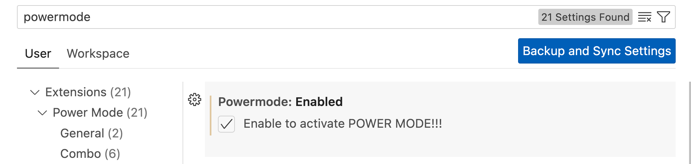

> This note will be consistently updated.
{: .prompt-info }


## Shortcuts

`Command + k` `Command + s`: Keyboard Shortcuts

### GOTO
- `Command + P`: Go to file
- `Command + Shift + O`: Go to symbol in editor
- `Command + T`: Go to symbol in workspace
- `Control + G`: Go to line
- `(Click the navigator)`: Outline (on the top of the main panel)

- `F12`: Go to definition
- `Shift + F12`: Go to references

- `Control + -`: Go back
- `Control + Shift + -`: Go forward

- `Control + W`: Switch window


### Open and Close
- `Command + Shift + N`: New window
- `Command + O`: Open
- `Command + ,`: Settings

- `Command + K` `W`: Close all tabs.
- `Command + K` `U`: Close all saved tabs.

### Panel
- ``Control + ` ``: Terminal
- `Control + B`: Toggle the left side bar (my customed shortcut)
- `Option + Command + B`: Toggle the right side bar

- `Command + \`: Split the editor

### Line
- `Command + Shift + k`: Delete the current line.
- `Control + G`: Go to line
- `Command + L`: Highlight the current line.
- `Option + (up/down)`: Move the current line up/down.
- `Option + Shift + (up/down)`: Duplicate the current line.
- `Command + X` without highlighting: Cut the current line.

- `Command + Enter`: Insert a line below (no need to move the cursor to the end)
- `Command + Shift + Enter`: Insert a line above

### Select
- `(Select Liens)` `Option + Shift + I`: Add cursors at the end of each lines
- `Option + (Click)`: Multiple cursors

- `(Highlight) Command + Shift + L`: Select all matches
- `(Highlight) Command + D`: Add the next selection to maches

### Else
- `Command + Shift + F`: Search in workspace
- `Command + Shift + P`: Input command

- `F2`: Rename symbol
- `Option + Shift + F`: Auto format current file

## Remote Connection

### Remote - SSH

这玩意可以直接用vs code打开服务器上的文件夹。

Remote - SSH 扩展使得开发者可以直接通过 SSH 协议连接到远程服务器。这意味着您可以在本地的 VS Code 中编辑远程服务器上的文件，运行代码，甚至调试程序。这对于那些需要处理大量数据、运行大型应用或者需要特定服务器环境的开发者特别有用。您只需在本地计算机上安装 VS Code 和必要的扩展，服务器端则无需安装 VS Code。

1. 打开远程窗口：点击 VS Code 左下角的绿色按钮（远程窗口指示器），或按 `Ctrl+Shift+P` 打开命令面板，然后输入`Remote-SSH: Add new ssh Host`。
2. 添加 SSH 主机：输入您的 SSH 连接命令，比如 `ssh username@hostname`。如果之前已添加过，可以直接从列表中选择。
3. 选择配置文件：如果是首次添加，系统会询问您保存配置的位置，通常保存在用户目录的 `.ssh/config` 文件中。如果我想用我的电脑连接远程服务器，我应该选择的是本机的ssh configuration file.
4. 连接和输入凭据：选择您的 SSH 主机后，VS Code 会尝试建立连接。根据配置，您可能需要输入密码或使用 SSH 密钥认证。
5. 打开项目：连接成功后，您可以通过 "File -> Open Folder" 打开远程服务器上的项目文件夹。

### SFTP

"SFTP" 是 Visual Studio Code (VS Code) 的一个流行插件，它允许用户通过 SFTP (Secure File Transfer Protocol) 或 FTP (File Transfer Protocol) 来上传、下载和同步文件。这个插件特别适合在本地和远程服务器之间同步文件，对于需要频繁更新服务器上文件的开发者来说非常有用。

- 下载和上传，文件同步
- 下载下来改，改完上传，然后在远程运行

#### Usage

> 1. In `VS Code`, open a local directory you wish to sync to the remote server (or create an empty directory
that you wish to first download the contents of a remote server folder in order to edit locally).
> 2. `Ctrl+Shift+P` on Windows/Linux or `Cmd+Shift+P` on Mac open command palette, run `SFTP: config` command.
> 3. A basic configuration file will appear named `sftp.json` under the `.vscode` directory, open and edit the configuration parameters with your remote server information.
> 
> For instance:
> ```json
> {
    "name": "Profile Name",
    "host": "name_of_remote_host",
    "protocol": "ftp",
    "port": 21,
    "secure": true,
    "username": "username",
    "remotePath": "/public_html/project",
    "password": "password",
    "uploadOnSave": false
> }
> ```
> The password parameter in `sftp.json` is optional, if left out you will be prompted for a password on sync.
> _Note：_ backslashes and other special characters must be escaped with a backslash.
> 
> 4. Save and close the `sftp.json` file.
> 5. `Ctrl+Shift+P` on Windows/Linux or `Cmd+Shift+P` on Mac open command palette.
> 6. Type `sftp` and you'll now see a number of other commands. You can also access many of the commands from the project's file explorer context menus.
> 7. A good one to start with if you want to sync with a remote folder is `SFTP: Download Project`.  This will download the directory shown in the `remotePath` setting in `sftp.json` to your local open directory.
> 8. Done - you can now edit locally and after each save it will upload to sync your remote file with the local copy.
> 9. Enjoy!
> 
> For detailed explanations please go to [wiki](https://github.com/Natizyskunk/vscode-sftp/wiki).

## Extensions

### Dendron Paste Image

`Command + Option + V`: put the copied image in a new created file (named the same as the current file) and paste it here.

### Markdown All in One

Run command "Create Table of Contents": Create Table of Contents.

### Outline Map
You can find it in the sidebar.

### CodeMap
You can find it in the sidebar.

### TODO Tree
You can find it in the sidebar.

### Local History
You can find it in the file explorer.

### vscode-icons
Skin.  
MacOS => Code > Preferences > File Icon Theme > VSCode Icons.

### Rainbow Brackets
Passive skill.

### Error Lens
Passive skill.

### Better Align
Choose texts and `Option + A`

### Path Intellisense
Passive skill.

### IntelliCode
Passive skill.

### Code Spell Checker
Passive skill.

### vscode-pdf
Passive skill.

### One Dark Pro
Skin.

### Power Mode
Skin.  
Passive skill.  
Show some special effects while you type.




### Black Formatter
Auto formatting for python files.  
Active skill.  
Using the context menu (right click on a open Python file in the editor) and select "Format Document With..."

### Live Share
Live share.

