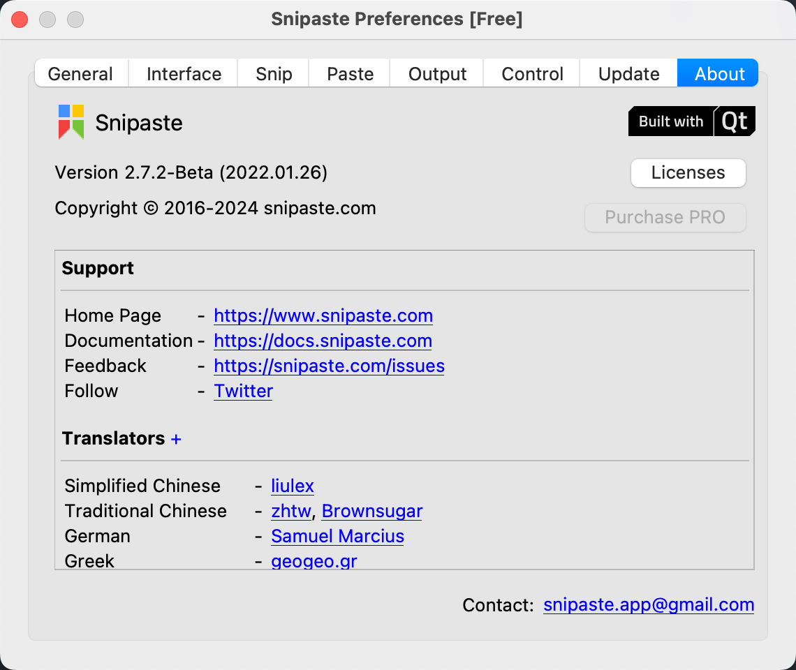

_Wallpaper: A Seascape, Shipping by Moonlight - Monet_

## Recommended Tools

### Hidden Bar

{: width="300" height="300" }

### Magnet
Window Arrangement

{: width="300" height="300" }

1. `Control + Option + Enter`: Maximize
2. `Control + Option + Backspace`: Restore
3. `Control + Option + e/t`: Left/Right Two Thirds
4. `Control + Option + d/g`: Left/Right Third
5. `Control + Option + c`: Center
6. `Control + Option + (left/right/up/down)`
7. `Control + Option + (u/i/j/k)`
8.  `Control + Option + Command + (left/right)`: Next Display

Recommended combo: 
1. Left/Right Two Thirds
2. Center

Recommended shortcuts: 

1. `Control + Option + a`: Maximize
2. `Control + Option + s`: Left Two Thirds
3. `Control + Option + d`: Center
4. `Control + Option + f`: Right Two Thirds

Effect:

### Snipaste

{: width="300" height="300" }

1. `F1`: Snip and Copy
2. `F3`: Paste on Screen