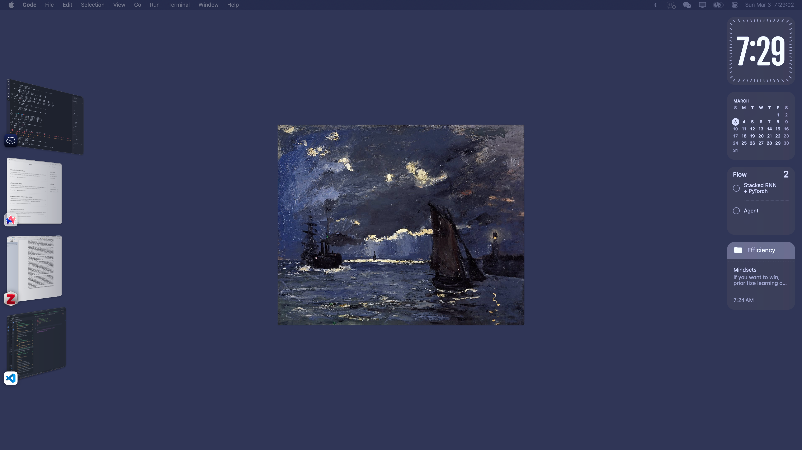
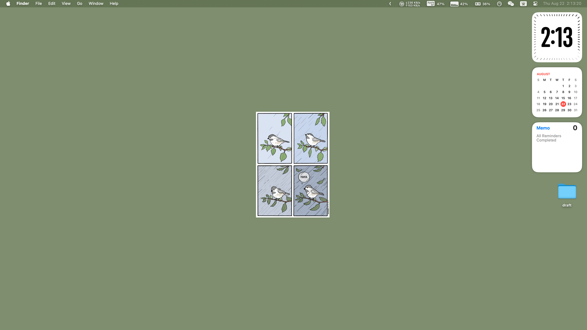
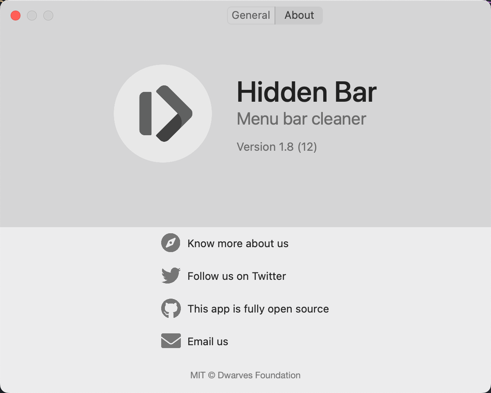
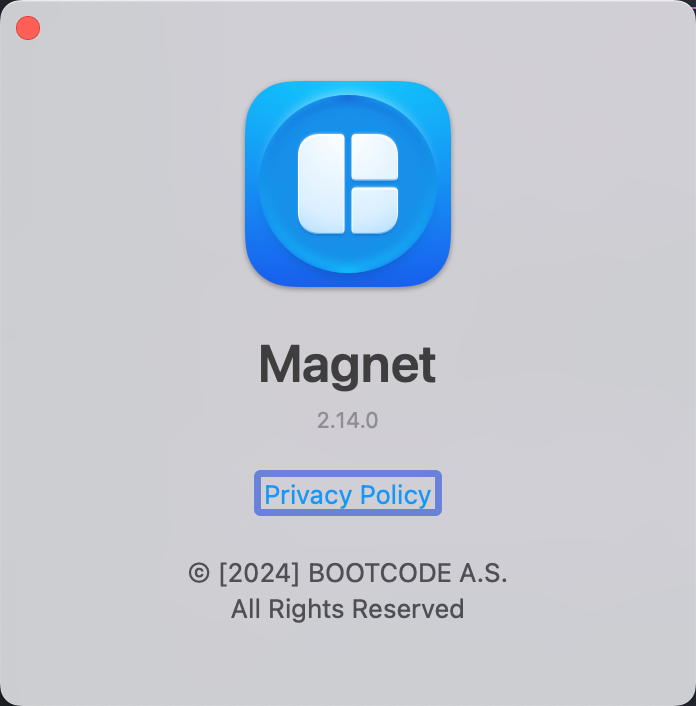
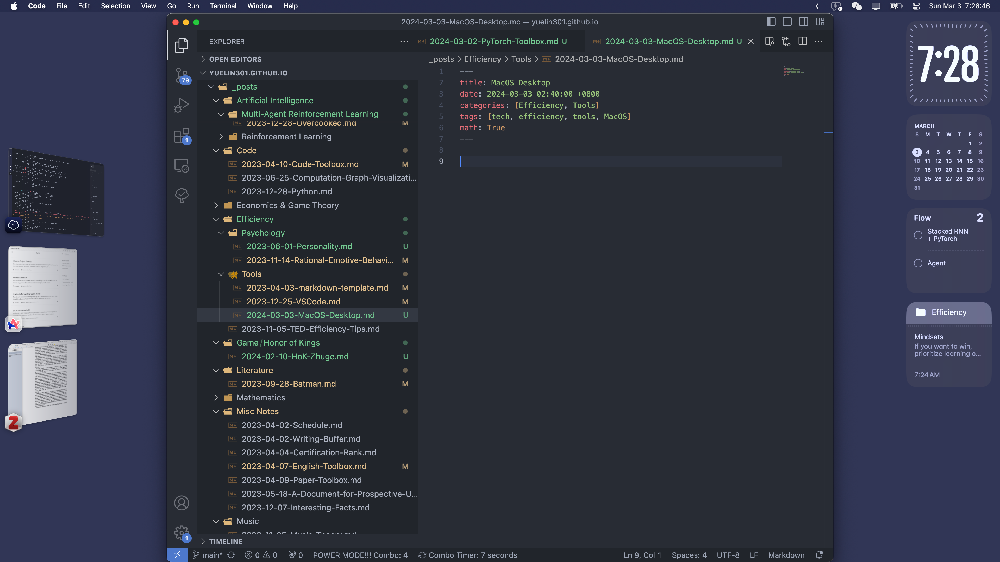
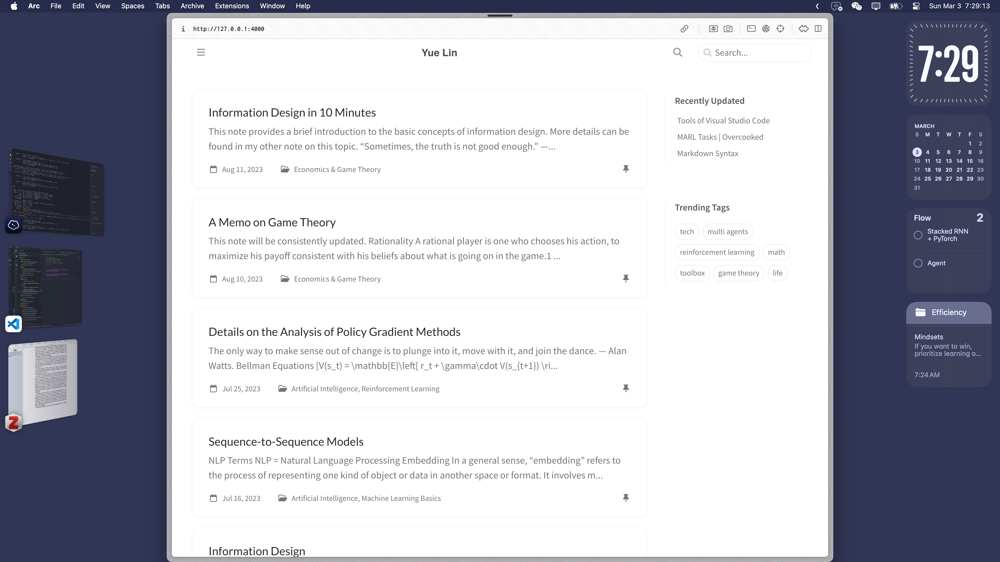
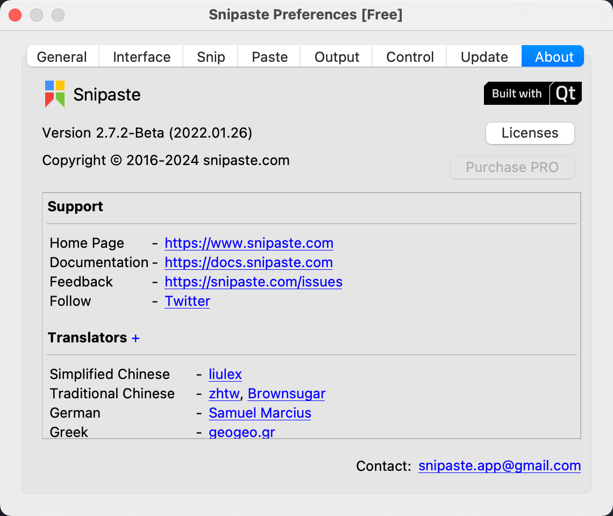
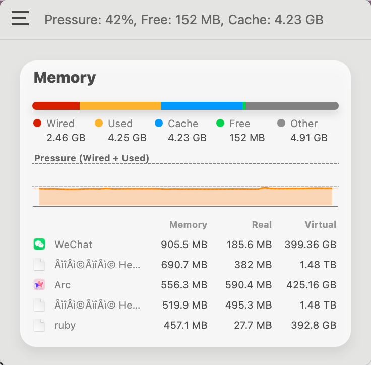

## Desktop

_Wallpaper: A Seascape, Shipping by Moonlight - Monet_

_False Knees - Joshua_

## Basic Tools

### Hidden Bar

{: width="300" height="300" }

### Wins and Magnet

Window Arrangement

Wins: https://wins.cool/html/index.html

{: width="300" height="300" }

Recommended combo: 
1. Left/Right Two Thirds
2. Center

Effect:

### Snipaste

{: width="300" height="300" }

1. `F1`: Snip and Copy
2. `F3`: Paste on Screen

### iStatistica Pro

系统监控软件: CPU, Memory, Disk, GPU, Network

{: width="300" height="300" }

> mac的memory为什么free的那么少？而cache和other那么多？我观察了一天了都这样
> 
> 从您提供的Mac内存状态截图中可以看出，"Free"（空闲内存）部分很少，而"Cache"（缓存）和"Other"（其他）占用较多。这种情况在macOS操作系统中是常见的，原因主要包括以下几点：
> 
> 1. **macOS 的内存管理机制**
> macOS 使用一种叫作“压力缓存”（Pressure Cached）的内存管理策略，意在最大化物理内存的使用效率。操作系统会保持较低的空闲内存，同时利用剩余的内存空间存放缓存数据，这样可以加速应用程序的响应速度和系统性能。
> 
> 2. **缓存的角色**
> - **缓存（Cache）**: 缓存内存用于存放你可能再次需要的数据。例如，如果你访问了一个文件，系统会将这个文件的数据缓存到内存中，以便快速访问。这意味着即使显示的空闲内存很少，系统实际上可以迅速释放缓存内存以响应新的需求。
> - **其他（Other）**: 这部分通常包括文件系统的元数据和为保持系统运行所需的内部数据结构。虽然这部分内存不直接用于当前运行的应用程序，但它们对操作系统的稳定和性能至关重要。
> 
> 3. **内存压力不高**
> 您的截图显示内存压力为42%，这表明尽管空闲内存不多，但系统并没有经历过高的内存压力。macOS设计了内存压力指标来指示是否需要采取行动（如关闭应用程序或重启系统）以释放内存。只要这个压力指标保持在低至中等水平，通常不需要担心内存问题。

### AutoRaise

鼠标移到哪里，哪里就会自动亮起，少一次点击操作

我的偏好是关闭window raise，打开window focus

### Parsec

远程连接

1. [【出门在外，我只用远程电脑！远程游戏、远程办公、远程桌面笔记，必备绿联扩展坞10合1，get远程大屏体验！】](https://www.bilibili.com/video/BV1TW421d7CS?vd_source=b3cf9eb7cfe43c730613c5158a38e978)
3. [【【保姆级教程】本地联机变成远程联机，远程同乐直呼内行《parsec》6023解决办法】](https://www.bilibili.com/video/BV1M44y117MC?vd_source=b3cf9eb7cfe43c730613c5158a38e978)

### Crossover

运行一些windows上的应用

[【谁说Mac不能玩游戏？我直接爽玩｜Mac丝滑游戏最新秘诀，都在这了。】](https://www.bilibili.com/video/BV1iG41127J4?vd_source=b3cf9eb7cfe43c730613c5158a38e978)

## Writing Tools

1. VSCode: code, blog
2. Scapple: mindmap
3. Typora: draft
4. Notes: memo
5. (Cooperation)
    1. Overleaf
    2. [HackMD](https://hackmd.io/)
6. (Remote Connection)
    1. Termius
    2. CUHKSZ VPN
    3. Parsec
7. (Miscs)
    1. Mathpix
    2. GitHub Copilot
    3. Grammarly

## Reading Tools

1. Arc: browser
2. Zotero: papers
3. Skim: misc pdf
4. Pigcha: VPN

## Entertainment APPs

1. Bilibili
2. Steam

## Storage

用iStatistica Pro扫描一下看看就好了

### Delete an Application

在Mac中，如果你删除了一个应用的container，这通常意味着你删除了该应用的所有数据和配置文件，但这并不总是等同于完全删除应用程序本身。应用程序的container通常包含用户数据、配置和缓存，位于`~/Library/Containers/`目录下。

删除container可以解决应用程序的一些问题，如配置损坏或升级问题，因为这会重置应用到初始状态。然而，应用程序的主体（执行文件和资源）通常安装在`/Applications/`文件夹中，除非你也从这个位置删除了它，否则应用程序仍然存在于你的系统上。如果你的目标是完全卸载一个应用，你应该删除其在`/Applications/`的应用程序文件，以及其相关的支持文件和container。

通常，为了彻底删除一个应用和它的所有数据，你可能需要删除以下几个部分：
1. `/Applications/`中的应用程序。
2. `~/Library/Containers/`中的相关container。
3. `~/Library/Application Support/`中的支持文件。
4. `~/Library/Preferences/`中的偏好设置文件。
5. 可能还有其他散落在`~/Library/Caches/`和`~/Library/Logs/`等地方的缓存和日志文件。

### Delete Chaches

点名微信和QQ。直接把`~/Library/Containers/`里的东西全删了就行了，软件都不用关，直接全部删掉就行，但是本地的聊天记录会清掉

还有一个是`~/Library/Chaches/`和`~/Library/Logs/`，删了一般没啥关系的，注意看文件名

<!-- ## Why Mac

优点：
1. 稳定
   1. win电脑牌子多，品控有问题
   2. win常出现蓝屏重启问题，应该是CPU散热原因
   3. 集成度高，不容易坏；我之前的win电脑出现过硬盘和主板的问题，浪费了很多时间和精力，且售后和维修很不专业
   4. win更新不稳定
2. 便携
   1. 带去上课风扇安静
   2. 待机很久，不用带电源
   3. 触控板和手势，无需多言
   4. 轻薄
3. 性能：满足便携性的轻薄本不能拿来跑实验
4. 环境：平板来说iPad是垄断般的存在，配合笔记什么的用Mac很舒服
5. 软件
   1. 类Unix内核
   2. 应用调度和检索比win舒服，习惯之后真的很快

当然如果是组台式PC那当然还是用windows，上面说的是笔记本的情况；如果哪天win没这些问题了并且有哪个win笔记本能有之前说的这些优点，请务必安利我，因为我之后一定会组台台式PC，如果能迁回win那就舒服了

如果我不学工科，不用工科软件，早点上mac，我早就可以开始到处带着作笔记了，泪目

缺点：
1. 硬件性价比低
   1. 丐版是性价比最高的，但是这个性能根本不够用
   2. 加钱能很爽但是哪有内存条和硬盘这么贵的？32GB内存的机型价格都起飞了
   3. 封装起来了，自己加不了条子
2. 不支持exe以及其他许多工业软件
3. 打不了多少游戏
4. 厂商刀法精湛且迭代太快，选购太揪心不痛快（还是没钱造成的）
5. Pytorch CUDA配置麻烦，而且代码要改变一些写法，还是不用了
6. 我的这台老版pro还得接拓展坞才够用，而且只能外接一台显示器 -->