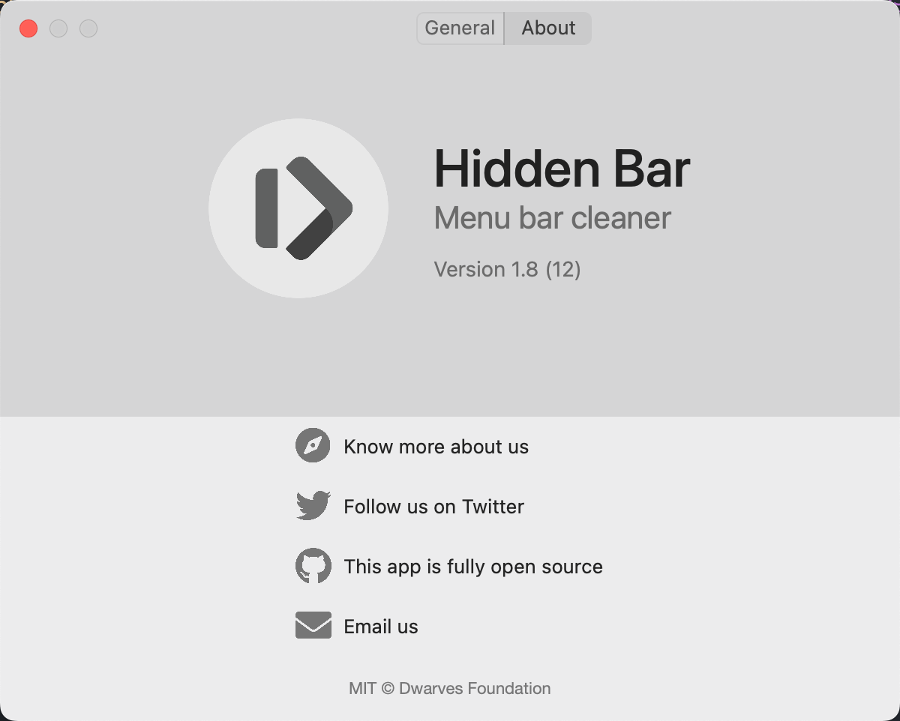
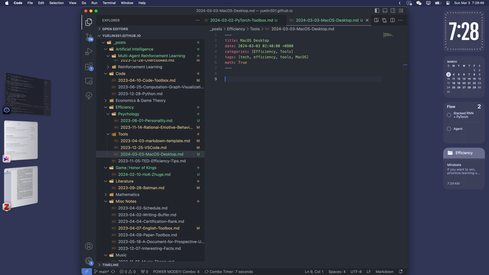
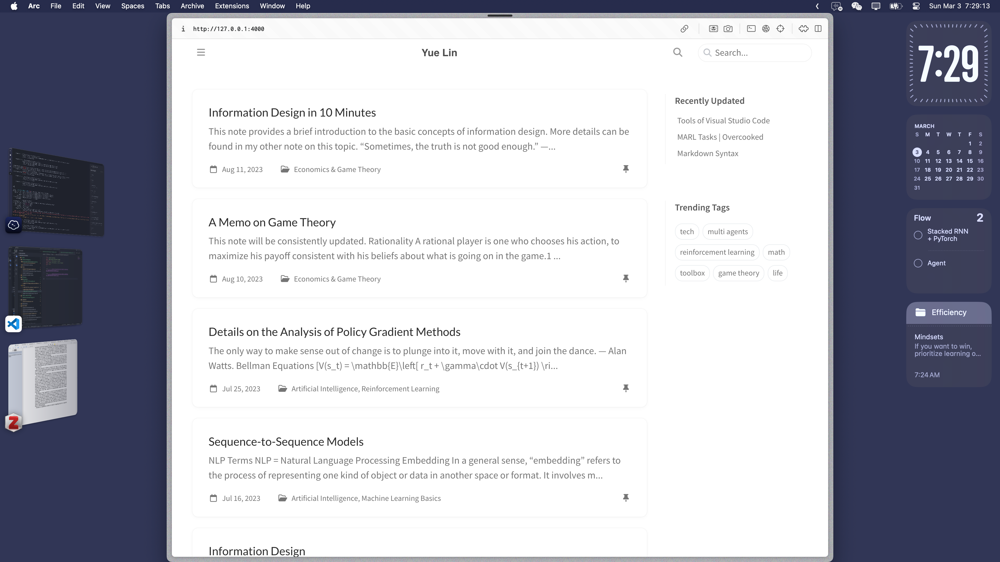

## Desktop

_Wallpaper: A Seascape, Shipping by Moonlight - Monet_

## Recommended Tools

### Hidden Bar

{: width="300" height="300" }

### Magnet
Window Arrangement

{: width="300" height="300" }

1. `Control + Option + Enter`: Maximize
2. `Control + Option + Backspace`: Restore
3. `Control + Option + e/t`: Left/Right Two Thirds
4. `Control + Option + d/g`: Left/Right Third
5. `Control + Option + c`: Center
6. `Control + Option + (left/right/up/down)`
7. `Control + Option + (u/i/j/k)`
8.  `Control + Option + Command + (left/right)`: Next Display

Recommended combo: 
1. Left/Right Two Thirds
2. Center

Recommended shortcuts: 

1. `Control + Option + a`: Maximize
2. `Control + Option + s`: Left Two Thirds
3. `Control + Option + d`: Center
4. `Control + Option + f`: Right Two Thirds

Effect:

### Snipaste

{: width="300" height="300" }

1. `F1`: Snip and Copy
2. `F3`: Paste on Screen

## Storage

### Delete an Application

在Mac中，如果你删除了一个应用的container，这通常意味着你删除了该应用的所有数据和配置文件，但这并不总是等同于完全删除应用程序本身。应用程序的container通常包含用户数据、配置和缓存，位于`~/Library/Containers/`目录下。

删除container可以解决应用程序的一些问题，如配置损坏或升级问题，因为这会重置应用到初始状态。然而，应用程序的主体（执行文件和资源）通常安装在`/Applications/`文件夹中，除非你也从这个位置删除了它，否则应用程序仍然存在于你的系统上。如果你的目标是完全卸载一个应用，你应该删除其在`/Applications/`的应用程序文件，以及其相关的支持文件和container。

通常，为了彻底删除一个应用和它的所有数据，你可能需要删除以下几个部分：
1. `/Applications/`中的应用程序。
2. `~/Library/Containers/`中的相关container。
3. `~/Library/Application Support/`中的支持文件。
4. `~/Library/Preferences/`中的偏好设置文件。
5. 可能还有其他散落在`~/Library/Caches/`和`~/Library/Logs/`等地方的缓存和日志文件。

### Delete Chaches

点名微信和QQ。直接把`~/Library/Containers/`里的东西全删了就行了，软件都不用关，直接全部删掉就行，但是本地的聊天记录会清掉

还有一个是`~/Library/Chaches/`和`~/Library/Logs/`，删了一般没啥关系的，注意看文件名

## Why Mac

优点：
1. 稳定
   1. win电脑牌子多，品控有问题
   2. win常出现蓝屏重启问题，应该是CPU散热原因
   3. 集成度高，不容易坏；我之前的win电脑出现过硬盘和主板的问题，浪费了很多时间和精力，且售后和维修很不专业
   4. win更新不稳定
2. 便携
   1. 带去上课风扇安静
   2. 待机很久，不用带电源
   3. 触控板和手势，无需多言
   4. 轻薄
3. 性能：满足便携性的轻薄本不能拿来跑实验
4. 环境：平板来说iPad是垄断般的存在，配合笔记什么的用Mac很舒服
5. 软件
   1. 类Unix内核
   2. 应用调度和检索比win舒服，习惯之后真的很快

当然如果是组台式PC那当然还是用windows，上面说的是笔记本的情况；如果哪天win没这些问题了并且有哪个win笔记本能有之前说的这些优点，请务必安利我，因为我之后一定会组台台式PC，如果能迁回win那就舒服了

如果我不学工科，不用工科软件，早点上mac，我早就可以开始到处带着作笔记了，泪目

缺点：
1. 硬件性价比低
   1. 丐版是性价比最高的，但是这个性能根本不够用
   2. 加钱能很爽但是哪有内存条和硬盘这么贵的？32GB内存的机型价格都起飞了
   3. 封装起来了，自己加不了条子
2. 不支持exe以及其他许多工业软件
3. 打不了多少游戏
4. 厂商刀法精湛且迭代太快，选购太揪心不痛快（还是没钱造成的）
5. Pytorch CUDA配置麻烦，而且代码要改变一些写法，还是不用了
6. 我的这台老版pro还得接拓展坞才够用，而且只能外接一台显示器