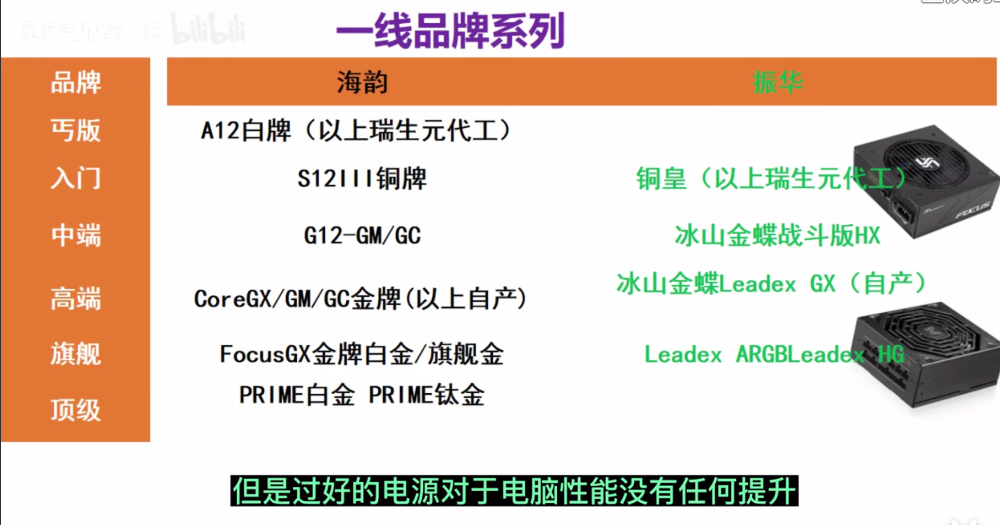

## 资源

- 装机：[【【装机教程】全网最好的装机教程，没有之一】](https://www.bilibili.com/video/BV1BG4y137mG?vd_source=b3cf9eb7cfe43c730613c5158a38e978)
- 兼容性：[【【收藏血赚】DIY电脑前必须要知道的事！手把手教你检查电脑装机配置单中各硬件兼容性问题！DIY电脑中各硬件兼容性检查指南！新手小白装机前必读！】](https://www.bilibili.com/video/BV1bF411b7Uc?vd_source=b3cf9eb7cfe43c730613c5158a38e978)
- 装系统：[【【装机教程】超详细WIN10系统安装教程，官方ISO直装与PE两种方法教程，UEFI+GUID分区与Legacy+MBR分区】](https://www.bilibili.com/video/BV1DJ411D79y?vd_source=b3cf9eb7cfe43c730613c5158a38e978)

- CPU：[【【硬核科普】CPU是如何命名的，数字更大就一定更好吗？】](https://www.bilibili.com/video/BV17u4y1979X?vd_source=b3cf9eb7cfe43c730613c5158a38e978)
- 主板：[【【硬核科普】从零开始认识主板】](https://www.bilibili.com/video/BV1xQ4y1b7JS?vd_source=b3cf9eb7cfe43c730613c5158a38e978)
- 内存：
  - [【【硬核科普】内存频率到底由谁决定上下限？不同频率的内存混插按谁算？如何为你的CPU和主板选择合适频率的内存？】](https://www.bilibili.com/video/BV12J411G7Tj?vd_source=b3cf9eb7cfe43c730613c5158a38e978)
  - [【你的内存买对了么？买内存前你最该知道的6件事儿】](https://www.bilibili.com/video/BV1wS4y1e7SW?vd_source=b3cf9eb7cfe43c730613c5158a38e978)
- 品牌相关：[【电脑硬件的一线品牌有哪些?各大电脑硬件性价比哪个最高】](https://www.bilibili.com/video/BV1gd4y1E7Sz?vd_source=b3cf9eb7cfe43c730613c5158a38e978)

- NAS：[【【硬核科普】NAS究竟是什么东西？你需要一台NAS吗？】](https://www.bilibili.com/video/BV1kZ4y1F733?vd_source=b3cf9eb7cfe43c730613c5158a38e978)

## 偏好清单概览

- **CPU：**Intel/AMD，我选Intel，听说是更稳定和更兼容；买带核显的，不然不买显卡的话画面都没有
- **内存RAM：**64GB；先买32GB，主板上插槽够的话后续可加；DDR5，比4好但贵，但主板上4和5接口不一样，不方便后期换
- **硬盘：**必须NVMe M.2固态硬盘，M-key接口或PCIe 4.0/5.0接口；机械不考虑；至少512GB，后续可再加
- **主板：**看适配，这里别省钱；尽量选尺寸大的、接口多的
- **CPU散热：**直接风冷，怕水冷漏夜；要对应CPU平台型号；不要灯
- **电源：**CPU功耗+显卡功耗+200w；买全模组电源；后面上个
- **机箱：**选适配的就行，不要灯；积木风扇看着整
- **显卡：**后选，先不买都行，看预算，可以换；实验室里是不是有多余的3090可以借来用用？

- **配件：**之后再买
  - UPS，防断电
  - NAS，存储，后续加上内网穿透直接爽飞
- **外设：**备忘
  - **鼠标：**罗技G304；轻，背部弧度贴掌心，边缘弧度方便提起
  - **鼠标垫：**Cherry，粗面；想换成这个同款桌垫了
  - **键盘：**DIY的：光头75v3，静音水蜜桃轴，灰色侧刻键帽，静音棉，轴下垫

<!-- 某大佬的配件：
处理器	处理器 Intel 酷睿 I9 14900K 中文原包（HS） 
散热器	散热器 华硕龙神ROG RYUJIN III 360 ARGB一体式水冷 
主板	主板 华硕ROG MAXIMUS Z790 HERO 
显卡	显卡 华硕ROG-STRIX-RTX4090-O24G-GAMING 
内存	内存 芝奇 48g\*2 7200 c34\*2 
硬盘	硬盘 三星990 PRO 4T PCIE4.0 固态硬盘*2 
机箱	机箱 华硕ROG 创世神GR701 
电源	电源 华硕ROG-THOR-1600T-GAMING 
配件1	配件 联力 三代积木风扇SL-INF-3B黑色*3 	
总价	53999元 -->

## 选购以及兼容检查

选购顺序和兼容性检查顺序均按顺序考虑

### CPU

#### Intel CPU的命名规律

例子：Intel Core i7-13700k

1. Intel是品牌名，不过根据后面的命名规律也可以区分出这CPU是AMD还是Intel，所以一般不写
2. Core是产品线名，Intel这从弱到强的产品线名分别为以下
   1. 赛扬 Celeron；低端
   2. 奔腾 Pentium；入门
   3. 酷睿 Core；主流，基本都是这个
   4. 至强 Xeon；服务器级
3. i7是型号名，i是intel的意思，7不是第7代产品，而是高端产品的意思
   1. 低端：i3
   2. 中端：i5
   3. 高端：i7
   4. 旗舰：i9
   5. 这个低端高端指的是同一代同一类产品线中的定位，不是性能等级
   6. 发布的时候不是先发布i3再发布i5，而是i3579发布一批，然后过几年下一代再发布一批
   7. 所以不是型号数字越大性能就越强
4. 13700k中的13是代数，这个基本上是越大越强
5. 13700k中的700是子型号，也是越大越强
6. 13700k中的k是尾缀，一般来说：
   1. 无尾缀是台式机，带核显，锁倍频（不能超倍频）
   2. U尾缀是轻薄本的低压CPU
   3. K尾缀相比无尾缀频率更高，带核显，不锁倍频
   4. F尾缀相比无尾缀只是没核显
   5. KF尾缀就是K尾缀但没有核显
   6. T尾缀指的是TDP，相比无尾缀功耗更低，一般不考虑
   7. S尾缀现在指的是特别版，指在K的基础上有高频率
   8. X尾缀代表超高性能，但没核显，就是超高性能的KF
   9. XE尾缀代表至尊性能

#### 需求

1. AMD/Intel？我选Intel，听说是更稳定和更兼容
2. 带核显，不然不买显卡的话画面都没有；显卡出问题也能应急

所以我是
1. 不考虑：尾缀是 U、F、KF、T、X、XE
2. 只考虑：尾缀是 无、K、S
3. 只考虑：酷睿、至强
4. 买型号名数字尽可能大的

### 内存

1. 64GB，先买32GB，主板上插槽够的话后续可加
2. DDR5
3. 通道数越多越好，一般都是双通道，要很牛的才有四通道，比如线程撕裂者、X299这种；一般双通道够用，只有3D建模和渲染这种才要高要求
4. 看主板和CPU是否支持内存的频率，内存频率的上限是CPU和主板，不要超过他俩的频率

一些知识点：
1. 官网的标注频率是保底频率
2. 有一些内存颗粒可以超过保底频率很多，有些则超不了太多
3. 如果两根内存，频率不一样，一般是会拉到同频来运行；可以一个正常运行一个降频，可以一个超频一个正常运行，也可以两个都超频
4. 支持不支持超频看主板
5. 如果主板允许超频，那么CPU的默认内存频率会被直接忽略，影响因素就变成
   1. 内存体质
   2. IMC（内存控制器）性能/体质，Intel这边都比较强，而且内存延迟会低
   3. 主板布线和电气性能，是物理性质
6. 现在厂商全是二道贩子，没有自己做内存颗粒的能力，都是买来颗粒来焊在自己的板子上来卖
7. 显卡越好，换好内存的收益越高
8. BIOS改内存频率可以，大不了是开不了机重启BIOS，但是改内存电压别轻易尝试，会烧东西
9. 通道数不是内存插槽数；通道数的话主流都是双通道的

Intel频率规律：
1. 奔腾和i3都是2400
2. i579都是2666
3. 不支持超频的主板是H系列和B系列，支持超频的是Z系列和X系列

### 硬盘

1. NVMe M.2固态硬盘，M-key接口或PCIe 4.0/5.0接口
2. 至少512GB，后续可再加

一般硬盘性能都过剩的，所以专注空间大小就行了

### 主板

#### 知识

大概分为6个区
1. I/O接口
   1. 机箱上露出来的那里
   2. 网线、USB、耳机口，等等
2. CPU区
   1. 有CPU插槽，和供电模块；还有一个充电插槽，一般在内存插槽的上边
   2. 插槽是CPU供电接口，8pin接口可以有350w左右供电，基本是旗舰级别的CPU供电都够了
   4. 供电模块
      1. 电脑电源的供电是12V，CPU的工作电压是1.3V左右，需要用供电模块改变电压
      2. CPU插槽周围一堆电容、电感和MOS管，再加上左上角的PWM芯片
      3. 供电相：一个MOS管+一个电感
      4. 我们说的主板对CPU的供电有多强，就是说的供电相数和每个供电相承受的电流大小
3. 内存区
   1. DDR4和DDR5的插槽互不兼容，所以咬咬牙直接上DDR5，不然之后主板都得换
   2. 4槽主板先插2再插4再插1再插3，2槽先插1再插2
   3. 内存就是RAM，CPU要经常读写，所以内存在CPU旁
   4. 内存为了提高CPU读写速度是并行存取的
   5. 仔细检查主板支持的内存频率，这个东西是要买的内存频率的上限
   6. intel H系列和B系列主板不支持超频，Z系列和X系列支持超频
4. 拓展区，PCIe和M.2(M-key)那些东西，装硬盘和显卡的
   1. M.2是专门接固态的，最好买M-key的接口，速度高
   2. PCIe接口可拿来装：显卡、PCIe固态、声卡、网卡、采集卡；也可以装转接口变M.2接口
   3. M.2和PCIe都走PCIe通道，这部分和CPU的速度会慢些
   4. 第一条M.2和PCIe接口的速度最高
5. 南桥区域，也是芯片组区，用来处理接口和拓展区的数据
   1. 处理外围的东西再把数据传CPU
   2. 相当于拓展坞
   3. 一般这个芯片组的名称就是主板的名称
6. 外围接口区
   1. 有很多的插针，插针也叫跳线，可以连接风扇和更多的接口
   2. 音频跳线，可以拓展出3.5mm耳机孔
   3. 散热风扇和水泵跳线
   4. USB跳线，2.0，3.0，3.2
   5. 前面板跳线JFP：连接开机键、重启键、开机指示灯、硬盘指示灯
   6. 6Pin供电，给USB-C接口供电
   7. 24Pin供电，给整个主板供电

一般官网会有一个清单列出性能，可以排除一些不能用的器件

尺寸（板型），从小到大
1. ITX
2. MATX
3. ATX
4. EATX

内置系统，主板的固件程序：BIOS
1. 用来指导硬件该以什么参数运行
   1. CPU的电压、频率、功耗
   2. 内存的电压、频率、时序
   3. 协议、各个部件如何通讯、速率
2. 存储在主板的BIOS芯片里

#### 注意

1. 这里别省钱
2. 是否和CPU兼容
   1. 要和CPU一个厂的，AMD或Intel，我选的是Intel
   2. 供电和频率，性能搭配要合理；强CPU配弱主板，则供电不够也不能超频；弱CPU配强主板更不用说，碗大水少
3. 是否支持内存数量和型号，以及内存的供电和频率
4. 是否有硬盘NVMe M.2固态的M-key接口（PCIe一般都有，和显卡共用），要看主板是否支持NVMe协议
5. 选尺寸比较大的、接口多的
6. BIOS功能也看看

### CPU散热器

1. 直接风冷，不超频就没有风冷压不住的
2. 不要灯
3. 要对应CPU平台型号
4. 检查能不能压住CPU的发热量，CPU温度太高会自动关机、蓝屏死机
5. 没硅脂要自己买硅脂，一定要有
6. 看主板有没有足够的风扇供电接口

### 电源

1. 买全模组电源
2. 检查电源瓦数是否满足整机功耗，功耗不够会自动关机或者黑屏；CPU功耗+显卡功耗+200w
3. 检查电源供电接口是否满足硬件要求
4. 后面上UPS

### 机箱

1. 不要灯
2. 机箱尺寸能否匹配主板，买刚刚好对应的尺寸就行，是4种
3. 机箱尺寸能否匹配散热器，看限高
4. 机箱尺寸能否匹配显卡尺寸
5. 机箱尺寸是否支持电源尺寸，电源尺寸基本是定的几种
6. 显卡位置留大点，因为后选

### 显卡

3090和4090通常是指英伟达（NVIDIA）生产的显卡芯片型号，全称分别是GeForce RTX 3090和GeForce RTX 4090。英伟达作为显卡芯片的设计和制造商，负责开发这些高性能GPU芯片。

然而，英伟达通常并不直接生产最终销售给消费者的显卡。相反，它们将显卡芯片（即GPU）出售给各个硬件合作伙伴，这些合作伙伴包括华硕（ASUS）、微星（MSI）、技嘉（Gigabyte）等。这些公司会根据自己的设计和制造标准，添加不同的散热方案、电路板设计、外观设计以及其他功能，然后组装成完整的显卡并销售。

因此，你会看到市面上有各种品牌的3090或4090显卡，这些显卡的核心GPU都是英伟达的，但具体的外观、散热、性能调教等方面会因品牌而异。不同品牌和型号之间可能存在性能、稳定性和价格上的差异，这是因为各个品牌在显卡设计和制造过程中加入了不同的优化和特色。

## 品牌相关

筛选过后的一线品牌及我的偏好：

- CPU：Intel
- 固态硬盘：三星990Pro，没有就西数
- 内存条：三星；内存是品牌最乱的硬件
- 主板：华硕、微星
- 散热：
  - 风冷：猫头鹰、利民、追风者、银欣；基本我会买利民；没有风冷压不住的不超频的CPU
  - 水冷：利民、追风者、ROG、微星、恩杰、九州风神；600元以上水冷都差不多；要么利民要么追风者，ROG也行但贵
- 电源：海韵、振华，或者长城；似乎不用太好的

- 显卡：华硕、微星；基本就买华硕

总结：
- CPU用intel，这厂直接卖的
- 存储（内存外存）就买三星，这原厂的
- 主板和显卡就买华硕
- 散热就利民
- 电源三选一，不用太好的

{: width="500"}
_主板：华硕_

{: width="500"}
_主板：微星_

{: width="500"}
_电源1_

{: width="500"}
_电源2_

{: width="500"}
_显卡_

## 安装顺序

[【【装机教程】全网最好的装机教程，没有之一】](https://www.bilibili.com/video/BV1BG4y137mG?vd_source=b3cf9eb7cfe43c730613c5158a38e978)

1. 开箱，包括以下步骤，全称录制视频，否则出了问题不好和商家扯皮
2. 把CPU装主板上
3. 把内存条装主板上，DIMM接口，优先装2口和4口
4. 把M.2固态硬盘装主板上，M-key接口，一般最上面是最快的，建议系统装到那里
5. 给CPU装风冷，先在CPU加硅脂，然后散热塔（记得撕保护膜），然后风扇
6. 把主板固定到机箱内
7. 把机箱风扇装机箱上
8. 接线
9. 装显卡，PCIe接口
10. 连显示器
11. 开机
12. 装系统