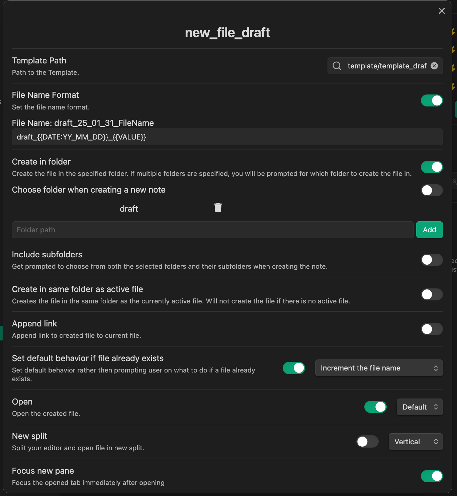
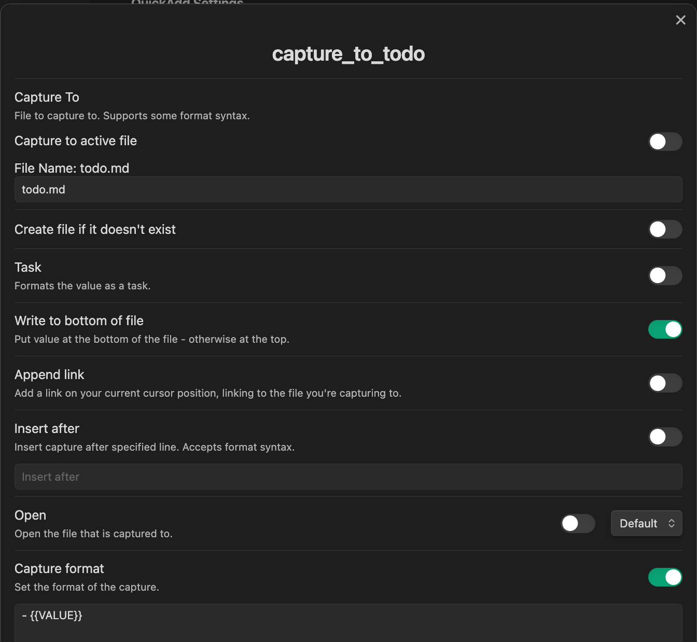

## 前言

[Github Repo: draft01_empty](https://github.com/YueLin301/draft01_empty)

用了很久的电脑，要记点东西
1. 要么就是随手记，
2. 要么是找半天分类再在专门的文件夹里创建md再记录
但是
1. 前者不好管理，记录的时候又担心之后找不到了，记录的欲望就低了
2. 后者是启动慢，有时候灵感就丢了或者来不及记了，记起来也很痛苦。本来用博客记，但是很多东西不好公开，而且预览也不直接
本来觉得时间小事但是长期下来发现这是个需要认真对待的问题，所以搞了个这个，主要的功能很简单轻量化：
- 集中记录的markdown的地方 + 复制图片随便放
- 快捷键
	- 快速创建文件、命名
	- 快速记录到指定位置
	- 只要键盘在手边，按两组快捷键就可以在想要的地方记录下东西

## Setting Backup

- It seems that the sync function provided is not free. So just save the `.obsidian` folder in the vault path for backing up.
	- Also save the template folder.
- Files and links
	- -> Default location for new attachments: In the folder specified below
	- -> `image`
- Appearance 
	- -> Accent color -> `(10, 164, 118)`
	- Translucent window -> Turn on
- Common hotkeys
	- `Control + 1`: Show file explorer
	- `Control + 2`: Toggle left sidebar
	- `Control + 3`: Toggle right sidebar
	- `Control + 4`: Show outline


## Open Obsidian Quickly by Automator

You can use **Automator** to create a shortcut that opens an app when you press a specific key combination.

### **Step 1: Open Automator**
1. Press `Command (⌘) + Space` to open **Spotlight Search**.
2. Type **"Automator"** and press **Enter** to launch it.

### **Step 2: Create a New Quick Action**
1. Click **"New Document"** when Automator opens.
2. Select **"Quick Action"** and click **"Choose"**.

### **Step 3: Configure the Quick Action**
1. **Set “Workflow receives” to "No input"**.
2. Ensure **"in" is set to "Any application"**.

### **Step 4: Add a Shell Script to Open the App**
1. In the **Library** panel on the left, search for **"Run Shell Script"**.
2. Drag **"Run Shell Script"** to the workflow area.
3. In the script text box, replace the default text with:
   ```sh
   open -a "Obsidian"
   ```
   *(Replace `"Obsidian"` with the name of the app you want to open.)*
4. Click **File → Save**, and name it something like **"Open Obsidian"**.

### **Step 5: Assign a Keyboard Shortcut**
1. Open **System Settings** (`Command (⌘) + Space` → Search "Keyboard" → Press Enter).
2. Go to **Keyboard Shortcuts**.
3. Select **"Services"** from the left panel.
4. Scroll down to find your newly created quick action (e.g., **"Open Obsidian"**).
5. Click **"Add Shortcut"** and press the key combination you want (e.g., `Command (⌘) + Option (⌥) + S`).


## draft01 Vault Settings

### Usage

1. Just write down everything I want/need to record
	1. Use tags e.g. `todo`, `reading_list`
2. Hotkeys
	1. `Command + Shift + s`: Toggle Live Preview/Source mode
	2. `Control + t`: QuickAdd capture_to_todo
	3. `Control + d`: QuickAdd new_file_draft
	4. `Control + b`: QuickAdd capture_to_buffer
	5. `Control + r`: QuickAdd capture_to_reading_list
	6. `Control + f`: QuickAdd capture_to_focus

### Plugins

1. Homepage
2. QuickAdd
3. Templater
4. Tasks (it can pick due date conveniently)

### Draft template

`/template/template_draft.md`


```
---
date: <% tp.date.now("YYYY-MM-DD HH:mm:ss ZZ") %>
tag:
  - draft
---

```


1. settings -> Community plugins -> QuickAdd
2. name: draft -> Add Choice -> Template: Template
3. click the flash -> click the gear
4. template path: `template/template_draft.md`


{: width="300" height="300" }


```
draft_{{DATE:YY_MM_DD}}_{{VALUE}}
```


Hotkeys -> Search `draft` -> `QuickAdd: new_file_draft`: `Control + d`

### Quick todo

`/todo.md`

```
---
tag:
  - todo
---

## 事件

- 申请 cooperative ai summer school

## 日期

- 1.31 ICML 截止
- 2.21 ML 作业截止

## 未分类

- test
```

1. settings -> Community plugins -> QuickAdd
2. name: todo -> Add Choice -> Template: Capture
3. click the flash -> click the gear

{: width="300" height="300" }

Hotkeys -> Search `todo` -> `QuickAdd: capture_to_todo`: `Control + t`


## Blog Vault Settings

1. `Control + d`: add draft
2. `Control + p`: add post