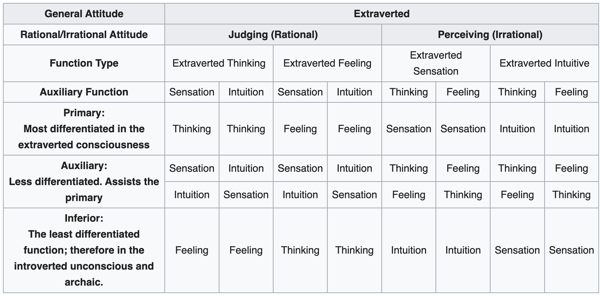
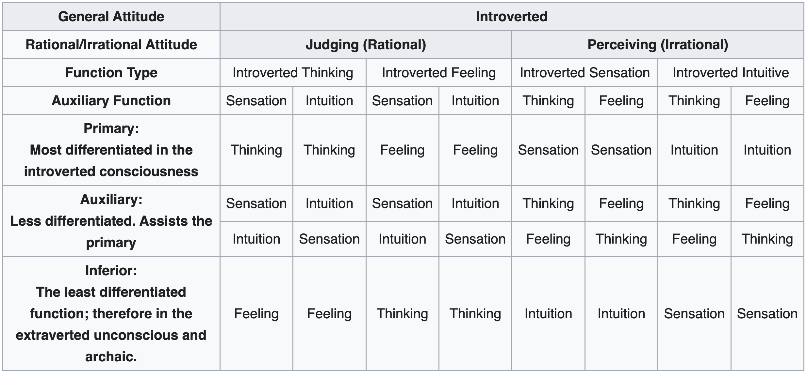
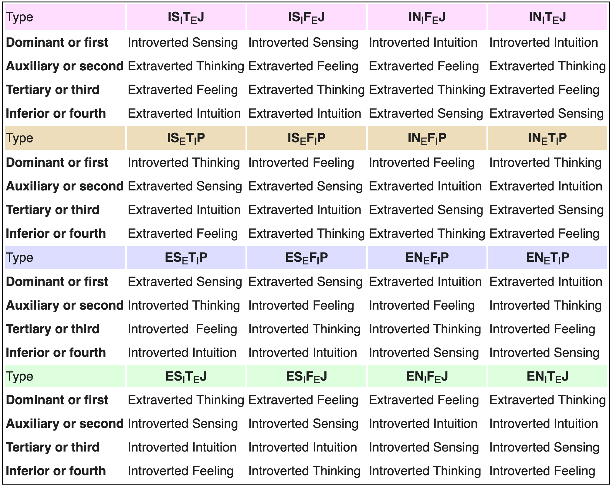
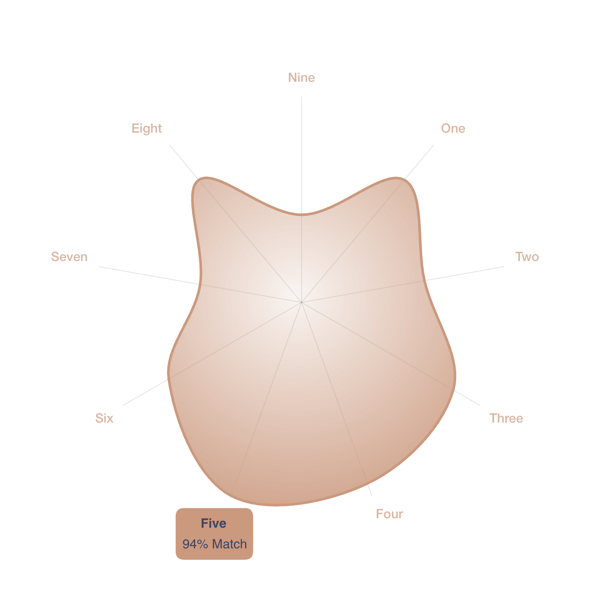

## Foreword

This post aims to briefly introduce three personality models: The Big Five, Myers-Briggs Type Indicator (MBTI), and Enneagram. The Big Five is generally well-regarded and supported by research in the psychology community, whereas the MBTI and Enneagram are viewed more critically, with concerns about their scientific validity and reliability.

But I believe that these tools are all efficient communication protocols, and using them allows me to easily introduce my profile.
Because if these models are common knowledge between me and my readers, then my test results will encapsulate a wealth of information about my behavioral habits and thought preferences.

After understanding these models, analyzing the characters in film and literary works will also yield many interesting new perspectives.

## Big Five Personality Test

The Big Five personality traits system is a widely accepted framework in psychology, consisting of five broad dimensions that describe human personality: 
- Openness (inventiveness and curiosity vs. consistency and caution), 
- Conscientiousness (efficiency and organization vs. easy-going and careless), 
- Extraversion (outgoing and energetic vs. solitary and reserved), 
- Agreeableness (friendly and compassionate vs. challenging and detached), and 
- Neuroticism (sensitive and nervous vs. secure and confident).

This model is empirically driven and is considered robust for understanding personality due to its extensive research base, cross-cultural validity, and ability to predict various life outcomes. It's praised for capturing the complexity of human personality traits in a comprehensive yet flexible manner.

### My test result

[[My test result in 2023]](https://bigfive-test.com/result/649d06c585aaa70008135b20): **SCOAI**.

|                        	| Abbr. 	| High 	| Low 	|
|------------------------	|-------	|------	|-----	|
| **Extraversion**           	| E     	| **S**    	| R   	|
| **Neuroticism**            	| N     	| L    	| **C**   	|
| **Conscientiousness**      	| C     	| **O**    	| U   	|
| **Agreeableness**          	| A     	| **A**    	| E   	|
| **Openness To Experience** 	| O     	| **I**    	| N   	|

| Openness To Experience (101) 	| Conscientiousness (96)        	| Agreeableness (76) 	| Neuroticism (67)        	| Extraversion (76)       	|
|------------------------------	|-------------------------------	|--------------------	|-------------------------	|-------------------------	|
| **Imagination (19)**         	| Self-Efficacy (16)            	| Trust (9)          	| Anxiety (14)            	| Friendliness (11)       	|
| Artistic Interests (15)      	| **Orderliness (18)**          	| Morality (15)      	| Anger (9)               	| Gregariousness (9)      	|
| Emotionality (16)            	| Dutifulness (13)              	| Altruism (14)      	| Depression (9)          	| Assertiveness (15)      	|
| **Adventurousness (17)**     	| **Achievement-Striving (17)** 	| Cooperation (15)   	| Self-Consciousness (12) 	| Activity Level (16)     	|
| **Intellect (20)**           	| Self-Discipline (16)          	| Modesty (10)       	| Immoderation (12)       	| Excitement-Seeking (14) 	|
| Liberalism (14)              	| Cautiousness (16)             	| Sympathy (13)      	| Vulnerability (11)      	| Cheerfulness (11)       	|

In the first row, each item has a full score of 120, while in the other rows, each item has a full score of 20.

> The detailed description of each dimension can be found in [[My Test Result in 2023]](https://bigfive-test.com/result/649d06c585aaa70008135b20).
{: .prompt-info}

<!-- > The following part of this section is to describe the 5 traits. The description is from [this website](https://bigfive-test.com/).
{: .prompt-info}

### **Extraversion**
Extraversion is marked by pronounced engagement with the external world.

#### Friendliness
Friendly people genuinely like other people and openly demonstrate positive feelings toward others. They make friends quickly and it is easy for them to form close, intimate relationships. Low scorers on Friendliness are not necessarily cold and hostile, but they do not reach out to others and are perceived as distant and reserved.

#### Gregariousness
Gregarious people find the company of others pleasantly stimulating and rewarding. They enjoy the excitement of crowds. Low scorers tend to feel overwhelmed by, and therefore actively avoid, large crowds. They do not necessarily dislike being with people sometimes, but their need for privacy and time to themselves is much greater than for individuals who score high on this scale.

#### Assertiveness
High scorers Assertiveness like to speak out, take charge, and direct the activities of others. They tend to be leaders in groups. Low scorers tend not to talk much and let others control the activities of groups.

#### Activity Level
Active individuals lead fast-paced, busy lives. They move about quickly, energetically, and vigorously, and they are involved in many activities. People who score low on this scale follow a slower and more leisurely, relaxed pace.

#### Excitement-Seeking
High scorers on this scale are easily bored without high levels of stimulation. They love bright lights and hustle and bustle. They are likely to take risks and seek thrills. Low scorers are overwhelmed by noise and commotion and are adverse to thrill-seeking.

#### Cheerfulness
This scale measures positive mood and feelings, not negative emotions (which are a part of the Neuroticism domain). Persons who score high on this scale typically experience a range of positive feelings, including happiness, enthusiasm, optimism, and joy. Low scorers are not as prone to such energetic, high spirits.

### **Neuroticism**
Neuroticism refers to the tendency to experience negative feelings.

#### Anxiety
The "fight-or-flight" system of the brain of anxious individuals is too easily and too often engaged. Therefore, people who are high in anxiety often feel like something dangerous is about to happen. They may be afraid of specific situations or be just generally fearful. They feel tense, jittery, and nervous. Persons low in Anxiety are generally calm and fearless.

#### Anger
Persons who score high in Anger feel enraged when things do not go their way. They are sensitive about being treated fairly and feel resentful and bitter when they feel they are being cheated. This scale measures the tendency to feel angry; whether or not the person expresses annoyance and hostility depends on the individual's level on Agreeableness. Low scorers do not get angry often or easily.

#### Depression
This scale measures the tendency to feel sad, dejected, and discouraged. High scorers lack energy and have difficulty initiating activities. Low scorers tend to be free from these depressive feelings.

#### Self-Consciousness
Self-conscious individuals are sensitive about what others think of them. Their concern about rejection and ridicule cause them to feel shy and uncomfortable around others. They are easily embarrassed and often feel ashamed. Their fears that others will criticize or make fun of them are exaggerated and unrealistic, but their awkwardness and discomfort may make these fears a self-fulfilling prophecy. Low scorers, in contrast, do not suffer from the mistaken impression that everyone is watching and judging them. They do not feel nervous in social situations.

#### Immoderation
Immoderate individuals feel strong cravings and urges that they have have difficulty resisting. They tend to be oriented toward short-term pleasures and rewards rather than long- term consequences. Low scorers do not experience strong, irresistible cravings and consequently do not find themselves tempted to overindulge.

#### Vulnerability
High scorers on Vulnerability experience panic, confusion, and helplessness when under pressure or stress. Low scorers feel more poised, confident, and clear-thinking when stressed.

### **Conscientiousness**
Conscientiousness concerns the way in which we control, regulate, and direct our impulses.

#### Self-Efficacy
Self-Efficacy describes confidence in one's ability to accomplish things. High scorers believe they have the intelligence (common sense), drive, and self-control necessary for achieving success. Low scorers do not feel effective, and may have a sense that they are not in control of their lives.

#### Orderliness
Persons with high scores on orderliness are well-organized. They like to live according to routines and schedules. They keep lists and make plans. Low scorers tend to be disorganized and scattered.

#### Dutifulness
This scale reflects the strength of a person's sense of duty and obligation. Those who score high on this scale have a strong sense of moral obligation. Low scorers find contracts, rules, and regulations overly confining. They are likely to be seen as unreliable or even irresponsible.

#### Achievement-Striving
Individuals who score high on this scale strive hard to achieve excellence. Their drive to be recognized as successful keeps them on track toward their lofty goals. They often have a strong sense of direction in life, but extremely high scores may be too single-minded and obsessed with their work. Low scorers are content to get by with a minimal amount of work, and might be seen by others as lazy.

#### Self-Discipline
Self-discipline-what many people call will-power-refers to the ability to persist at difficult or unpleasant tasks until they are completed. People who possess high self-discipline are able to overcome reluctance to begin tasks and stay on track despite distractions. Those with low self-discipline procrastinate and show poor follow-through, often failing to complete tasks-even tasks they want very much to complete.

#### Cautiousness
Cautiousness describes the disposition to think through possibilities before acting. High scorers on the Cautiousness scale take their time when making decisions. Low scorers often say or do first thing that comes to mind without deliberating alternatives and the probable consequences of those alternatives.

### **Agreeableness**
Agreeableness reflects individual differences in concern with cooperation and social harmony. Agreeable individuals value getting along with others.

#### Trust
A person with high trust assumes that most people are fair, honest, and have good intentions. Persons low in trust see others as selfish, devious, and potentially dangerous.

#### Morality
High scorers on this scale see no need for pretense or manipulation when dealing with others and are therefore candid, frank, and sincere. Low scorers believe that a certain amount of deception in social relationships is necessary. People find it relatively easy to relate to the straightforward high-scorers on this scale. They generally find it more difficult to relate to the unstraightforward low-scorers on this scale. It should be made clear that low scorers are not unprincipled or immoral; they are simply more guarded and less willing to openly reveal the whole truth.

#### Altruism
Altruistic people find helping other people genuinely rewarding. Consequently, they are generally willing to assist those who are in need. Altruistic people find that doing things for others is a form of self-fulfillment rather than self-sacrifice. Low scorers on this scale do not particularly like helping those in need. Requests for help feel like an imposition rather than an opportunity for self-fulfillment.

#### Cooperation
Individuals who score high on this scale dislike confrontations. They are perfectly willing to compromise or to deny their own needs in order to get along with others. Those who score low on this scale are more likely to intimidate others to get their way.

#### Modesty
High scorers on this scale do not like to claim that they are better than other people. In some cases this attitude may derive from low self-confidence or self-esteem. Nonetheless, some people with high self-esteem find immodesty unseemly. Those who are willing to describe themselves as superior tend to be seen as disagreeably arrogant by other people.

#### Sympathy
People who score high on this scale are tenderhearted and compassionate. They feel the pain of others vicariously and are easily moved to pity. Low scorers are not affected strongly by human suffering. They pride themselves on making objective judgments based on reason. They are more concerned with truth and impartial justice than with mercy.

### **Openness To Experience**
Openness to Experience describes a dimension of cognitive style that distinguishes imaginative, creative people from down-to-earth, conventional people.

#### Imagination
To imaginative individuals, the real world is often too plain and ordinary. High scorers on this scale use fantasy as a way of creating a richer, more interesting world. Low scorers are on this scale are more oriented to facts than fantasy.

#### Artistic Interests
High scorers on this scale love beauty, both in art and in nature. They become easily involved and absorbed in artistic and natural events. They are not necessarily artistically trained nor talented, although many will be. The defining features of this scale are interest in, and appreciation of natural and artificial beauty. Low scorers lack aesthetic sensitivity and interest in the arts.

#### Emotionality
Persons high on Emotionality have good access to and awareness of their own feelings. Low scorers are less aware of their feelings and tend not to express their emotions openly.

#### Adventurousness
High scorers on adventurousness are eager to try new activities, travel to foreign lands, and experience different things. They find familiarity and routine boring, and will take a new route home just because it is different. Low scorers tend to feel uncomfortable with change and prefer familiar routines.

#### Intellect
Intellect and artistic interests are the two most important, central aspects of openness to experience. High scorers on Intellect love to play with ideas. They are open-minded to new and unusual ideas, and like to debate intellectual issues. They enjoy riddles, puzzles, and brain teasers. Low scorers on Intellect prefer dealing with either people or things rather than ideas. They regard intellectual exercises as a waste of time. Intellect should not be equated with intelligence. Intellect is an intellectual style, not an intellectual ability, although high scorers on Intellect score slightly higher than low-Intellect individuals on standardized intelligence tests.

#### Liberalism
Psychological liberalism refers to a readiness to challenge authority, convention, and traditional values. In its most extreme form, psychological liberalism can even represent outright hostility toward rules, sympathy for law-breakers, and love of ambiguity, chaos, and disorder. Psychological conservatives prefer the security and stability brought by conformity to tradition. Psychological liberalism and conservatism are not identical to political affiliation, but certainly incline individuals toward certain political parties. -->

## Myers-Briggs Type Indicator (MBTI)

The Myers-Briggs Type Indicator (MBTI) is another popular personality framework, particularly in non-academic settings like business and career counseling. It categorizes people into 16 distinct personality types based on four dichotomies: 
- [**Introversion vs. Extraversion.**](https://www.16personalities.com/articles/mind-introverted-vs-extraverted) This dimension describes how individuals draw and expend their energy. Extraverts (E) are energized by interaction with others and the external world. They tend to be sociable, outgoing, and more comfortable in groups or social situations. Introverts (I), in contrast, are energized by spending time alone or in quiet environments. They are often reflective, reserved, and more comfortable working independently or in smaller groups. This preference doesn't necessarily determine social skills or shyness; it's more about where one gets their energy from.
- [**Sensing vs. Intuition.**](https://www.16personalities.com/articles/energy-intuitive-vs-observant) This dimension indicates how individuals prefer to gather information. People who prefer Sensing (S) focus on the present and concrete information gained from their senses. They are detail-oriented, practical, and prefer to deal with facts and real-world applications. Intuitive types (N), however, are more focused on possibilities and what might be. They enjoy thinking about the future, abstract concepts, and the big picture. They value imagination and innovation more than practical applications.
- [**Thinking vs. Feeling.**](https://www.16personalities.com/articles/nature-thinking-vs-feeling) This dimension describes how people prefer to make decisions. Thinkers (T) make decisions based on logic and objective analysis. They value principles, consistency, and impersonal truth, often focusing on the task rather than people. Feelers (F), on the other hand, are more concerned with harmony and the well-being of others. Their decisions are influenced more by personal values and the impact on people. They are empathetic, compassionate, and tend to prioritize relationships in their decision-making process.
- [**Judging vs. Perceiving.**](https://www.16personalities.com/articles/tactics-judging-vs-prospecting) This dimension relates to how individuals prefer to organize their lives. Judging types (J) like structure, firm decisions, and clear rules. They prefer planning and organizing their lives and tend to be decisive, efficient, and task-focused. Perceiving types (P), conversely, prefer to remain open to new information and options. They are more spontaneous, flexible, and adaptable. Perceivers are less structured and more comfortable adapting to changes and exploring various possibilities.

Furthermore, there is a fifth letter in some MBTI representations, such as "INTJ-T," originates from the 16Personalities framework and represents an additional dimension known as "Identity," which is not part of the original MBTI model. 
- [**Assertive vs. Turbulent.**](https://www.16personalities.com/articles/identity-assertive-vs-turbulent) This dimension is divided into "Assertive" (A) and "Turbulent" (T) traits. Assertive individuals are typically confident, relaxed, and resistant to stress, maintaining a stable level of emotional resilience. In contrast, Turbulent individuals are more likely to be self-conscious, sensitive to stress, and driven by a desire for improvement, often experiencing wider emotional fluctuations and a strong sense of ambition. This Assertive/Turbulent aspect, blending elements from the Big Five personality traits, adds another layer to personality assessment, offering a nuanced view of one's overall disposition and reaction to stress and change.

Developed from Carl Jung's theory of psychological types, MBTI is often used for personal development, career planning, and team building. However, it has faced criticism from the academic psychology community due to concerns about its scientific validity, reliability, and lack of empirical support, as people may receive different type designations upon retaking the test.

### My test result

[[My test result in 2023]](https://www.16personalities.com/profiles/8dc4f03308407): [**INTJ-T (The Turbulent Architect)**](https://www.16personalities.com/intj-personality).
  - Introverted, Intuitive, Thinking, Judging, and Turbulent;
  - Strategy: [Constant Improvement](https://www.16personalities.com/articles/strategies-constant-improvement);
  - Dominant (Jungian) Cognitive Functions: 
    [Introverted Intuition (Ni)](https://en.wikipedia.org/wiki/Jungian_cognitive_functions#Introverted_intuition) and 
    [Extraverted Thinking (Te)](https://en.wikipedia.org/wiki/Jungian_cognitive_functions#Extraverted_thinking).

### Jungian cognitive functions

The MBTI is heavily influenced by the theories of Swiss psychiatrist Carl Jung, particularly his concept of cognitive functions.

Jung proposed a theory of psychological types in his 1921 work "Psychological Types."
He introduced the concepts of introversion and extraversion as the main orientations of personality and added four psychological functions through which people experience the world: thinking, feeling, sensation, and intuition.
These functions could operate in either an extraverted or introverted mode, leading to a total of eight distinct functions in his theory.

> Cognitive functions, also referred to as psychological functions, as described by Carl Jung in his book Psychological Types, are particular mental processes within a person's psyche that are present regardless of common circumstance. This is a concept that serves as one of the foundations for his theory on personality type. In his book, he noted four main psychological functions: thinking, feeling, sensation, and intuition. He introduced them with having either an internally focused (introverted) or externally focused (extraverted) tendency which he called "attitudes". He also categorizes the functions as either rational (thinking and feeling) or irrational (intuition and sensation).
> — [Wikipedia](https://en.wikipedia.org/wiki/Jungian_cognitive_functions).

The MBTI was developed by Katharine Cook Briggs and her daughter Isabel Briggs Myers in the 1940s. They were influenced by Jung’s theory and sought to apply it in a more practical, accessible way.
While they retained Jung's basic concepts of extraversion/introversion and the four functions (thinking, feeling, sensing, and intuition), they added a new dimension: Judging vs. Perceiving. This was not explicitly part of Jung's original theory but was inferred from his descriptions of how people use their judging (thinking and feeling) and perceiving (sensing and intuition) functions.

In MBTI, the combination of Extraversion vs. Introversion with the four functions results in eight possible cognitive functions (e.g., extraverted thinking, introverted feeling, etc.).
These functions are used to determine the 16 MBTI types, with each type having a primary function that dominates their personality. The MBTI also considers secondary and tertiary functions in its personality descriptions, attempting to create a more holistic view of each personality type.
In summary, the MBTI is an adaptation and extension of Carl Jung's theory of cognitive functions. It maintains the core of Jung's ideas but simplifies and expands them to create a more structured and easily applicable personality typology. However, it's important to note that the MBTI's interpretation and application of Jung's theories are not without criticism, particularly from academic psychologists who question the MBTI's scientific validity and reliability.

_Table 1 from [Wikipedia](https://en.wikipedia.org/wiki/Jungian_cognitive_functions#Carl_Jung)._

_Table 2 from [Wikipedia](https://en.wikipedia.org/wiki/Jungian_cognitive_functions#Carl_Jung)._

_Table 3 from [Wikipedia](https://en.wikipedia.org/wiki/Jungian_cognitive_functions#Myers-Briggs_Type_Indicator_2)._

[**Introverted Intuition (Ni)**](https://en.wikipedia.org/wiki/Jungian_cognitive_functions#Introverted_intuition) is an information-gathering function, but unlike its counterpart, Extroverted Intuition, it processes information in a more internal and reflective manner. Individuals who primarily use Introverted Intuition tend to focus on the future, relying on insights and impressions rather than concrete facts. They often perceive patterns and connections that are not immediately obvious to others. Ni users are typically deep thinkers, valuing concepts, theories, and abstract ideas. They have a natural inclination towards understanding complex systems and are often driven by a vision or a sense of where things are heading. This introspective function can sometimes lead them to seem detached from the present, as they are more engaged with their internal world of ideas and possibilities.

[**Extroverted Thinking (Te)**](https://en.wikipedia.org/wiki/Jungian_cognitive_functions#Extraverted_thinking) is an extroverted function, meaning it is oriented towards the external world. Te is logical, systematic, and focused on organizing and structuring the environment. Individuals with a dominant Extroverted Thinking function are typically very good at setting goals, making plans, and implementing strategies. They prioritize efficiency, productivity, and are often drawn to positions of management or leadership due to their ability to make objective, logical decisions and to create order and consistency in their surroundings. Te users are practical and straightforward, preferring clear communication and measurable outcomes. They excel in taking complex ideas and organizing them in a way that is understandable and actionable, often thriving in environments where their skills in organization and leadership can be put to good use.

[**Introverted Feeling (Fi)**](https://en.wikipedia.org/wiki/Jungian_cognitive_functions#Introverted_feeling) is featured in the Myers-Briggs Type Indicator (MBTI). Fi is a decision-making function that is focused inwardly, dealing with emotions and values. Individuals who primarily use Introverted Feeling process their feelings internally and place a high emphasis on personal, often subjective, values and morals. They tend to be guided by these internal values when making decisions, rather than external sources of morality or societal expectations. Fi users are often very aware of their own emotions and seek to understand and align their actions with their inner sense of integrity and authenticity. This can make them seem reserved or private, as they prefer to reflect deeply on their feelings rather than express them openly. They are often empathetic and compassionate, with a strong sense of individualism and a deep commitment to living in harmony with their personal ethical code.

[**Extroverted Sensing (Se)**](https://en.wikipedia.org/wiki/Jungian_cognitive_functions#Extraverted_sensation) is a perceiving function that focuses on the external world, emphasizing the present moment and concrete sensory experience. Individuals with a dominant Extroverted Sensing function are typically very aware of their physical environment and enjoy engaging with it. They are often pragmatic and realistic, preferring direct interaction with the world around them. Se users tend to be action-oriented, enjoying activities that involve sensory stimulation and physical engagement. They are often adept at responding to immediate situations and can be very spontaneous and adaptable. This focus on the here and now can sometimes lead to a lesser emphasis on planning for the future or reflecting on the past. Extroverted Sensing is associated with a love for aesthetics, a keen awareness of their surroundings, and a preference for hands-on experiences.

## Enneagram

The Enneagram is a personality system that describes nine primary personality types, each with its own set of characteristics, motivations, fears, and desires. Its origins are more spiritual and mystical, tracing back to ancient traditions. The Enneagram has become popular in various self-help and spiritual contexts and is sometimes used in counseling for personal and relational growth. Despite its popularity in these areas, the Enneagram is viewed with skepticism by the mainstream psychology community due to its lack of empirical evidence and scientific grounding. Critics point out that its categories are too vague and subjective, making it difficult to validate and study scientifically.

[This website](https://www.enneagraminstitute.com/type-descriptions) provides a great introduction to the various types of the Enneagram.

### My test result

[[My test result in 2023]](https://personalitypath.com/enneagram/personality-test-result/?t=6565fb05b6e90&swcfpc=1): [**Type 5 with a 4-Wing**](https://www.enneagraminstitute.com/type-5).
  <!-- [Instincts](https://www.enneagrammer.com/the-three-instincts): SX/SP; -->

{: width="350" }
_My test result at [this website](https://personalitypath.com/enneagram/personality-test-result/?t=6565fb05b6e90&swcfpc=1)._

> **Fives (The Investigators)** are alert, insightful, and curious. They are able to concentrate and focus on developing complex ideas and skills. Independent, innovative, and inventive, they can also become preoccupied with their thoughts and imaginary constructs. They become detached, yet high-strung and intense. They typically have problems with eccentricity, nihilism, and isolation. At their Best: visionary pioneers, often ahead of their time, and able to see the world in an entirely new way.
>
> - **Basic Fear:** Being useless, helpless, or incapable
> - **Basic Desire:** To be capable and competent
> - **Enneagram Five with a Four-Wing:** "The Iconoclast"
> - **Enneagram Five with a Six-Wing:** "The Problem Solver"
> 
> **Key Motivations:** Want to possess knowledge, to understand the environment, to have everything figured out as a way of defending the self from threats from the environment.
>
> When moving in their Direction of Disintegration (stress), detached Fives suddenly become hyperactive and scattered at Seven. However, when moving in their Direction of Integration (growth), avaricious, detached Fives become more self-confident and decisive, like healthy Eights.
> 
> — From [this webpage](https://www.enneagraminstitute.com/type-5).

### Tritype
The tritype theory suggests that while individuals have a primary Enneagram type, they also exhibit significant characteristics of two other types.
These three types – one from each of the Enneagram's centers of intelligence (Heart/Feeling, Head/Thinking, Gut/Instinct) – combine to form a person's tritype. For example, someone could have a tritype of 4-7-1, meaning their primary type is in the Heart center (type 4), but they also strongly identify with a type in the Head center (type 7) and the Gut center (type 1).

My tritye is [548](https://wiki.personality-database.com/books/enneagram/page/458-the-scholar-archetype).

<!-- - [Fives (The Investigators)](https://www.enneagraminstitute.com/type-5) are perceptive, innovative, secretive, and isolated. They want to be capable and competent;
- [Fours (The Individualists)](https://www.enneagraminstitute.com/type-4) are expressive, dramatic, self-absorbed, and temperamental. They want to find themselves and their significance (to create an identity);
- [Eights (The Challengers)](https://www.enneagraminstitute.com/type-8) are self-confident, decisive, willful, and confrontational. They want to protect themselves (to be in control of their own life and destiny). -->

> **Fours (The Individualists)** are self-aware, sensitive, and reserved. They are emotionally honest, creative, and personal, but can also be moody and self-conscious. Withholding themselves from others due to feeling vulnerable and defective, they can also feel disdainful and exempt from ordinary ways of living. They typically have problems with melancholy, self-indulgence, and self-pity. At their Best: inspired and highly creative, they are able to renew themselves and transform their experiences.
> 
> **Basic Fear:** That they have no identity or personal significance
> **Basic Desire:** To find themselves and their significance (to create an identity)
> **Enneagram Four with a Three-Wing:** "The Aristocrat"
> **Enneagram Four with a Five-Wing:** "The Bohemian"
> 
> **Key Motivations:** Want to express themselves and their individuality, to create and surround themselves with beauty, to maintain certain moods and feelings, to withdraw to protect their self-image, to take care of emotional needs before attending to anything else, to attract a "rescuer."
>
> When moving in their Direction of Disintegration (stress), aloof Fours suddenly become over-involved and clinging at Two. However, when moving in their Direction of Integration (growth), envious, emotionally turbulent Fours become more objective and principled, like healthy Ones.
>
> — From [this webpage](https://www.enneagraminstitute.com/type-4).

> **Eights (The Challengers)** are self-confident, strong, and assertive. Protective, resourceful, straight-talking, and decisive, but can also be ego-centric and domineering. Eights feel they must control their environment, especially people, sometimes becoming confrontational and intimidating. Eights typically have problems with their tempers and with allowing themselves to be vulnerable. At their Best: self- mastering, they use their strength to improve others' lives, becoming heroic, magnanimous, and inspiring.
> 
> **Basic Fear:** Of being harmed or controlled by others
> **Basic Desire:** To protect themselves (to be in control of their own life and destiny)
> **Enneagram Eight with a Seven-Wing:** "The Maverick"
> **Enneagram Eight with a Nine-Wing:** "The Bear"
> 
> **Key Motivations:** Want to be self-reliant, to prove their strength and resist weakness, to be important in their world, to dominate the environment, and to stay in control of their situation.
> 
> When moving in their Direction of Disintegration (stress), self-confident Eights suddenly become secretive and fearful at Five. However, when moving in their Direction of Integration (growth), lustful, controlling Eights become more open-hearted and caring, like healthy Twos.
> 
> — From [this webpage](https://www.enneagraminstitute.com/type-8).