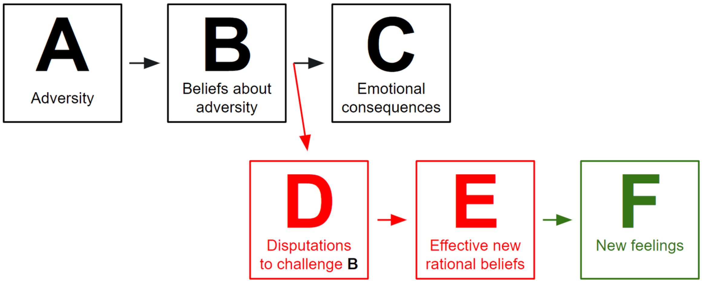

<!-- > This note aims to summarize the essence of this website ["Psychology Today"](https://www.psychologytoday.com/us/therapy-types/rational-emotive-behavior-therapy) -->

## Introduction

> Rational Emotive Behavior Therapy is a form of psychotherapy that helps you identify self-defeating thoughts and feelings, challenge the nature of irrational and unproductive feelings, and replace them with healthier, more productive beliefs.  
> — From the website ["Psychology Today"](https://www.psychologytoday.com/us/therapy-types/rational-emotive-behavior-therapy).

## Theoretical Assumptions

> The REBT framework posits that humans have both innate **rational** (meaning self-helping, socially helping, and constructive) and **irrational** (meaning self-defeating, socially defeating, and unhelpful) tendencies and leanings.  
> REBT claims that people to a large degree consciously and unconsciously construct emotional difficulties such as self-blame, self-pity, clinical anger, hurt, guilt, shame, depression and anxiety, and behavior tendencies like procrastination, compulsiveness, avoidance, addiction and withdrawal by the means of their irrational and self-defeating thinking, emoting and behaving.
> 
> REBT is then applied as an educational process in which the therapist often active-directively teaches the client how to identify irrational and self-defeating beliefs and philosophies which in nature are rigid, extreme, unrealistic, illogical and absolutist, and then to forcefully and actively question and dispute them and replace them with more rational and self-helping ones.  
> — From [Wikipedia](https://en.wikipedia.org/wiki/Rational_emotive_behavior_therapy#Theoretical_assumptions).

## A-B-C-D-E-F Model

_Illustration from [Wikipedia](https://en.wikipedia.org/wiki/Rational_emotive_behavior_therapy#A-B-C-D-E-F_Model)._

> The Bs, irrational beliefs that are most important in the A-B-C model are the explicit and implicit philosophical meanings and assumptions about events, personal desires, and preferences. The Bs, beliefs that are most significant are highly evaluative and consist of interrelated and integrated cognitive, emotional and behavioral aspects and dimensions. According to REBT, if a person's evaluative B, belief about the A, activating event is rigid, absolutistic, fictional and dysfunctional, the C, the emotional and behavioral consequence, is likely to be self-defeating and destructive. Alternatively, if a person's belief is preferential, flexible, and constructive, the C, the emotional and behavioral consequence is likely to be self-helping and constructive.
> 
> Through REBT, by understanding the role of their mediating, evaluative and philosophically based illogical, unrealistic and self-defeating meanings, interpretations and assumptions in disturbance, individuals can learn to identify them, then go to D, disputing and questioning the evidence for them. At E, effective new philosophy, they can recognize and reinforce the notion no evidence exists for any psychopathological must, ought or should and distinguish them from healthy constructs, and subscribe to more constructive and self-helping philosophies. This new reasonable perspective leads to F, new feelings and behaviors appropriate to the A they are addressing in the exercise.
> — From [Wikipedia](https://en.wikipedia.org/wiki/Rational_emotive_behavior_therapy#A-B-C-D-E-F_Model).

## My Understanding

We cannot ignore our feelings. Since the adversity has come true, the best thing we can do now is to adjust what we think to have positive feelings, and move on.