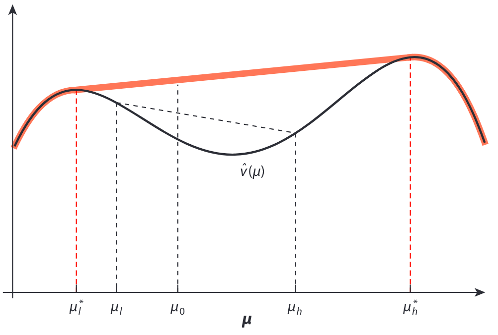

> It is not from the benevolence of the butcher, the brewer, or the baker, that we expect our dinner, but from their regard to their own interest. We address ourselves, not to their humanity but to their self-love, and never talk to them of our own necessities but of their advantages.  
> *— Adam Smith, The Wealth of Nations.*
 
## What is Information Design?

Communication does not just happen in fully cooperative scenarios. 
In some cases, the sender can persuade the receiver by "strategically deceiving", to increase its own expected payoff. 
Actually, "one quarter of gdp is persuasion." *(McCloskey & Klamer 1995)*.

Nontrivially, "successful partially deceiving" is a better equilibrium than "saying nothing" and "revealing all information".
Information design is the study of this persuasion. And Bayesian persuasion is a special case of information design, which consists of a sender and a receiver.

The problem of information design can be equivalently approached from various perspectives:
1. $\max_{\varphi} \mathbb{E}\_{s \sim \mu_0}\left[\mathbb{E}\_{\sigma \sim \varphi(\cdot\mid s)}\left[r^i(s,a^*(\sigma))\right]\right]$.
2. $\max_{\varphi} \mathbb{E}\_{\mu\sim\tau}\Big[\mathbb{E}\_{s\sim\mu}\big[r^i(s,a^*(\mu))\big]\Big]$, s.t. $\mathbb{E}\_{\mu\sim\tau}(\mu) = \mu_0$.
3. In a two-signal case: The sender manipulates the receiver's posterior beliefs (each corresponding to a sent signal) to find the **highest intersection point** of the line segment $(\mu_1 - \mu_2, \hat{v}_1 - \hat{v}_2)$ and $x = \mu_0$.
4. Denote the concavification of $\hat{v}(\mu) = \mathbb{E}\_{s\sim\mu}\big[r^i(s,a^{\*}(\mu))\big]$ as $f(\mu)$. The sender's optimal expected payoff is $f(\mu_0)$.
5. The sender select an optimal Bayes correlated equilibrium given an objective function.
6. $\max_{\varphi} \mathbb{E}\_{s \sim \mu_0}\left[\mathbb{E}\_{\sigma \sim \varphi(\cdot\mid s)}\left[r^i(s,a^*(\sigma))\right]\right]$, s.t. Obedience.

## Papers
The following part of this note is to summarize the essence of these papers:
1. [Bayesian Persuasion](https://www.aeaweb.org/articles?id=10.1257/aer.101.6.2590) *(Kamenica & Gentzkow 2011)*
2. An equilibrium perspective:
   1. [Correlated Equilibrium in Games with Incomplete Information](https://papers.ssrn.com/sol3/papers.cfm?abstract_id=1941708) *(Bergemann & Morris 2011a)*
   2. [Robust Predictions in Games with Incomplete Information](https://onlinelibrary.wiley.com/doi/abs/10.3982/ECTA11105) *(Bergemann & Morris 2011b)*
   3. [Bayes Correlated Equilibrium and the Comparison of Information Structures in Games](https://onlinelibrary.wiley.com/doi/abs/10.3982/TE1808) *(Bergemann & Morris 2016)*
3. Surveys:
   1. [Bayesian Persuasion and Information Design](https://www.annualreviews.org/doi/abs/10.1146/annurev-economics-080218-025739) *(Kamenica 2019)*
   2.  [Algorithmic Information Structure Design: A Survey](https://dl.acm.org/doi/abs/10.1145/3055589.3055591) *(Dughmi 2019)*
   3.  [Information Design: A Unifified Perspective](https://www.aeaweb.org/articles?id=10.1257/jel.20181489) *(Bergemann & Morris 2019)*

<!-- ## Notations
The notations in this note are adapted from the common RL papers.

| Meaning          | Symbol in this note | Symbol(s) in other papers |
| ---------------- | ------------------- | ------------------------- |
| state            | $s\in S$            | $\omega$,                 |
| signal (message) |                     |                           |
| action           |                     |                           | -->

## Timing
Consider a persuasion between a sender and a receiver (named as Bayesian persuasion). The timing of it is:
1. The sender chooses a signaling scheme $\varphi$. (Given a state $s$, $\varphi(\cdot \mid s)$ is a distribution of $\sigma$.)
2. The receiver observes this $\varphi$.
3. The environment generates a state $s$.
4. A signal $\sigma$ is sampled accroding to the commited $\varphi(\cdot\mid s)$.
5. The receiver calculates its posterior belief $\mu(\cdot \mid \sigma)$, and then chooses an action $a$ that maximizes $\mathbb{E}_{\mu}(r^j)$. (Thus the term Bayesian persuasion.)
6. The sender and the receiver get rewards $r^i(s,a)$ and $r^j(s,a)$, respectively.

 > The core of information design is to find the optimal signaling scheme $\varphi$ for the sender and to study the nature of this problem. But the sender's payoff is determined by the receiver's action, so it has to use its information advantage to influence the receiver's behavior (by designing $\varphi$), thereby indirectly optimizing its own expected payoff.
{: .prompt-tip }

## Important Examples
1. Recommendation Letter *(Example 2.1 in Dughmi 2019)*.
2. Courtroom *(The first example in Section 2.2 of Kamenica 2019)*.
3. Routing Game *(Example 3.2 in Dughmi 2019)* or [Braess's paradox](https://en.wikipedia.org/wiki/Braess%27s_paradox).

## Assumptions
1. The prior $\mu_0$ of states is common knowledge.
2. The receiver is self-interested.
   - The receiver has its objective function to optimize (In my understanding it does not need to be consistent with its epected environmental reward), and the sender wants to influence the receiver's behavior.
   - The sender's objective function does not need to be consistent with its environmental reward, e.g., it can be social welfare $r^i+r^j$. (In this way, the sender is altruistic.)
   - Anyway, there is no limit to the goals of the sender and the receiver. They may be fully cooperative, mixed motived or adversarial.
3. The receiver's strategy is based on Bayes' rule (i.e. Bayesian rational). (Timing 5)
4. **Commitment**: The sender will *honestly* commit a signaling scheme to the receiver *before* the interaction with the receiver. (Timing 1-2)
   - It is this that makes Bayesian persuasion (or information design) different from other communication models, e.g. cheap talk, verifiable message, signaling games. *(Kamenica 2019)*
   - Justifications:
      - Reputation
      - The signaling schemes are common knowledge, e.g., the sender (prosecutor) can choose investigative means (forensic tests, calling witness, etc.) to partially reveal the truth, which are public to everyone. *(Courtroom)*
      - (Justifications vary across applications. See *Section 2.2 in Kamenica 2019*)
5. An analysis analogues to the **revelation principle**: The optimal scheme needs no more signals than the number of states of nature.
   - Proof: probability simplex + Caratheodory's theorem. *(Dughmi 2019)*

## Simplification and Geometric Interpretations
### Reformulation
 - The receiver's strategy: 
   - Given a sent $\sigma$, its posterior belief is $\mu(\cdot\mid \sigma)$.
   - Then it chooses $a^{\*}(\sigma) = a^{\*}(\mu(\cdot\mid\sigma)) = \arg\max_{a}\mathbb{E}_{s\sim\mu(\cdot\mid\sigma)}\left[r^j(s,a)\right]$.
   - The mapping from signals to posterior beliefs is **many-to-one**: All the $\sigma$ that induce the same posterior belief $\mu(\cdot\mid \sigma)$, the receiver will behave the same way (thus the payoffs of both agents).

> "Making decisions based on the posterior beliefs" are always better than "making decisions based on the prior belief." Actually, the receiver's action policy is the Bayesian decision rule. Regarding Bayesian decision theory, [these slides](https://cse.buffalo.edu/~jcorso/t/CSE555/files/lecture_bayesiandecision.pdf) provide a very thorough introduction.
{: .prompt-info }

- The distribution of posterior beliefs $\tau$
   - **Every sent signal induces a specific posterior belief**: Given a committed signaling scheme $\varphi$ and a sent signal $\sigma$, the receiver's posterior belief is $\mu(\cdot\mid\sigma)$. Calculated as $\mu(s_i \mid\sigma) = \frac{\mu_0(s_i)\cdot \varphi(\sigma\mid s_i)}{\sum\limits_{s_j}\mu_0(s_j)\cdot \varphi(\sigma\mid s_j)}$. 
   - Again: The mapping from signals to posterior beliefs is **many-to-one**.
   - **A distribution of signals corresponds to a distribution of posterior beliefs**: Before the signal $\sigma$ realized, the receiver can only estimate its distribution by the committed signaling scheme: $\sigma\sim p^1\_{\mu_0, \varphi}(\cdot)  = \sum\limits\_{s}\mu_0(s)\cdot \varphi(\cdot\mid s)$. Then $\mu\sim p^2\_{\mu_0, \varphi}(\cdot) = \sum\limits\_{\sigma: \mu(\cdot\mid \sigma) = \mu}\sum\limits\_{s} \mu_0(s)\cdot\varphi(\sigma\mid s)$.
   - A $\tau$ induced by a $\varphi$ is denoted as $\tau\_{\mu_0,\varphi}$.
- The sender's optimization problem
   - Original optimization: $\max_{\varphi} \mathbb{E}\_{s\sim\mu_0}\Big[\mathbb{E}\_{\sigma\sim\varphi(\cdot\mid s)}\big[r^i(s,a^*(\sigma))\big]\Big]$.
   - Reformulation:
     - An equivalent objective function: $\mathbb{E}\_{\mu\sim\tau}\Big[\mathbb{E}\_{s\sim\mu}\big[r^i(s,a^*(\mu))\big]\Big]$.
     - The only contraint: $\mathbb{E}\_{\mu\sim\tau}(\mu) = \mu_0$. (i.e. $\tau = \tau_{\mu_0,\varphi}$. This is named as Bayes plausible. See the next subsection.)

> 每个signal会引起一个receiver的对state猜测的后验分布，这个对应关系是多对一的关系：可能有多个signal引起同一个receiver的后验分布。所以$\sum\_{\sigma: \mu(\cdot\mid \sigma) = \mu}$这个求和就是在做这件事，把所有引起$\mu$这个后验的$\sigma$的概率加起来。但其实这个用不到...看下列推导
{: .prompt-tip }

$$
\begin{aligned}
\mathbb{E}_{\mu\sim\tau_{\mu_0, \varphi}}(\mu) 
=& \sum\limits_{\mu} \mathbb{P}(\mu)\cdot \mu \\
=& \sum\limits_{\sigma} \mathbb{P}(\sigma) \cdot \mu(\cdot\mid\sigma) \\
=& \sum\limits_{\sigma} \mathbb{P}(\sigma) \cdot \frac{\mu_0(\cdot)\cdot \varphi(\sigma\mid\cdot)}{\mathbb{P}(\sigma)} \\
=& \sum\limits_{\sigma} \mu_0(\cdot)\cdot \varphi(\sigma\mid\cdot) \\
=& \mu_0(\cdot) \cdot \sum\limits_{\sigma} \varphi(\sigma\mid\cdot) \\
=& \mu_0(\cdot)
\end{aligned}
$$

<!-- % =& \sum\limits_{\sigma: \mu(\cdot\mid \sigma) = \mu} \mathbb{P}(\sigma) \cdot \mu(\cdot\mid\sigma) \\
% =& \sum\limits_{\mu} \sum\limits_{\sigma: \mu(\cdot\mid \sigma) = \mu}\sum\limits_{s} \mu_0(s)\cdot\varphi(\sigma\mid s) \cdot \mu(\cdot\mid \sigma) \\
% =& \sum\limits_{\mu} \sum\limits_{\sigma: \mu(\cdot\mid \sigma) = \mu}\sum\limits_{s} \mu_0(s)\cdot\varphi(\sigma\mid s) \cdot \frac{\mu_0(\cdot)\cdot \varphi(\sigma\mid \cdot)}{\sum\limits_{s'}\mu_0(s')\cdot \varphi(\sigma\mid s')} \\ -->

### Bayes Plausible
 > The sender's optimization problem can be approached from the perspective of **any arbitrary** distribution of induced posterior beliefs **that satisfies the Bayes plausible**.  
 Understanding this is important for grasping the concepts of geometric interpretation (concavification) in the next subsection.
{: .prompt-tip }

If an arbitrary $\tau$ satisfies $\mathbb{E}_{\mu\sim\tau}(\mu) = \mu_0$, then this $\tau$ is Bayes plausible. (Kamenica 2019)
- What is necessary and sufficient:
  - Every $\tau_{\mu_0,\varphi}$ (a $\tau$ induced by the $\varphi$) is Bayes plausible. (It can be proved by the law of iterated expectations. *Kamenica 2019*)
  - If a $\tau$ is Bayes plausible, then it can be induced by a $\varphi$. *(Kamenica 2019. Proved in Kamenica & Gentzkow 2011.)*
- A geometric interpretation: probability simplex *(Figure 2 of Dughmi 2019)*. 
  - A point in the probability simplex represents a distribution of singals (a convex combination of signals). 
  - The blue point is the prior belief. The red points are posterior beliefs. 
  - Bayes plausible = The blue point is inside the simplex of the red points.

### Concavification
 > Does the sender **benefit** from persuasion? What is an **optimal** mechanism?
{: .prompt-tip }

{:width="500"}
_Figure 1 of Kamenica & Gentzkow 2011, Kamenica 2019. Sender’s value function and its concavification (thick red line)._

This technique is best described with a **two-signal** example *(Figure 1 of Kamenica & Gentzkow 2011, Kamenica 2019)*:
- Assume that there are $n$ states. Then a posterior belief $\mu$ is a point in $\mathbb{R}^{n-1}$. *(2011)*
- The values of $x$-axis are in $\mathbb{R}^{n-1}$. Each represents a posterior belief $\mu$. *(2011)*
- A $\mu$ induces an expected payoff of the sender $\hat{v}(\mu) = \mathbb{E}\_{s\sim\mu}\big[r^i(s,a^{\*}(\mu))\big]$. The black line in the figure denotes this function. *(2011,2019)*
- $\sigma_1$ and $\sigma_2$ induce posterior beliefs $\mu_1(\cdot\mid\sigma_1)$ and $\mu_2(\cdot\mid\sigma_2)$ respectively. These two $\mu$ correspond to two values on the $x$-axis, and indicate two expected payoff of the sender $\hat{v}_1$ and $\hat{v}_2$. *(2019)*
- $\mu_1$ and $\mu_2$ are **almost arbitrary**: The distribution of $\mu_1$ and $\mu_2$ should be Bayes plausible, i.e., their expectation should be $\mu_0$. 
  - Assume that the distribution of $\mu$ is $\tau = (k, 1-k)$. Then $k\cdot\mu_1+(1-k)\cdot\mu_2 = \mu_0$. Thus if $\mu_{i}$ is on the left side of $\mu_0$ on the $x$-axis, then $\mu_{1-i}$ is on the right side. Unless they both coincide with $\mu_0$.
  - Also, $\mathbb{E}\_{\mu\sim\tau}(\hat{v}(\mu)) = k\cdot \hat{v}_1+(1-k)\cdot\hat{v}_2$, which is the sender's expected payoff (obejective). It means that: When the receiver's posterior beliefs are $\mu_1,\mu_2$ (after receiving $\sigma_1, \sigma_2$ respectively), the sender will gets $\mathbb{E}\_{\mu\sim\tau}(\hat{v}(\mu))$.
  - Since the coordinates are proportional, connecting $(\mu_1, \hat{v}_1)$ and $(\mu_2, \hat{v}_2)$ to get a line segment $l$, $(\mu_0, \mathbb{E}\_{\mu\sim\tau}(\hat{v}(\mu)))$ is on $l$. In this way, the sender needs to manipulate the receiver's posterior beliefs to find the **highest intersection point**.
- A concavification of $\hat{v}(\mu)$ is the smallest concave function everywhere greater than $\hat{v}(\mu)$. *(The red line in Figure 1 of 2011, 2019)*
  - The concavification of $\hat{v}(\mu)$ evaluated at $\mu_0$ equals $\max\set{y\mid(\mu_0, y)\in co(\hat{v})}$, where $co(\hat{v})$ denotes the convex hull of the graph of $\hat{v}$, i.e., the light blue region in Figure 1 of 2011.

- In this case, a signaling scheme with more than two signals cannot improve the sender’s expected payoff. *(Kamenica 2019)*

> 简单再理一遍，就是说
> - 现在有两个signal，所以对应有两个后验分布；两个signal意味着横坐标上两个点，这两个点在横坐标上可以任意动，想象我们抓着这俩点左右晃动，然后有两根长长的棍子往上指
> - 这两个signal会各自对应一个收益期望，就是这个点对应的函数线上的点的纵坐标，就是那两根棍子指到的点的纵坐标
> - 约束是取$\tau_{\mu_0,\varphi}$，意味着这两个横坐标要取两个系数让它加权后（就是期望）等于$\mu_0$，系数记为$(k_1, k_2)$
> - 那么纵坐标也取这个系数之后，其实我们根据几何关系可以知道是line segment，就是“我们那两根棍子指到的点的连线”和“$x=\mu_0$”的交点，的那个纵坐标，就是当前我们手的两个横坐标profile的收益期望
> - 现在我们就是要晃动我们的手，使得这个交点最大，那么就是找凸包和$x=\mu_0$”的交点就行了，这个晃一晃就懂了
{: .prompt-tip }

### Corollaries and propositions

*(Kamenica & Gentzkow 2011)*:

- Corollary 1: **The sender benefits from persuasion if and only if** there exists a Bayes plausible distribution $\tau$ of posterior belief $\mu$ such that $\mathbb{E}\_{\mu\sim\tau}\Big[\mathbb{E}\_{s\sim\mu}\big[r^i(s,a^{\*}(\mu))\big]\Big] > \mathbb{E}\_{s\sim\mu_0}\big[r^i(s,a^{\*}(\mu_0))\big]$. **The sender's optimal expected payoff is** $\max_{\varphi} \mathbb{E}\_{\mu\sim\tau}\Big[\mathbb{E}\_{s\sim\mu}\big[r^i(s,a^*(\mu))\big]\Big]$, s.t. $\mathbb{E}\_{\mu\sim\tau}(\mu) = \mu_0$.
- Corollary 2: **The sender benefits from persuasion if and only if** $f(\mu_0)>\hat{v}(\mu_0)$, where $\hat{v}(\mu) = \mathbb{E}\_{s\sim\mu}\big[r^i(s,a^{\*}(\mu))\big]$, and $f(\mu)$ is the concavification of $\hat{v}(\mu)$. **The sender's optimal expected payoff is** $f(\mu_0)$.
- Proposition 2: If $\hat{v}(\mu)$ is **concave**, the sender **does not benefit** from persuasion for any prior $\mu_0$. If $\hat{v}(\mu)$ is **convex and not concave**, the sender benefits from persuasion for every prior $\mu_0$.
- Proposition 3: If there is **no information** the sender would share, the sender **does not benefit** from persuasion.
  - *"There is information the sender would share"* is defined as $\exists \mu$, s.t. $\hat{v}(\mu)> \sum\limits_{s} \mu(s)\cdot r^i(s, a^{\*}(\mu_0))$.
  - In other words, there must exist a $\mu$ such that, if the sender had private information that led it induces $\mu$, it would prefer to share this information with the receiver rather than have the receiver act based on $\mu_0$.
  - Otherwise, the sender does not have the motivation to share its information.
- Proposition 4: If there is information the sender would share, and the receiver's preference is discrete at the prior, the sender **benefits** from persuasion. (sufficient)
  - "The receiver's preference is discrete at belief $\mu$" is defined as: If there is an $\epsilon>0$ s.t. $\forall a\ne a^{\*}(\mu)$, $\sum\limits_{s}\mu(s)\cdot r^j(s, a^{\*}(\mu)) > \sum\limits_{s} \mu(s)\cdot r^j(s, a)+\epsilon$.
  - In other words, the receiver’s expected payoff from its preferred action $a^{\*}(\mu)$ is bounded away from its expected payoff from any other action.
  - Otherwise, the sender does not have the ability to influence the receiver.
- Proposition 5: If $A$ is finite, the receiver’s preference is discrete at the prior generically.
- Proposition 7: An optimal mechanism exists.
- Proposition 8: For any prior, 
  - if $\hat{v}(\mu)$ is (strictly) concave, no disclosure is (uniquely) optimal;
    - no disclosure: $\mu = \mu_0$.
  - if $\hat{v}(\mu)$ is (strictly) convex, full disclosure is (uniquely) optimal;
    - full disclosure: $\mu(\cdot\mid\sigma)$ is degenerate for all $\sigma$ sent in equilibirum. $\mu$ is degenerate if there is $s$ s.t. $\mu(s) = 1$.
  - if $\hat{v}(\mu)$ is convex and not concave, strong disclosure is (uniquely) optimal.
    - strong disclosure: $\mu$ is at the boundary of $\Delta(s)$ for all $\sigma$ sent in equilibirum. (?)

*(Dughmi 2019)*:
  - If reward functions are identical (i.e. $r^i = r^j$), then the sender's objective function is convex. The optimal signaling scheme is to reveal all the information.
  - If $(r^i+r^j)(s,a) = k, \forall s,a$, where $k \in \mathbb{R}$, then the sender's objective function is concave. The optimal signaling scheme is to reveal nothing (In this case, $\mu = \mu_0$). 

---

## An Equilibrium Perspective
*(Bergemann & Morris 2016)*

<!-- ### Settings
- A game of incomplete information can be decomposed into **a basic game** and **an information structure**.
  - The basic game defines the set of actions, the set of payoff states, the payoff functions, and the common prior over the payoff states.
  - The information structure refers to the signals that the players receive in the game.
- An incomplete information game $\mathcal{G} = (G, M)$.
  - A basic game $G = ((A^j, r^j)_{j=1}^{J}, \mu_0)$.
    - $A = \prod_{j} A^j$.
    - $r^j: S\times A \to \mathbb{R}$.
    - $\mu_0 \in \Delta_{++}(S)$.
  - An information structure $M = ((\Sigma^j)_{j=1}^{J}, \varphi)$.
    - Signal (type) $\Sigma = \prod_{j} \Sigma^j$.
    - Signaling scheme $\varphi: S \to \Delta(\Sigma)$.
- A decision rule $\xi: S\times \Sigma \to \Delta(A)$
  - There is an omniscient mediator, who first observes the sampled $s\sim\mu_0$ and the sampled $\sigma\sim\varphi(\cdot\mid s)$, and then picks actons and privately announces $a^j$ to each receiver $j$.
- A policy (behavioral strategy) for receiver $j$ in $(G, M)$ is $\pi^j: \Sigma^j \to \Delta(A^j)$. -->

### Settings in my understanding
 > This paper studies the persuasion of **a group of receivers** with **private channels**.
{: .prompt-tip }
- A game of incomplete information can be decomposed into **a basic game** and **an observation structure** (or information structure).
  - The "omniscient mediator" is the sender. And players are the receivers.
  - The basic game defines the set of actions, the set of payoff states, the payoff functions, and the common prior over the payoff states.
  - The observation structure refers to the **function of partial observations** that the players receive in the game.
- An incomplete information game $\mathcal{G} = (G, M)$.
  - A basic game $G = ((A^j, r^j)_{j=1}^{J}, \mu_0)$.
    - $A = \prod_{j} A^j$.
    - $r^j: S\times A \to \mathbb{R}$.
    - $\mu_0 \in \Delta_{++}(S)$.
  - An observation structure $M = ((O^j)_{j=1}^{J}, q)$.
    - Partial observation (type) $O = \prod_{j} O^j$.
    - Emission function $q: S \to \Delta(O)$.
    -  A possible (and natural) observation structure is the null observation structure in which each player’s set of ovservations (tyes) $O^j$ is a singleton, $O^j = \set{t^j}$.
- A signaling scheme (decision rule) $\varphi: S\times O \to \Delta(A)$.
  - There is an omniscient mediator, who first observes the sampled $s\sim\mu_0$ and the sampled $o\sim q(\cdot\mid s)$, and then picks actons and privately announces $a^j$ to each receiver $j$.
- A policy (behavioral strategy) for receiver $j$ in $(G, M)$ is $\pi^j: O^j \to \Delta(A^j)$.
  

### Obedience & BCE
A decision rule $\varphi$ is **obedient** for $(G, M)$ if, for each $j = 1, \ldots, J$, $o^j\in O^j$, and $a^j\in A^j$, we have

$$
\begin{aligned}
  & \sum\limits_{s, o^{-j}, a^{-j}} \mu_0(s) 
  \cdot q\Big((o^j, o^{-j})\mid s \Big) 
  \cdot \varphi\Big( (a^j, a^{-j})\mid s, (o^j, o^{-j}) \Big)
  \cdot r^j\Big(s, (a^j, a^{-j})\Big) \ge \\
  & \sum\limits_{s, o^{-j}, a^{-j}} \mu_0(s) 
  \cdot q\Big((o^j, o^{-j})\mid s \Big) 
  \cdot \varphi\Big( (a^j, a^{-j})\mid s, (o^j, o^{-j}) \Big)
  \cdot r^j\Big(s, (a^{j\prime}, a^{-j})\Big)
\end{aligned}
$$

for all $a^{j\prime}\in A^j$.

> The definitions of obedience in *(Bergemann & Morris 2011a, 2011b)* is a bit different from this.
{: .prompt-info }

A decision rule $\varphi$ is a **Bayes correlated equilibrium (BCE)** of $(G,M)$ if it is obedient for $(G,M)$.

> In my understanding, it can be seen that: 
> - The receiver still makes decisions based on its calculated posterior beliefs after receiving the messages. 
> - When the sender's signaling scheme satisfies the obedience constraints, then the receiver's best responses to its calculated posterior beliefs are exactly the sender's recommendations.
>
> The receiver calculating the posteriror beliefs still needs the commitment assumption.
{: .prompt-tip }

### Degenerated BCE

1. There is complete information, i.e., if $S$ is a singleton: this definition reduces to the definition of correlated equilibrium (CE) for a complete information game. *(Aumann 1987)*
2. If $M$ is the null observation function (a singleton), then this is essentially the “universal Bayesian solution” of *(Forges 1993)*.  

    A decision rule $\varphi$ is **obedient** for $(G)$ if, for each $j = 1, \ldots, J$ and $a^j\in A^j$, we have

    $$
    \begin{aligned}
      & \sum\limits_{s, a^{-j}} \mu_0(s) 
      \cdot \varphi\Big( (a^j, a^{-j})\mid s \Big)
      \cdot r^j\Big(s, (a^j, a^{-j})\Big) \ge \\
      & \sum\limits_{s, a^{-j}} \mu_0(s) 
      \cdot \varphi\Big( (a^j, a^{-j})\mid s \Big)
      \cdot r^j\Big(s, (a^{j\prime}, a^{-j})\Big)
    \end{aligned}
    $$

    for all $a^{j\prime}\in A^j$.

3. If $M$ is the null observation function, and if there is only one receiver, then this definition reduces to behavior in the concavification problem of *(Aumann et al. 1995)* and the Bayesian persuasion of *(Kamenica & Gentzkow 2011)*.

    A decision rule $\varphi$ is **obedient** for $(G)$ if, for each $a\in A$, we have

    $$
    \sum\limits_{s} \mu_0(s) 
    \cdot \varphi( a\mid s )
    \cdot \Big( r^j(s, a) - r^j(s, a') \Big) \ge 0
    $$

    for all $a^{\prime}\in A$.

> Why is it called obedience? Why do the receivers follow the recommendation?
{: .prompt-tip }

*(Bergemann & Morris 2019)*

$$
\begin{aligned}
  & \Leftrightarrow
  \sum\limits_{s} \frac{\mu_0(s) \cdot \varphi( a\mid s )}
  { \sum\limits_{s'}\mu_0(s') \cdot \varphi( a\mid s')}
  \cdot \Big( r^j(s, a) - r^j(s, a') \Big) \ge 0 , \forall a'\in A.\\
  & \Leftrightarrow
  \sum\limits_{s} \mu(s\mid a)
  \cdot \Big( r^j(s, a) - r^j(s, a') \Big) \ge 0 , \forall a'\in A.
\end{aligned}
$$  

### BNE
A strategy profile (joint policy) $\pi$ is a **Bayes Nash equilibrium (BNE)** of $(G, M)$ if for each $j = 1 , \ldots, J$, $\sigma^j\in\Sigma^j$, and $a^j\in A^j$ with $\pi^j(a^j \mid o^j) > 0$, we have

$$
\begin{aligned}
  & \sum\limits_{s, o^{-j}, a^{-j}} \mu_0(s) 
  \cdot q\Big((o^j, o^{-j})\mid s \Big) 
  \cdot \Bigg( \prod_{j \ne k} \pi^k(a^k \mid o^k) \Bigg)
  \cdot r^j\Big(s, (a^j, a^{-j})\Big) \ge \\
  & \sum\limits_{s, o^{-j}, a^{-j}} \mu_0(s) 
  \cdot q\Big((o^j, o^{-j})\mid s \Big) 
  \cdot \Bigg( \prod_{j \ne k} \pi^k(a^k \mid o^k) \Bigg)
  \cdot r^j\Big(s, (a^{j\prime}, a^{-j})\Big)
\end{aligned}
$$

for all $a^{j\prime}\in A^j$.

---

> The following part has not been finished yet.
{: .prompt-warning }

---

## Extensions
1. Multiple senders
2. Multiple receivers
3. Dynamic environment
4. Others:
   1. The receiver has private information

## An Ethical Justification
I do not think information design is immoral. Information is a kind of property of the sender, and it is legal for it to profit from its information. (Unless the utilized information is a public resource.)  
Furthermore, in those cases where the sender can improve its own expected payoff through information design, the receiver's payoff is not worse than that of the sender not reveal information at all.  
Nevertheless, practice use of information design should take the sender's objective function into some serious consideration.
{: .prompt-tip }

> Disclaimer: The above content is summarized from the mentioned papers. Corresponding links or references have been provided.
{: .prompt-danger }