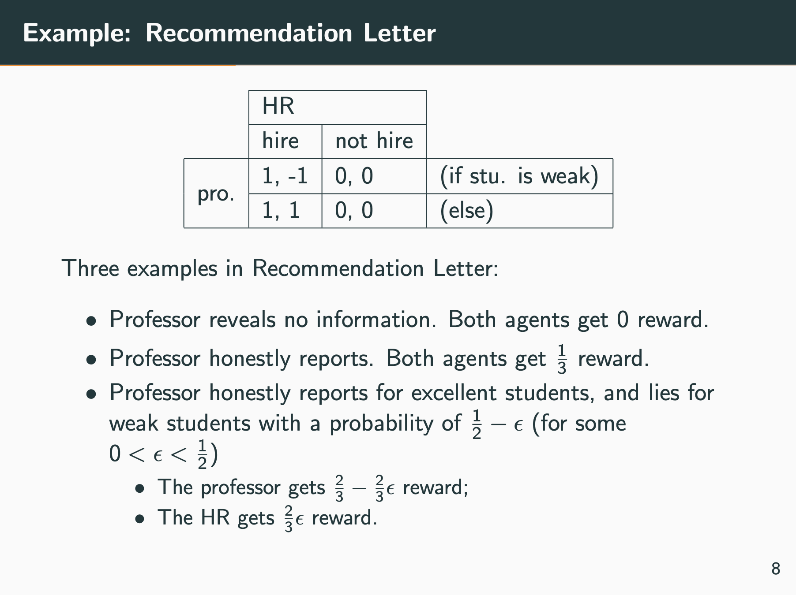

> This note provides a brief introduction to the basic concepts of information design. More details can be found in [my other note on this topic]({{site.baseurl}}/posts/Information-Design/).
{: .prompt-info }

## A Brief Introduction

> "Sometimes, the truth is not good enough." *— Batman, The Dark Knight (2008).*

Information design focuses on scenarios of **mixed-motive** unidirectional communication, where one self-interested sender with informational advantage attempts to **persuade** a self-interested rational receiver to take actions that the sender prefers.

- The **"informational advatage"** means that the sender has something that the receiver wants to know (i.e. which affects the receiver's payoff) but cannot know, 
- **"self-interested"** refers to the agent being concerned only about its own expected payoff, and 
- **"rational"** means that when it believes one action's payoff is greater than another's, the agent will choose the action with higher expected payoff.

Additionally, information design with a sender and a receiver is known as Bayesian persuasion. And the flow of an one-step Bayesian persuasion process is as follows:
1. The sender commits a signaling scheme to the receiver. The receiver will use this to calculate its posterior expected payoff. (This is referred to as the **commitment assumption**.);
2. The nature generates a state $s$. The sender observes the state $s$ and then samples a message according to the distribution of the committed signaling scheme; and
3. Receiving the message, the receiver calculates a posterior and chooses an optimal action for itself. Given the current state and the receiver's chosen action, the sender and the receiver get rewards from the nature.

The key to the sender successfully persuading a receiver with whom it has an interest conflict lies in **obedience constraints**. To introduce it, let's simplify the problems first.

Assuming that the sender's signal set is equal to the receiver's action set, the sender's signals can be interpreted as recommending the receiver to take a specific action. This common assumption is without loss of generality according to the **revelation principle**, i.e., there is an optimal signaling scheme that does not require more signals than the number of actions available to the receiver. 

Under this premise, **obedience constraints** can be formalized as:

$$
\sum\limits_{s} \mu_0(s) 
  \cdot \varphi( a\mid s )
  \cdot \Big( r^j(s, a) - r^j(s, a') \Big) \ge 0,
$$

where $s\in S$ is the state which is only observable by the sender, $\mu_0$ is a prior distribution which is a common knowledge (both know, both know both know, etc.), $a\in A$ is the receiver's action space, $\varphi$ is the sender's signaling scheme, and $r^j$ is the receiver's reward function that depends on the state and the receiver's chosen action.

**The obedience constraints ensure that the receiver will definitely follow the sender's recommendations.** A simple derivation is as follows: 

$$
\begin{aligned}
  & \sum\limits_{s} \mu_0(s) 
  \cdot \varphi( a\mid s )
  \cdot \Big( r^j(s, a) - r^j(s, a') \Big) \ge 0 \\
  \Leftrightarrow &
  \sum\limits_{s} \frac{\mu_0(s) \cdot \varphi( a\mid s )}
  { \sum\limits_{s'}\mu_0(s') \cdot \varphi( a\mid s')}
  \cdot \Big( r^j(s, a) - r^j(s, a') \Big) \ge 0 , \forall a'\in A.\\
  \Leftrightarrow &
  \sum\limits_{s} \mu(s\mid a)
  \cdot \Big( r^j(s, a) - r^j(s, a') \Big) \ge 0 , \forall a'\in A.\\
  \Leftrightarrow &
  \sum\limits_{s} \mu(s\mid a)
  \cdot r^j(s, a)  \ge 
  \sum\limits_{s} \mu(s\mid a)
  \cdot r^j(s, a'), \forall a'\in A.
\end{aligned}
$$

where $\mu$ represents the posterior probability. Therefore, a self-interested and rational receiver will definitely follow the sender's recommendations, because the posterior expected payoff of the action recommended by the sender is greater than or equal to the posterior expected payoffs of all other actions. 

This greatly simplifies the problem, allowing **the sender to choose the receiver's action that maximizes its expected payoff, while ensuring that the receiver obeys, and then recommend the receiver to take that action.** Thus, the specific representation of the sender's optimization goal is:

$$
\begin{aligned}
\max\limits_{\varphi} \mathbb{E}_{\varphi}[\ r^i(s, a) \ ],\;\;\textrm{s.t. Obedience Constraints.}
\end{aligned}
$$

---

> The estimated 10 minutes in the title does not include the following part :)
{:.prompt-tip}

## Examples

### Recommendation Letter

> [Algorithmic Information Structure Design: A Survey](https://dl.acm.org/doi/abs/10.1145/3055589.3055591) *(Dughmi 2019)*

> The following analysis is from Appendix F of my paper ["Information Design in Multi-Agent Reinforcement Learning."](https://arxiv.org/abs/2305.06807)

To better understand the information design problem, we illustrate it with an example of $\texttt{Recommendation Letter}$ and its Bayesian persuasion solution. 
In the example, a professor will write recommendation letters for a number of graduating students, and a company's human resources department (HR) will receive the letters and decide whether to hire the students. 
The professor and the HR share a prior distribution of the candidates' quality, with a probability of $1/3$ that the candidate is strong and a probability of $2/3$ that the candidate is weak. 
The HR does not know exactly what each student's quality is but wants to hire strong students, while the letters are the only source of information. 
The HR will get a reward of $1$ for hiring a strong candidate, a penalty of $-1$ for hiring a weak candidate, and a reward of $0$ for not hiring. 
The professor gets a $1$ reward for each hire. 
There are three types of outcomes between the professor and the HR:

- Since there are more weak students than strong students, the HR tends not to hire anyone if the professor does not write letters. 
- If the professor honestly reports the qualities of the students, then the HR will accurately hire those strong candidates. 
Then their payoff expectations are both $1/3$;
- The professor reports the qualities of the strong students honestly and lying with a probability of $$(1/2-\epsilon)$$ for weak students, for some arbitrarily small $\epsilon$. The optimal policy of HR is to respect the professor's recommendations. In this way, the professor's and the HR's payoff expectations are $$(2/3-2\epsilon/3)$$ and $$2\epsilon/3$$, respectively.

The critical insight from the example is that the information provider (the professor) needs to "lie" about its information to get the best interest.  
This lie, meanwhile, must still reveal part of the truth so that the information receiver (the HR) respects the information because it will benefit from the posterior belief in its best interest. 
The condition that the receiver benefits from the message is known as the **obedience constraints** in information design, which implies the incentive compatibility of the receiver.
The sender must subtly balance the benefits of both parties under this condition and carefully design the information to be sent.

It is easy to analyze that HR can only make decisions based on the prior probability distribution if the professor does not write a recommendation letter, and its best policy is to refuse to hire any student. 
In this way, the professor and the HR payoffs are both $0$, which is obviously a bad situation for both parties. 
If the professor tells the HR the student's quality honestly (i.e., the professor gives up its informational advantage), then the best strategy for the HR is to hire strong students and not weak students. In the case of the honest signaling scheme, the payoff expectations of the professor and the HR are $1/3$.

The professor can change its signaling scheme to make its payoff expectation higher, which is exactly the primary concern of information design. 
- If the current student is strong, the professor will report it honestly; otherwise, the professor tells the HR that it is strong with a probability of $$(1/2-\epsilon)$$, where $$\epsilon\in (0,1/2]$$. This means $$\varphi(\sigma=1\mid s=0)=(1/2-\epsilon)$$. 
- When HR heard the professor say this was a weak student, it knew the student must be weak. So it would refuse to hire her. 
    <!-- - $$P(\sigma=0)=\sum\limits_{s}\mu_0(s)\cdot \varphi(\sigma=0\mid s) = P(s=1, \sigma=0) + P(s=0,\sigma=0) = 1/3 \times 0 + 2/3 \times(1- (1/2-\epsilon)) = 1/3 +2/3\epsilon$$ -->
    - $\mu(s=0\mid \sigma=0) = \frac{P(s=0,\sigma=0)}{P(s=1, \sigma=0) + P(s=0,\sigma=0)} =\frac{P(s=0,\sigma=0)}{1/3 \times 0 + P(s=0,\sigma=0)} = 1$
- And the HR can calculate that $1/3$ of the students are strong $$P(s=1, \sigma=1)=1/3$$, and the professor will call them strong, and $$(1/3-2\epsilon/3)$$ of students are weak, but the professor will call them strong still $$P(s=0, \sigma=1)=(1/3-2\epsilon/3)$$. So when the professor says that the current student is strong, the probability of being a strong student is $$\mu(s=1\mid \sigma=1) = 1/(2-2\epsilon)$$, and the probability of being a weak student is $$\mu(s=0\mid\sigma=1)=(1-2\epsilon)/(2-2\epsilon)$$. When the professor recommends the student, the HR will guess the state as $1$ because $\mu(s=0\mid\sigma=1) \le \mu(s=1\mid\sigma=1)$. Then the HR will choose to hire. In this case, the payoff expectation of the professor is $$(2/3-2\epsilon/3)$$, and the payoff expectation of the HR is $$2\epsilon/3$$. It can be found that when epsilon takes $1/2$, the signaling scheme degenerates into the honest one.

### Courtroom

> [Bayesian Persuasion](https://www.aeaweb.org/articles?id=10.1257/aer.101.6.2590) *(Kamenica & Gentzkow 2011)*

- Players
  - Sender: A prosecutor
  - Receiver: A judge
- States: The defendant is either guilty or innocent.
- The prior belief: $\Pr(guilty)=0.3$
- Actions (of the receiver): Acquit or Convict
- Motivations and Payoffs
  - Sender: The prosecutor wants defendants to be convicted, regardless of the state. She gets utility $1$ if the receiver (Judge) convicts and utility $0$ if the judge acquits.
  - Receiver: The judge gets utility $1$ for choosing the just action (convict when guilty and acquit when innocent) and gets utility $0$ otherwise.

<table class="tg"><thead>
  <tr>
    <th class="tg-c3ow"></th>
    <th class="tg-c3ow" colspan="2">Judge</th>
    <th class="tg-c3ow"></th>
  </tr></thead>
<tbody>
  <tr>
    <td class="tg-c3ow"></td>
    <td class="tg-c3ow">Convict</td>
    <td class="tg-c3ow">Acquit</td>
    <td class="tg-c3ow"></td>
  </tr>
  <tr>
    <td class="tg-9wq8" rowspan="2">Prosecutor</td>
    <td class="tg-c3ow">$1,1$</td>
    <td class="tg-c3ow">$0,0$</td>
    <td class="tg-c3ow">(if defendant is guilty)</td>
  </tr>
  <tr>
    <td class="tg-c3ow">$1,0$</td>
    <td class="tg-c3ow">$0,1$</td>
    <td class="tg-c3ow">(else)</td>
  </tr>
</tbody>
</table>

- **Investigations** (This is the part different from Recommendation Letter)
  - Examples: The decisions on
    - whom to subpoena
    - what forensic tests to conduct
    - what question to ask an expert witness
  - The results of investigations will be presented to the judge without any concealment.
  - "The prosecutor can ask for a DNA test but does not have to; he can call an expert witness but does not have to; etc."
  - The sender can still form any signaling scheme similar to that in Recommendation Letter, implementing it by adjusting and choosing different investigation strategies.

> In my understandings:
> 
> An investigation $\psi_i$ is a mapping from states to distributions over states, i.e., $\psi_i: S \in \Delta(S)$. This distribution represents the sender's estimation, indicating that if she chooses investigation $i$, the probability that she tells the judge the current defendant is $s'$ is $\psi_i(s'\mid s),$ given the current state $s.$ We assume that the sender's estimate is accurate.
> 
> We also assume that the space of possible investigation $\Psi$ is arbitrarily rich. Thus for any signaling scheme $\varphi: S \to S,$ there exists **an investigation strategy** $\zeta: S \to \Delta(\Psi)$ such that $\varphi(s'\mid s) = \sum_{\psi_i\in \Psi} \zeta(\psi_i \mid s) \cdot \psi_i(s' \mid s),$ $\forall s,s'\in S.$ And the revelation principle still works.
>
> So here the sender is to optimize its signaling scheme, by forming an appropriate investigation strategy. 
{:.prompt-tip}

Then we can have the following three cases:
- **The sender says nothing.** The receiver will know there are more innocent defendants ($0.7$ of them) than guity defendants, so he will always acquits. The sender gets nothing and the receiver gets $0.7.$
- **The sender is always honest.** The receiver can see the state so he convicts when it is guilty and acquits when it is innocent. The sender gets $0.3$ and the receiver gets $1.$
- **Persuasion.** The sender is honest when the defendant is guilty, and lies (at most) with a probability of $3/7.$ The receiver will follow the hint from the sender. In this way, the sender gets $0.6$ and the receiver gets $0.7.$
    - $\mu_0(s=i)=0.7$
    - $\mu_0(s=g)=0.3$
    - It is clear that the prosecutor has no conflict with the judge when the defendant is guitly, so he will be honest at this state.
        - $\varphi(\sigma=g\mid s=g)= 1$
        - $\varphi(\sigma=i\mid s=g)= 0$
    - Let $\varepsilon$ denote the probability of the prosecutor lying when the defendant is innocent.
    - $P(s=i, \sigma=i)=0.7 (1-\epsilon)$
    - $P(s=i, \sigma=g)=0.7 \epsilon$
    - $P(s=g, \sigma=i)=0.3 \times 0 = 0$
    - $P(s=g, \sigma=g)=0.3 \times 1 = 0.3$
    - $P(\sigma=i)=0.7 (1-\epsilon)$
    - $P(\sigma=g)=0.3 + 0.7 \epsilon$
    - $\mu(s=i \mid \sigma=i) = \frac{0.7 (1-\epsilon)}{0.7 (1-\epsilon)} = 1$
    - $\mu(s=i \mid \sigma=g) = \frac{0.7 \epsilon}{0.7 \epsilon + 0.3}$
    - $\mu(s=g \mid \sigma=i) = 0$
    - $\mu(s=g \mid \sigma=g) = \frac{0.3}{0.7 \epsilon + 0.3}$
    - So we can see that the judge will follow the prosecutor's suggestions when $$\mu(s=i \mid \sigma=g) \le \mu(s=g \mid \sigma=g)$$, that is, $\epsilon \le\frac{3}{7}$. (When $\epsilon=\frac{3}{7}$ the judge is neutral to either way.)
    - So to maximize its own expected payoff, the prosecutor will set $\epsilon=\frac{3}{7}$.

<!-- The details of $\epsilon$ for illustrating incentive compatibility is omitted, for it being similart to the case of Recommendation Letter. -->

### Preference Disagreement

> [Bayesian Persuasion](https://www.aeaweb.org/articles?id=10.1257/aer.101.6.2590) *(Kamenica & Gentzkow 2011)*

- The state: $s \in S = [0, 1]$
- The prior: Uniformly distributed.
- The receiver's action: $a \in A = [0, 1]$
- The receiver's utility function: $r^j = - (a - s)^2$
- The sender's utility function: $r^i = -(a - (b_1+b_2 \cdot s))^2$ 
  - $b_1$ and $b_2$ are parameters of the environment, reflecting preference disagreement.
  - Values of $b_1$ away from $0$ indicate that the sender and the receiver disagree about the best average level of $a.$
  - Values of $b_2$ away from $1$ indicates that they disagree about how the action should vary with the state.

There is only a concavification analysis of it. And it seems that $b_1$ is used to show the difference between cheap talk models and does not affect the signaling scheme, and there left no space for information design:
- If $0<b_2<1/2,$ then saying nothing is uniquely optimal.
- If $1/2<b_2,$ then being honest is uniquely optimal.
- If $b_2=1/2,$ then all mechanisms yield the same value.

<!-- $r^j = - (a - s)^2$ means that the receiver is guessing the state. It wants its action to be aligned with the state. So if its posterior belief of the state is $\mu,$ then its -->

### Law Enforcement

> [Bayesian Persuasion and Information Design](https://www.annualreviews.org/doi/abs/10.1146/annurev-economics-080218-025739) *(Kamenica 2019)*  
> [Speeding, Terrorism, and Teaching to the Test](https://ideas.repec.org/a/oup/qjecon/v121y2006i3p1029-1061..html)

> - There are $Z$ miles of road. 
> - A driver (Receiver) can either speed or obey the speed limit on each mile. 
> - Speeding generates utility $V$ per mile, and the fine for speeding if caught is $K>V$. 
> - There are $G<Z$ policemen, and each policeman can patrol one mile of road. 
> - The police (Sender) wish to minimize the number of miles over which drivers speed. 
{:.prompt-info}

> I found the definitions of states and signals in this example in *(Kamenica 2019)* might be wrong.
{:.prompt-tip}

So there are $G$ miles being patrolled by the police, and $(Z-G)$ miles left. Sampling a random mile, the police knows the state: whether there is a policeman patrolling it. And the police can send a binary signal to the driver. The prior of state is $$\Pr(\text{someone patrolling here}) = G/Z.$$

We assume that $$V>(G K) / Z.$$

<table class="tg"><thead>
  <tr>
    <th class="tg-9wq8"></th>
    <th class="tg-9wq8" colspan="2">Driver</th>
    <th class="tg-9wq8"></th>
  </tr></thead>
<tbody>
  <tr>
    <td class="tg-9wq8"></td>
    <td class="tg-9wq8">Speed</td>
    <td class="tg-9wq8">Obey</td>
    <td class="tg-9wq8"></td>
  </tr>
  <tr>
    <td class="tg-9wq8" rowspan="2">Police</td>
    <td class="tg-9wq8">$0,V-K$</td>
    <td class="tg-9wq8">$Y,0$</td>
    <td class="tg-9wq8">(if there is a policeman here)</td>
  </tr>
  <tr>
    <td class="tg-9wq8">$0,V$</td>
    <td class="tg-9wq8">$Y,0$</td>
    <td class="tg-9wq8">(else)</td>
  </tr>
</tbody>
</table>

- **Saying nothing:** The case where police randomly choose where to set up their speed traps each day corresponds to the completely uninformative signal $$\underline{\pi}$$ (with $s$ and $\sigma$ uncorrelated) and $$\mu_{\underline{\pi}}(\cdot \mid \sigma)=G / Z$$ on every mile of the road $s$. This policy induces drivers to speed everywhere because $$V-(GK)/Z >0.$$ So the sender gets $0$ and the receiver gets $$((V-K)G+ V(Z-G))/Z,$$ which equals $(VZ-GK)/Z.$
- **Being honest:** The case where the police always patrol the exact same locations corresponds to the completely informative signal $\bar{\pi}$ (with $s$ and $\sigma$ perfectly correlated), and $$\mu_{\bar{\pi}}(\cdot \mid \sigma)$$ is either zero or one: one on the $G / Z$ share of miles that are consistently patrolled and zero on the remainder of the road. So the sender gets $$(Z-G)Y / Z$$ and the receiver gets $$VG/Z.$$
- **Persuasion:** The sender tells the truth when there is a policeman here, and lies (at most) with probability of $$(1-\frac{VZ-GK}{VZ-VG}).$$ And the receiver will follow the recommendation. In this way, the sender gets $$GY/Z + (1-\frac{VZ-GK}{VZ-VG})Y$$ and the receiver gets $$(VZ-GK)/Z.$$

The details of $\epsilon$ for illustrating incentive compatibility is omitted, for it being similart to the case of Recommendation Letter.