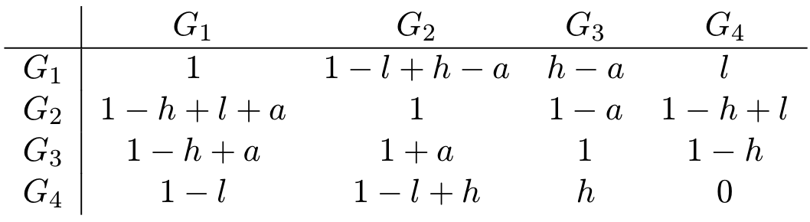

## The Game
> The experimenter assigns a certain sum, and the Proposer can offer a share of it to the Responder. If the Responder (who knows the sum) accepts, the sum is split accordingly between the two players, and the game is over. If the Responder declines, the experimenter withdraws the money. Again, the game is over: but this time, neither of the two players gets anything.

---

> This note aims to explain this paper:  
> [Nowak, Martin A., Karen M. Page, and Karl Sigmund. "Fairness versus reason in the ultimatum game." Science 289.5485 (2000): 1773-1775.](https://pure.iiasa.ac.at/id/eprint/6189/1/IR-00-057.pdf)
{: .prompt-info }

## Background
- "The Ultimatum Game is quickly catching up with the Prisoner's Dilemma as a prime showpiece of apparently **irrational behavior.**"
- "Rational responders should accept even the smallest positive offer, since the alternative is getting nothing."
- "In a large number of human studies, however, conducted with different incentives in different countries, the majority of proposers offer 40-50% of the total sum, and about half of all responders reject offers below 30%." (Citation: 1-6)
- "The irrational human emphasis on a fair division suggests that players have preferences which do not depend solely on their own payoff, and that responders are ready to **punish** proposers offering only a small share by rejecting the deal (which costs less to themselves than to the proposers)."
  1. "Repeating the Ultimatum Game is like haggling over a price, and fair splits are more likely" (Citation: 6-8)
  2. "allowing a co-player to get a large share is conceding a relative advantage to a direct rival. This argument holds only for very small groups." (Citation: 9)
  3. "A substantial proportion of humans maximize a subjective utility function different from the payoff." (Citation: 10-12)
- Method: Evolutionary Game Theory

## Basic Settings

- "Players are equally likely to be in one of the two roles."
  - Proposer
  - Responder
- Dyanmics: The replicator quation
- Strategy:
  - As Proposer: the player offers the amount $p \in [0,1]$
  - As Responder: the player rejects any offer smaller than $q \in [0,1]$
  - Strategy Profile of Player $i$ is  $(p_i, q_i)$
- The expected payoffs of players with the joint strategy profile $ ((p_1,q_1),(p_2,q_2))$

| Half Payoff 1 	| Half Payoff 2 	|       1 As Proposer      	|     1 As Responder     	|
|:-------------:	|:-------------:	|:------------------------:	|:----------------------:	|
|  $(1-p_1)+p_2$	|  $p_1+(1-p_2)$	| $p_1 \ge q_2$ (Accepted) 	| $p_2 \ge q_1$ (Accept) 	|
|    $1-p_1$    	|     $p_1$     	| $p_1 \ge q_2$ (Accepted) 	|  $p_2 < q_1$ (Refuse)  	|
|     $p_2$     	|    $1-p_2$    	|   $p_1 < q_2$ (Refused)  	| $p_2 \ge q_1$ (Accept) 	|
|      $0$      	|      $0$      	|   $p_1 < q_2$ (Refused)  	|  $p_2 < q_1$ (Refuse)  	|

## Minigame
Consider the following 4 strategy profiles
  - $G_1: (l,l ),$ this is the reasonable strategy.
  - $G_2: (h,l )$
  - $G_3: (h,h ),$ this is the fair strategy.
  - $G_4: (l,h )$

where $0<l<h<1/2.$

Their frequencies are $x_1,x_2,x_3,x_4,$ respectively. $0\le x_i \le 1$ and $\sum_{i=1}^{4}x_i = 1.$

{: width="400"}
_Figure 1 in the paper._

### $p + q \le 1$

- "The condition, $1−p \ge q$, is equivalent to the assumption that the individuals do not regard the role of proposer inferior to the role of responder."
- "What they demand for themselves when proposer should not be less than the minimum amount they expect as responders."

If the responder accepts the offer (which means $1-p\ge q$), then the proposer gets $1-p$ and the responder gets $p.$ We want to assume that the proposer's payoff should not be less thatn the responder's, meaning that $1-p\ge p.$ It follows that $0<q\le p\le 1/2.$

Why do we want to assume this? Because:

- "Otherwise, high levels of information can lead to a reversal of the game."
- "If the proposer has perfect knowledge of the responder's $q$ value, then it is in fact the responder who makes the offer."

If the proposer knows the responder's $q,$ then, as a rational player, it has to offer $q.$ Otherwise it gets nothing. Then the proposer become the new "responder": it either "accept" the fact that it has to offer $q$ or it "refuse" to offer.

### No Information

"Starting with any mixture of $G_1$, $G_2$ and $G_3$ players, evolution will always lead to a population that consists entirely of $G_1$ players. Reason dominates fairness."

#### My Analysis

**$G_4$ gets eliminated.**

If the 2 players play $((l,h),(l,h)),$ then their payoffs are both $0$.   
$\Rightarrow$ Any of the player can unilaterally change its strategy to get a higher payoff, since the pyaoffs of other cases are better than $0.$  
$\Rightarrow$ $((l,h),(l,h))$ is not a Nash equilibrium.  
$\Rightarrow$ $(l,h)$ is not an ESS.  
Then we set $x_4=0.$

**$G_1$ will  eventually reach fixation.**

- 1 vs 1: $((p_1=l,q_1=l),(p_2=l,q_2=l)).$ 
  - $p_1 = l = l = q_2$
  - $p_2 = l = l = q_1$
  - Fitness of $G_1$ is $1$
- 1 vs 2: $((p_1=l,q_1=l),(p_2=h,q_2=l)).$ 
  - $p_1 = l = l = q_2$
  - $p_2 = h > l = q_1$
  - Fitness of $G_1$ is $1-p_1+p_2 = 1-l+h$
  - Fitness of $G_2$ is $p_1+1-p_2 = 1+l-h$
- 1 vs 3: $((p_1=l,q_1=l),(p_2=h,q_2=h)).$ 
  - $p_1 = l < h = q_2$
  - $p_2 = h > l = q_1$
  - Fitness of $G_1$ is $p_2 = h<1/2$
  - Fitness of $G_3$ is $1-p_2 = 1-h>1/2$
- 2 vs 2: $((p_1=h,q_1=l),(p_2=h,q_2=l)).$ 
  - $p_1 = h > l = q_2$
  - $p_2 = h > l = q_1$
  - Fitness of $G_2$ is $1$
- 2 vs 3: $((p_1=h,q_1=l),(p_2=h,q_2=h)).$ 
  - $p_1 = h = h = q_2$
  - $p_2 = h > l = q_1$
  - Fitness of $G_2$ is $1-p_1+p_2 = 1$
  - Fitness of $G_3$ is $p_1+1-p_2 = 1$
- 3 vs 3: $((p_1=h,q_1=h),(p_2=h,q_2=h)).$ 
  - $p_1 = h = h = q_2$
  - $p_2 = h = h = q_1$
  - Fitness of $G_3$ is $1$

**Conclusion 1:**

- $F(G_1 \mid G_1) = 1 > 1-h = F(G_3 \mid G_1)$ 
- $F(G_1 \mid G_1) = 1 > 1+l-h = F(G_2 \mid G_1)$ 

$\Rightarrow$ $G_1$ is an ESS. (See the alternative definition of ESS in [my blog]({{site.baseurl}}/posts/Evolutionary-Game-Theory/#definition).)

**Conclusion 2:**

$F(G_2 \mid G_2) = 1 < 1-l+h = F(G_1 \mid G_2)$ 

$\Rightarrow$ $G_2$ is not a Nash equilibrium $\Rightarrow$ $G_2$ is not an ESS. (See the corollaries of ESS in [my blog]({{site.baseurl}}/posts/Evolutionary-Game-Theory/#corollaries).)

**Conclusion 3:**
- $F(G_3 \mid G_3) = 1 = 1 = F(G_2 \mid G_3)$ 
- But $F(G_3 \mid G_2) = 1 = 1 = F(G_2 \mid G_2)$ (Not $F(G_3 \mid G_2) > F(G_2 \mid G_2)$ )

$\Rightarrow$ $G_3$ is not an ESS. (See the alternative definition of ESS in [my blog]({{site.baseurl}}/posts/Evolutionary-Game-Theory/#definition).)

But my analysis cannot tell the situation of other points in the interior. (?)

#### Analysis in the Paper

Pairwise comparison.

<!-- {: width="200"}
_Part of Figure 1 in the paper._ -->

{: width="400"}
_My explanation._

- "Populations that consist only of $G_1$ and $G_3$ players will converge to pure $G_1$ or $G_3$ populations depending on the initial frequencies of the two strategies."
- "Mixtures of $G_1$ and $G_2$ players will always tend to $G_1$."
- "Mixtures of $G_2$ and $G_3$ players are neutrally stable and subject to random drift."

{: width="400"}
_Table 1 in the paper. Citation 18. The strategy as the proposer is represented by the row, and the same strategy as the responder is represented by the column._

**$G_4$ gets eliminated.**

Because "$G_4$ is dominated by $G_1,$ so that $x_4/x_1$ converges to $0.$"

"It follows that all orbits in the interior of the state space $S_4$ (the simplex spanned by the unit vectors on the $x_i$-axes) converge to the boundary face where $x_4=0.$" 

{: width="300"}
_The simplex of population._

My explanation:
- $G_4$ is dominated by $G_1,$ because `Table1[1][1]` $>$ `Table1[4][1]` and `Table1[1][4]` $>$ `Table2[4][4]`, where table index starts with 1. Actually, the numbers in the first row are all greater than the corresponding numbers in the fourth row.
- The interior (or the spanned simplex) is $(x_1,x_2,x_3,x_4),$ where $x_i\ge 0, \forall i$ and $\sum_{i=1}^4 x_i=1.$
- The orbit means the evolution process of $(x_1,x_2,x_3,x_4).$ It means the trajectory from $S_0$ to $S_{end}$ with a velocity (the replicator dynamics function).
- $(x_1,x_2,x_3,x_4=0)$ is a boundary face. It just like that $(x,y,z=0)$ is a face.

**The edge $G_2G_3$ consists of fixed points.**

The points on the edge $G_2G_3$ are $(0, x_2, x_3, 0).$ They are the fixed points of the replicator dynamics function. This is because that the payoffs are all the same, so they are same as the average payoff. It follows that the repilicator dynamics function result (the derivatives) are zeros.

It does not mean that these points are stable. They may be invaded by mutants.

**Those fixed points between $G_3$ and $Q(0, (1-h)/(1-l), (h-l)/(1-l), 0)$ are saturated.** 

"Saturated" means stable or optimized. If a point is saturated, it means that the population cannot be invaded by mutants. And this point is a Nash equilibrium. "The point is a fixed point" is a necessary condition of "the point is saturated."

{: width="400"}
_We focus on this surface._

Let $b$ denote the "edge" population of $x_2$.

The replicator dynamics function is $\dot{x}_i = x_i (f_i(x) - \bar{f}(x)),$ but here $f_i(x)$ is not given. So we have to calculate the expected payoffs in the current population as the $f_i(x).$

Since the saturated points should be able to maintain stable under the pressure of mutation, the replicator dynamics function of the mutant, which is $x_1$ here, should be negative. Let the population of mutant be $x_1 = \epsilon+\delta,$ then it should be negative, which means $f_1(x)-- \bar{f}(x)<0.$ Then we can derive the result given in the paper.

{: width="500"}

This also means that other points on edge $G_2G_3$ can be invaded.

Figuring out Nash equilibria is not enough. Because we want to find ESSs.

**On the edge $G_1G_2,$ strategy $G_1$ dominates.** 

Look at the four squares in the top left corner; the two columns in the upper row are each greater than those in the lower row.

**The edge $G_1G_3$ is bistable, with fixed point $P(1−h, 0, h, 0).$**

|       |       | $c$   | $1-c$ |
|       |       | $G_1$ | $G_3$ |
| $c$   | $G_1$ | $1$   | $h$   |
| $1-c$ | $G_3$ | $1-h$ | $1$   |

The edge is "bistable" because the elements on the main diagonal are 1, higher than other elements.

The fixed point, still, is a population profile point. Since it is on the edge $G_1G_3$, $x_2 = x_4 = 0.$

To find the fixed point, let $(c, 0, 1-c, 0)$ denote the fixed point.
It is a fixed point so it maintains the same after it passed through the replicator dynamics function, which means $\dot{x}_i=0,\forall i.$ That is, $f_1(x)-\bar{f}(x) = 0$ and $f_3(x)-\bar{f}(x) = 0.$

{: width="500"}

**There is one further fixed point, $R(0, 1−h+l, 0, h−l)$ which is stable on the edge $G_2G_4$ but can be invaded by both missing strategies.**

|       |       | $d$     | $1-d$   |
|       |       | $G_2$   | $G_4$   |
| $d$   | $G_2$ | $1$     | $1+l-h$ |
| $1-d$ | $G_4$ | $1-l+h$ | $0$     |

The calculation is the same as the previous one.

|         |       |         | $1-h+l$ | $h-l$   |
| ------- | ----- | ------- | ------- | ------- |
|         |       | $G_1$   | $G_2$   | $G_4$   |
|         | $G_1$ | $1$     | $1-l+h$ | $l$     |
| $1-h+l$ | $G_2$ | $1-h+l$ | $1$     | $1-h+l$ |
| $h-l$   | $G_4$ | $1-l$   | $1-l+h$ | $0$     |

The points can be invaded by $G_1$ because $G_4$ is dominated by $G_1.$

|         |       | $d$     |       | $1-d$   |
| ------- | ----- | ------- | ----- | ------- |
|         |       | $G_2$   | $G_3$ | $G_4$   |
| $d$     | $G_2$ | $1$     | $1$   | $1-h+l$ |
|         | $G_3$ | $1$     | $1$   | $1-h$   |
| $1-d$   | $G_4$ | $1-l+h$ | $h$   | $0$     |

> But I do not think that it can be invaded by $G_3.$
{:.prompt-warning}

{: width="500"}

**$x_2/x_3$ grows whenver $x_1$ or $x_4$ are positive.**

In Table 1, the third row are dominated by the second row.

**The dynamics are simple: orbits can converge either to $G_1$, which is the only perfect Nash equilibrium of the game, or else to the segment $QG_3.$**

1. Some points will converge to $G_1.$
2. Some points will converge to $QG_3$ because these points are saturated, as shown before.
   1. But these points will move to $G_2,$ because $x_2/x_3$ grows whenver $x_1$ or $x_4$ are positive. "Neutral drift or recurrent mutations introducing $G_1$ or $G_4$ will inexorably push the state towards $QG_2.$"
   2. On the edge $G_1G_2,$ $G_2$ is dominated by $G_1.$

So all the points will converge to $G_1.$

{: width="400"}

### Obtaining Information About Previous Encounters

**Reputation:** "If they accept low offers, this may become known, and the next proposer may think twice about making a high offer."
- "We stress that the same players need not meet twice."

Therefore:  
**An important assumption:** "The *average offer* of an $h$-proposer to an $l$-responder is lowered by an amount $a.$" And $h-a\ge l.$ "A proposer will offer $p$-value or the minimum offer that it knows has been accepted by the responder during previous encounters."
- It means the proposer will exploit the responder if it knows that the responder is easy to be satisfied.
- And $h-a\ge l$ means the responder will still accept the lowered offer. 

**$a$ may be small.**
1. Because
  - "Obtaining information on the co-player is diffcult." If a proposer cannot get this information at this time $k$, then $a_k$ is zero. Sometimes $a_k$ is positive and sometimes it's zero. The average lowered payoff is $a.$
  - "The information may be considered unreliable by $h$-proposers."
2. Even if $a$ is small, the effect is drastic.
3. If the $h$-proposer has full knowledge of the $l$-responder, then it will exploit fully the responder, which means $a=h-l.$ And this is the maximized $a.$

{: width="400"}
_Table 2 in the paper. Citation 19. Adapted from Table 1._

#### If $0<a<h-l$

<!-- Basic relations:
1. $0<a<h-l<h$
2. $0<l<h-a<h$ -->

{: width="400"}
_The plane, given $x\_4$ and $0<a<h-l.$_

**The fair strategy $G_3$ dominates $G_2$ on the edge $G_2G_3.$**

Because `Table2[3][2]` $>$ `Table2[2][2]` and `Table2[3][3]` $>$ `Table2[2][3]`, where table index starts with 1.

**$G_1$ dominates $G_2$ on the edge $G_1G_3.$**

Because `Table2[1][1]` $>$ `Table2[2][1]` and `Table2[1][2]` $>$ `Table2[2][2]`, where table index starts with 1.

**On the edge $G_1G_3$ the system is bistable.**

Because `Table2[1][3]` $<$ `Table2[1][1]` $=$ `Table2[3][3]` $= 1 >$ `Table2[3][1]`, where table index starts with 1.

**The basin of attraction of $G_1$ and $G_3$ are separated by the point $P(a)=(1-h+a, 0, h-a, 0).$**

And $h-a<h<1/2<1-h<1-(h-a),$ so the point $P(a)$ is more close to $G_1$ than $G_3,$ which means $G_3$ has the larger basin of attraction.

|       |       | $d$     | $1-d$ |
|       |       | $G_1$   | $G_3$ |
| $d$   | $G_1$ | $1$     | $h-a$ |
| $1-d$ | $G_3$ | $1-h+a$ | $1$   |

{: width="400"}

**$G_3$ risk-dominates.**

Citation 20. TO-READ.

**Dyanamics Property 1: The ratio $x_2 x_4 / x_1 x_3$ remains constant.**

> I can hardly understand the part of **dynamics properties**. I mean I can examine the results, but I can't tell how they found them.
{:.prompt-warning}

#### If $a=h-l$

Then Table 2 becomes:

|       | $G_1$ |   $G_2$   |  $G_3$  |  $G_4$  |
| $G_1$ |  $1$  |    $1$    |   $l$   |   $l$   |
| $G_2$ |  $1$  |    $1$    | $1-h+l$ | $1-h+l$ |
| $G_3$ | $1-l$ |  $1+h-l$  |   $1$   |  $1-h$  |
| $G_4$ | $1-l$ |  $1-l+h$  |   $h$   |   $0$   |

**The fair strategy $G_3$ dominates $G_2$ on the edge $G_2G_3.$**

Because `Table2[3][2]` $>$ `Table2[2][2]` and `Table2[3][3]` $>$ `Table2[2][3]`, where table index starts with 1.

**The edge $G_1G_2$ consists of fixed points.**

$G_1$ and $G_2$ are neutral.

Because their replicator dynamics functions are always zero. See the case $G_2G_3$ in "No Information."

**On the edge $G_1G_3$ the system is bistable.**

Because `Table2[1][3]` $<$ `Table2[1][1]` $=$ `Table2[3][3]` $= 1 >$ `Table2[3][1]`, where table index starts with 1.

## Full Game and Computer Simulation

{: width="400"}
_Figure 2 in the paper. Fairness evolves in computer simulations of the Ultimatum Game._

### Full Game Settings
1. There are $N=100$ players.
2. $p + q \le 1$
3. "Each accepted deal is made known to a fraction $w$ of all players."
4. "Each player will be proposer on average $r=50$ times and be responder the same number of times."
5. The proposer's offer
   1. If the proposer knows the responder's reputation (its accepted offers in previous rounds), then the proposer will only offer the minimum offer the responder accpeted.
   2. Otherwise, the proposer will offer its $p$-value.
   3. "In addition there is a small ($0.1$) probability that the responder will offer his p value minus some random number between $0$ and $0.1$; this is to test for players who are willing to accept reduced offers."
6. Every point on the curve is a stable evolution result. The 2 curves are not learning curves.

I think the simulation aims to find how $w$ affect evolution results.

How to ensure the fourth setting? My guess:
1. Randomly pair *every* 2 players.
   1. Shuffle and number all the players.
   2. Pair every even player and its next odd player.
2. Randomly assign the roles.
   1. Assume the player 1 (2) played as proposer $c_1(p)$ ($c_2(p)$) times and as responder $c_1(r)$ ($c_2(p)$) times.
   2. It holds that $c_1(p)+c_1(r) = c_2(p)+c_2(r).$ And if $c_1(p) < c_2(p)$ then $c_1(r) > c_2(r)$ and vice versa.
   3. If $c_1(p) < c_2(p)$ then player 1 plays as proposer this time. Otherwise it plays as responder.
3. Repeat step 1 and 2 $r$ times.

### The Procedure
1. Choose a $w.$
2. "In every generation, several random pairs are formed."
   - Repeated $r$ times as shown above.
3. "Individuals reproduce proportional to their payoff."
   - "Offspring adopt their parent's $p$ and $q$ values plus a random number from the interval $(−0:005; +0:005).$"
4. Repeated step 1 and 2 $10^5$ times (generations).
5. Log the current result as a point.

### Results
- For $w = 0$ (no information about previous interactions), the $p$ and $q$ values converge close to the rational solution $S(0, 0);$ they are not exactly zero because mutation introduces heterogeneity, and the best response to a heterogeneous population is not $S(0; 0).$ 
- "For increasing values of w, there is convergence close to the fair solution, $S(1=2, 1=2)$, with $q$ being slightly smaller than $p$."

