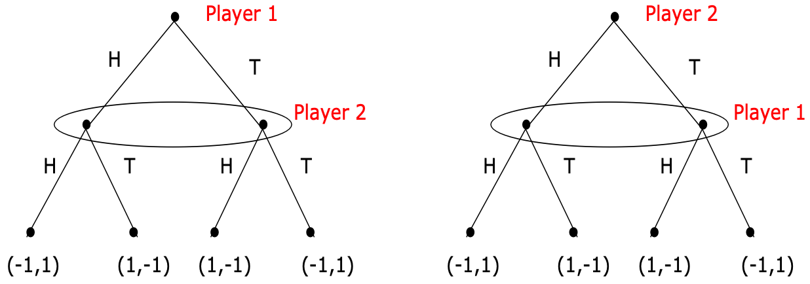

## Resources
This post uses the material from the following works:

- [MIT 6.254 2010: Game Theory With Engineering Applications](https://ocw.mit.edu/courses/6-254-game-theory-with-engineering-applications-spring-2010/pages/lecture-notes/)
- [MIT 14.12 2012: Economic Applications Of Game Theory](https://ocw.mit.edu/courses/14-12-economic-applications-of-game-theory-fall-2012/)
- Tadelis, Steven. Game theory: an introduction. Princeton university press, 2013.
- [Extensive Form Games - Jonathan Levin 2002 - Stanford](https://web.stanford.edu/~jdlevin/Econ%20203/ExtensiveForm.pdf)
- Wikipedia
  - [Subgame](https://en.wikipedia.org/wiki/Subgame)
  - One-Shot Deviation Principle

## Extensive-Form Games

### Definition 

> The normal-form game was a model of players choosing their actions simultaneously, without observing the moves of their opponents. The extensive form enriches the set of situations we can model to include those in which **players learn something about the choices of other players who moved earlier,** in which case a player can condition his behavior on the moves of other players in the game.

> **Definition:** Formally, a finite extensive form game (EFG) $G$ consists of:
> - A finite set of players $I=[[N]].$
> - A finite set $X$ of nodes that form a tree, with $Z \subset X$ being the terminal nodes which are the outcomes of the game.
> - A set of functions that describe for each $x \notin Z,$
>   - The player $i(x)$ who moves at $x.$
>   - The set $A(x)$ of possible actions at $x.$
>   - The successor node $n(x, a)$ resulting from action $a.$
> - Payoff functions $u_i: Z \rightarrow \mathbb{R}$ assigning payoffs to players as a function of the terminal node reached. Payoff functions represent the players' preferences on the outcomes.
> - An information partition: for each $x$, let $h(x)$ denote the set of nodes that are possible given what player $i(x)$ knows. Thus, if $x^{\prime} \in h(x)$, then $i\left(x^{\prime}\right)=i(x), A\left(x^{\prime}\right)=A(x)$ and $h\left(x^{\prime}\right)=h(x).$ We will sometimes use the notation $i(h)$ or $A(h)$ to denote the player who moves at information set $h$ and his set of possible actions. When the player is about to take an action, it cannot distinguish which node they are at within the current information set.
> 
> That is, 
> 
> $$G = \set{I, X, \set{i(x)}_{x\in X}, \set{A(x)}_{x\in X}, \set{n(x,a)}_{x\in X, a\in A(x)}, \set{u_i: Z \rightarrow \mathbb{R}}_{i\in I}, \set{h(x)}_{x\in X}}.$$
{:.prompt-info}

In another definition, $X$ is also a path of taken actions.
- $H^k := \set{h^k = (a^0, a^1, \ldots, a^k), \forall a^l, l}$
- $X := \cup_{k} H^k$

> Note that, compared to POMDPs,
> - There is no state in EFGs. The nodes in EFGs can be seen as the history/path of taken actions. The states in MDPs can appear releatedly, the nodes in EFGs cannot.
> - The agents get their payoffs in the end of EFGs, not after every times they taking actions.
> - The payoffs in EFGs depends on the history/path of taken actions.
> - The  information set in EFGs can convert the game to a simultaneous move game.
> Compared to the MDP scenario, I think the two dimensions of long-term have become ambiguous here. My preliminary thought is that there is no long-term dimension within episodes in EFGs.
{:.prompt-tip}

The definition of EFGs does not require that the nodes at the same depth of each level of the game tree are all acted upon by the same player, although this is often the case in many games. (So the definition of EFGs in MIT 6.254 Lecture 12 is not the most general one.)

### More About Information Set

#### Perfect Information

> **Definition:** A game has perfect information if all its information sets are singletons (i.e., all nodes are in their own information set).
{:.prompt-info}

#### Reperesenting Simultaneous Move Games

{: width="500"}
_Matching Pennies. The oval represents the information set containing the two nodes._

It can be seen that games with simultaneous moves are generally not considered games of perfect information.

## Subgame Perfect Equilibrium (SPE)

### Subgame

> **Definition:** A subgame is any part (a subset) of a game that meets the following criteria (the following terms allude to a game described in extensive form):
> 
> 1. It has a single initial node that is the only member of that node's information set (i.e. the initial node is in a singleton information set).
> 2. If a node is contained in the subgame then so are all of its successors.
> 3. If a node in a particular information set is in the subgame then all members of that information set belong to the subgame.
{:.prompt-info}

Note that, the definition requires that all successors of a node is in the subgame and that the subgame does not "chop up" any information set. This ensures that a subgame can be analyzed in its own right.

### The Definition of SPE

> **Definition:** A Nash equilibrium is said to be subgame perfect if an only if it is a Nash equilibrium in every subgame of the game.
{:.prompt-info}

### Backward Induction

It is used to check if an outcome is a SPE in an EFG with **finite** horizon.

Check if the outcome is a Nash equilibrium (It is actually finding the best response of the current player). If it is not, then eliminated it. If it is, then assign the Nash eqilibrium outcome as the new outcome and go above to check the next node, until it reaches the initial node.

> **Theorem:** Backward induction gives the entire set of SPE.
{:.prompt-info}

**Proof:** backward induction makes sure that in the restriction of the
strategy profile in question to any subgame is a Nash equilibrium.

### Existence of SPE

(MIT 6.254 Lecture 12)

> **Theorem:** Every finite perfect information extensive-form game $G$ has a pure strategy SPE.
{:.prompt-info}

**Proof:** Start from the end by backward induction and at each step one strategy is best response. Nash equilibrium exists at every timestep.

> **Theorem:** Every finite extensive-form game $G$ has a SPE.
{:.prompt-info}

**Proof:** Same argument as the previous theorem, except that some subgames need not have perfect information and may have mixed strategy equilibria.

### One-Stage Deviation Principle

It is used to check if an outcome is a SPE in an EFG with **infinite** horizon.

(MIT 6.254 Lecture 12)

> **Theorem:** For finite horizon multi-stage games with observed actions, $s^*$ is a subgame perfect equilibrium if and only if for all $i, t$ and $h^t$, we have
> 
> $$
> u_i\left(s_i^*, s_{-i}^* \mid h^t\right) \geq u_i\left(s_i, s_{-i}^* \mid h^t\right)
> $$
> 
> for all $s_i$ satisfying
> $$s_i\left(h^t\right) \neq s_i^*\left(h^t\right)$$ and 
> $$s_{i \mid h^t}\left(h^{t+k}\right)=s_{i \mid h^t}^*\left(h^{t+k}\right),$$ for all $$k>0,$$ and all $$ h^{t+k} \in G\left(h^t\right).$$
{:.prompt-info}

Informally, a joint action profile (a joint strategy) $s$ is a subgame perfect equilibrium (SPE) if and only if **no player $i$ can gain by deviating from $s$ in a single stage and conforming to $s$ thereafter.**

### Continuous at Infinity

> **Definition:** Consider an extensive-form game with an infinite horizon, denoted by $G^{\infty}$. Let $h$ denote an $\infty$-horizon history, i.e., $h=\left(a^0, a^1, a^2 \ldots\right)$, is an infinite sequence of actions. Let $h^t=\left(a^0, \ldots a^{t-1}\right)$ be the restriction to first $t$ periods. The game $G^{\infty}$ is **continuous at infinity** if for all players $i$, the payoff function $u_i$ satisfies
> 
> $$
> \lim\limits_{t \rightarrow \infty} \sup _{h, \tilde{h} \text { s.t. } h^t=\tilde{h}^t}\left|u_i(h)-u_i(\tilde{h})\right| = 0.
> $$
{:.prompt-info}

I suppose that the utility function is now defined on histories, not on the leaf nodes, since there is no leaf node in games with infinite horizon.

If a function $f(x)$ is described as continuous at positive infinity, it means that as $x$ increases towards positive infinity, $f(x)$ approaches a specific real number $L$ closely, and the difference between $f(x)$ and $L$ can be made arbitrarily small.

In this case, an EFG with infinite horizon being continuous at infinity means that we can analyze the players' values at infinity

> **Definition:** The continuity at infinity condition is satisfied when the overall payoffs are a discounted sum of stage payoffs, i.e.,
> 
> $$
> u_i=\sum_{t=0}^{\infty} \delta_i^t g_i^t\left(a^t\right), 
> $$
> 
> where $g_i^t\left(a^t\right)$ are the stage payoffs, the positive scalar $\delta_i<1$ is a discount factor, and the stage payoff functions are uniformly bounded, i.e., there exists some $B$ such that $\max _{t, a^t}\vert g_i^t\left(a^t\right) \vert <B$.
{:.prompt-info}

> **Theorem:** Consider an infinite-horizon game, $G^{\infty}$, that is continuous at infinity. Then, the one-stage deviation principle holds, i.e., the strategy profile $s^*$ is an SPE if and only if for all $i, h^t$, and $t$, we have
> 
> $$
> u_i\left(s_i^*, s_{-i}^* \mid h^t\right) \leq u_i\left(s_i, s_{-i}^* \mid h^t\right),
> $$
> 
> for all $s_i$ that satisfies $$s_i\left(h^t\right) \neq s_i^*\left(h^t\right)$$ and $$s_i\left \vert h^t\left(h^{t+k}\right)=s_i^*\right \vert h^t\left(h^{t+k}\right)$$ for all $$h^{t+k} \in G\left(h^t\right)$$ and for all $$k>0$$.
{:.prompt-info}