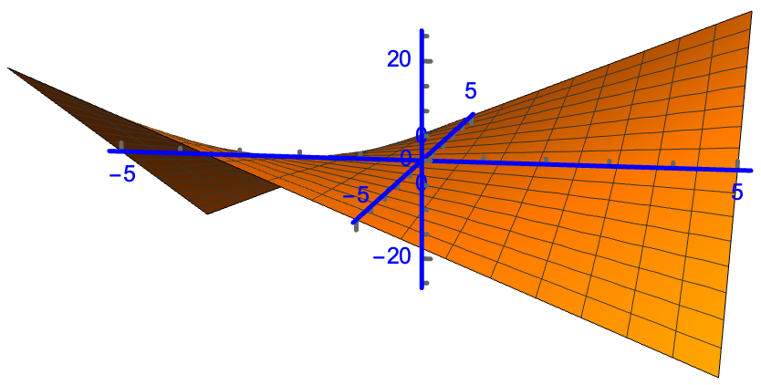
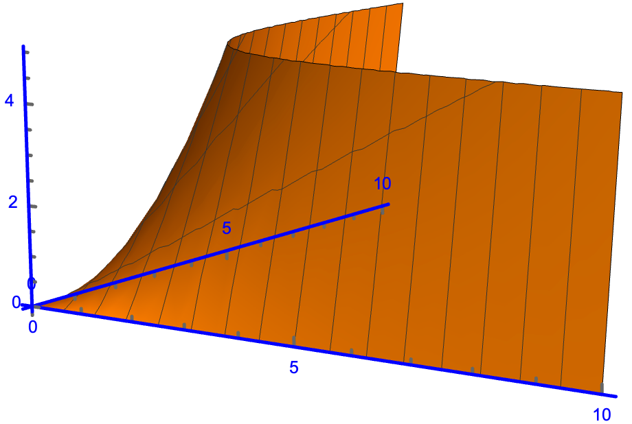

## An Extensive-Form Game Model

### Ultimatum

Two people use the following procedure to split $$1$$ object:
- Player 1 offers Player 2 some amount $$0 \leq x \leq 1$$
- If Player 2 accepts the outcome is: $$(1-x, x)$$
- If Player 2 rejects the outcome is: $$(0,0)$$

{:width="200"}
_Ultimatum. $$c=1.$$_

#### SPE

- If $$x>0,$$ then $$(0,0)$$ can be eliminated.
- If $$x=0,$$ then both outcomes are $$(0,0).$$

Player 2's strategies:
- Strategy 1: Accept when $$x> 0,$$ rejecet when $$x=0.$$
- Strategy 2: Accept when $$x\ge 0.$$ That is, accept in all cases.

Considering backward induction, if Player 2 chooses Strategy 1, then there is no best response for Player 1 at the first stage. 
Because $$\max\limits_{x>0} (1-x)$$ has no solution.

If Player 2 chooses Strategy 2, then Player 1's best response at the first stage is to offer $$x=0.$$ And this case ($$(1,0)$$) is the unique SPE. The Player 1 gets everything and Player 2 gets nothing.

#### Comments

1. Results of human experiments and evolution game theory do not align with this analysis. Their outcomes appear to be more fair.
2. We can allow 2 to make **a counter offer after rejection** then it is more like bargaining.

### Alternating Offers with Finite Horizon

{:width="200"}
_A Counter Offer._

Additional rules/notation:
- If Player 2 rejects, then it can make a counter offer.
- $c=1, x_1+x_2=1, y_1+y_2=1.$

By backward induction, the analysis is the same as the previous one at the second stage. This means Player 2 will definitely reject at the first stage.

**Last Mover’s Advantage:** Similar result with alternating offers. In every SPE, the player who makes the offer in the last period obtains all the pie.

### Rubinstein's Model

It is an alternating-offers bargaining with discount factor and infinite horizon.

Additional rules/notation:
- Players flip a coin to decide whom to propose first.
- Stages start by index 0.
- Player 1's proposal at stage $t$ is denoted as $(x_t,1-x_t).$
- Player 2's proposal at stage $t$ is denoted as $(y_t,1-y_t).$
- Assume that they agree at stage $t$ and the agreement is $(a,1-a),$ then they get $(\delta_1^t a, \delta_2^t (1-a))$ respectively.

> **Theorem:** There is a unique SPE in Rubinsein's bargaining model whenever Player 1 proposes $(x, 1-x)$ and $x=\frac{1-\delta_2}{1-\delta_1 \delta_2}$ and Player 2 accepts any offer if it gives more than $1-x,$ or whenever Player 2 proposes $(y, 1-y)$ and $y=\frac{\delta_1(1-\delta_2)}{1-\delta_1 \delta_2}$ and Player 1 accepts any offer if it gives more than $y.$
{:.prompt-info}

#### Solution by One-Stage Deviation Principle

From Player 2's perspective (or from player 1's, symmetrically):

Currently, Player 1 offers $(x_t,1-x_t).$
- If Player 2 accepts, then it gets $(1-x_t).$
- If Player 2 rejects, then it proposes $(y_{t+1}, 1-y_{t+1})$ at the next stage. 
  - But if rejected, then it turns to Player 1's phase again. They may never make an agreement if this case goes on.
  - And if accepted, the outcome is $(\delta_1 y_{t+1}, \delta_2 (1-y_{t+1})).$

Then it holds $1-x_t \ge \delta_2 (1-y_{t+1}), \forall t\in \set{2n \vert n \in \mathbb{N}},$ otherwise Player 2 will reject and get $\delta_2 (1-y_{t+1})$ because it knows that Player 1 will not reject $(y_{t+1}, 1-y_{t+1})$ or otherwise this is not a SPE.

And Player 1 will know that Player 2 can take any offer that satisfies $1-x_t \ge \delta_2 (1-y_{t+1}).$ So it will propose the most benificial offer for itself, which minimizes $1-x_t.$ So we have $1-x_t = \delta_2 (1-y_{t+1}), \forall t\in \set{2n \vert n \in \mathbb{N}}.$ 

This is also called the indifference condition for Player 2.

<!-- And we have $x_t \ge \delta_1 (1-y_{t+1}), \forall t,$ otherwise rational Player 1 would not make this offer. (It assumes that Player 1 knows the future $y.$)

Similarly at stage $t+1,$ we have $y_{t+1} \ge \delta_2(1-x_{t+2})$ and $1-y_{t+1} \ge \delta_1 x_{t+2}, \forall t.$ Equivalently, $y_{t} \ge \delta_2(1-x_{t+1})$ and $1-y_{t} \ge \delta_1 x_{t+1}, \forall t.$ -->

> I have read several material and I suppose: here is an assumption that rectricts the players to know the other's strategy, and they have no intention to deviate from the current joint strategy unilaterally.
{:.prompt-tip}

And we have $x_t \ge \delta_1 y_{t+1}, \forall t\in \set{2n \vert n \in \mathbb{N}},$ otherwise rational Player 1 would not make this offer, for it knowing that its least payoff is $\delta_1 y_{t+1}$ if it comes to $(y_{t+1}, 1-y_{t+1}).$

<!-- Let $z = x_t - \delta_1 (1-y_{t+1}) \ge 0,$ then we can see that Player 2 knows that Player 1 will be satisfied with all $z\ge 0.$  -->
<!-- We have known that Player 1 will not reject Player 2's offer if it comes to that case ($t+1$, see the fourth bullet list item). So, if Player 2 rejects, Player 1 will get $ \delta_1 y_{t+1}.$  -->
For Player 2, to maximize its payoff, it will minimize $x_t.$So we can have $x_t = \delta_1 y_{t+1}, \forall t\in \set{2n \vert n \in \mathbb{N}}.$ Otherwise Player 2 can reject and then get more on that.

Combine the two equations: $1-x_t = \delta_2 (1-y_{t+1})$ and $x_t = \delta_1 y_{t+1}, \forall t\in \set{2n \vert n \in \mathbb{N}},$ and we can obtain an SPE:

$$
x_t^* =\frac{1-\delta_2}{1-\delta_1 \delta_2}, 
y_{t+1}^* =\frac{\delta_1(1-\delta_2)}{1-\delta_1 \delta_2}, 
\forall t\in \set{2n \vert n \in \mathbb{N}}.
$$

The case that Player 2 offers first can be analyzed symmetrically.

#### Another Way And Also A Proof of Uniqueness

Let $\underline{v}_1, \bar{v}_1$ denote the lowest and highest payoffs that Player 1 can get in all possible SPEs.

Consider the times that Player 2 is offering. Player 1 will:
- Accept any offer greater than $\delta_1 \bar{v}_1$ and 
- Reject any offer less than $\delta_1 \underline{v}_1$. 

In this way, what Player 2 can get ranges from $1-\delta_1 \bar{v}_1$ to $1-\delta_1 \underline{v}_1.$

It means Player 1 must offer Player 2 at least $\delta_2\left(1-\delta_1 \bar{v}_1\right)$ to get agreement when it is its turn to offer. So we have $$\delta_2\left(1-\delta_1 \bar{v}_1\right) \leq 1-\bar{v}_1.$$ Also, player two will certainly accept if offered more than $\delta_2\left(1-\delta_1 \underline{v}_1\right)$. So we have $$\delta_2\left(1-\delta_1 \underline{v}_1\right) \geq 1-\underline{v}_1.$$

It follows that:

$$
\bar{v}_1\leq  \frac{1-\delta_2}{1-\delta_1 \delta_2} \leq \underline{v}_1.
$$

And $\bar{v}_1 \geq \underline{v}_1$ by definition, so we know that in all possible SPEs, $v_1=\left(1-\delta_2\right) /\left(1-\delta_1 \delta_2\right).$

The case of Player 2 can be analyzed similarly.

#### Comments

1. Be patient. In the SPE, the proposer $i$ will get $\frac{1-\delta_j}{1-\delta_i \delta_j},$ and the responder will get $\frac{\delta_j(1-\delta_i)}{1-\delta_i \delta_j}.$ It can be seen that the less patient the player is (the smaller its $\delta$ is), the less it will get, and the more the opponent will get.
2. There is no delay. Players will reach an agreement at the first stage.
3. The first player to make an offer has an advantage. With identical discount factor $\delta,$ the proposer will get $\frac{1}{1+\delta}$ and the responder will get $\frac{\delta}{1+\delta}.$ The proposer will get more. But when $\delta \rightarrow 1$ (which means the players are very patient) the first mover's advantage will disappear. The limiting split is $(0.5,0.5).$

## An Axiomatic Model

> One states as axioms several properties that would seem natural for the solution to have and then one discovers that axioms actually determine the solution uniquely.  
> — John Forbes Nash, 1950.

### Formulation

Let $X$ denote set of possible agreements and $D$ to denote the disagreement outcome.

$$
X=\left\{\left(x_1, x_2\right) \mid x_1+x_2=1, x_i \geq 0\right\}, D=(0,0) .
$$

We assume that each player $i$ has preferences, represented by a utility function $u_i$ over $X \cup\{D\}$. We denote the set of possible payoffs by set $U$ defined by

$$
\begin{aligned}
U & =\left\{\left(v_1, v_2\right) \mid u_1(x)=v_1, u_2(x)=v_2 \text { for some } x \in X\right\} \\
d & =\left(u_1(D), u_2(D)\right)
\end{aligned}
$$

A bargaining problem is a pair $(U, d)$ where $U \subset \mathbb{R}^2$ and $d \in U$. We assume that
- $U$ is a convex and compact set. (We need $U$ to be compact because of the axiom Pareto efficiency. And we need it to be convex because we want to make sure that Nash bargaining solution is unique. See below.)
- There exists some $v \in U$ such that $v>d$ (i.e., $v_i>d_i$ for all $i$ ). Otherwise they will always choose to disagree.

$X$ is an isosceles right triangle in the coordinate system $x_1x_2$, and $U$ is a mapping from $X$ to $\mathbb{R}^2.$

We denote the set of all possible bargaining problems by $\mathcal{B}$. 
**A bargaining solution** is a function $f: \mathcal{B} \rightarrow U$. 

We will study bargaining solutions $f(\cdot)$ that satisfy a list of reasonable axioms.


The overall idea is:
- We intuitively propose 4 axioms that we think the solutions should have.
- There is an optimization problem,
  - The solution of the optimization problem is unique.
  - This solution of the optimization problem is a bargaining solution and it satisfies the 4 axioms.
  - If a bargaining solution satisfies the 4 axioms, then it must be the unique solution of this optimization problem.

### Axioms

There are 4 axioms.

#### Pareto Efficiency

> **Axiom:** A bargaining solution $f(U, d)$ is Pareto efficient if there does not exist a $\left(v_1, v_2\right) \in U$ such that $v \geq f(U, d)$ and $v_i>f_i(U, d)$ for some $i$.
{:.prompt-info}

- This axiom ensures that the solution is optimally efficient among the participants, i.e., no participant’s utility can be improved further without detriment to any other party.
- An inefficient outcome is unlikely, since it leaves space for renegotiation.
- After the agents taking what they agreed to take from the pool, there is nothing left in the pool.
- This means the solution should drop at the boundary of the feasible set. So we need $U$ to be compact.

#### Symmetry
> **Axiom:** Let $(U, d)$ be such that $\left(v_1, v_2\right) \in U$ if and only if $\left(v_2, v_1\right) \in U$ and $d_1=d_2$. Then $f_1(U, d)=f_2(U, d)$.
{:.prompt-info}

- If the players are indistinguishable, the agreement should not discriminate between them.
- I think this axiom requires that the variable set $U$ to be symmetric about the line $x_1 = x_2.$ And since this set is convex and unique, then the optimal solution must be the intersection point of the line $x_1=x_2$ and the boundary of $U.$

#### Invariance to Equivalent Payoff Representations

> **Axiom:** Given a bargaining problem with $(U, d)$, consider a different bargaining problem $\left(U^{\prime}, d^{\prime}\right)$ for some $\alpha>0, \beta$:
> 
> $$
> \begin{aligned}
> U^{\prime} & =\left\{\left(\alpha_1 v_1+\beta_1, \alpha_2 v_2+\beta_2\right) \mid\left(v_1, v_2\right) \in U\right\} \\
> d^{\prime} & =\left(\alpha_1 d_1+\beta_1, \alpha_2 d_2+\beta_2\right)
> \end{aligned}
> $$
> 
> Then, $f_i\left(U^{\prime}, d^{\prime}\right)=\alpha_i f_i(U, d)+\beta_i$.
{:.prompt-info}

Utility functions are only representation of preferences over outcomes. A transformation of the utility function that maintains the some ordering over preferences (such as a linear transformation) should not alter the outcome of the bargaining process.

#### Independence of Irrelevant Alternatives

> **Axiom:** Let $(U, d)$ and $\left(U^{\prime}, d\right)$ be two bargaining problems such that $U^{\prime} \subseteq U$. If $f(U, d) \in U^{\prime}$, then $f\left(U^{\prime}, d\right)=f(U, d)$.
{:.prompt-info}

### Nash Bargaining Solution

> **Definition:** We say that a pair of payoffs $$\left(v_1^*, v_2^*\right)$$ is a Nash bargaining solution if it solves the following optimization problem:
> 
> $$
> \begin{aligned}
> \max _{v_1, v_2} \quad& \left(v_1-d_1\right)\left(v_2-d_2\right) \\
> \text { s.t. } \quad& \left(v_1, v_2\right) \in U \\
> & \left(v_1, v_2\right) \geq\left(d_1, d_2\right)
> \end{aligned}
> $$
> 
> We use $f^N(U, d)$ to denote the Nash bargaining solution.
{:.prompt-info}

> **Proposition:** Nash bargaining solution $f^N(U, d)$ is the unique bargaining solution that satisfies the 4 axioms.
{:.prompt-info}

It means:
- Nash bargaining solution satisfies the 4 axioms. 
- If a bargaining solution satisfies the 4 axioms, it must be equal to $f^N(U, d)$.

#### Existence of The Optimal Solution of This Optmization Problem 

Because:
- $U$ is compact.
- The objective function is continuous.

#### Uniqueness of The Optimal Solution of This Optmization Problem

Because:
- $U$ is convex.
- The objective function is strictly quasi-concave.

> **Definition:** A function $ f(x) $ is defined as **quasi-concave** if for every pair of points $ x $ and $ y $ in its domain and for every $ \alpha $ in the interval $[0, 1]$, the following inequality holds:
> 
> $$
> f(\alpha x + (1-\alpha) y) \geq \min \{ f(x), f(y) \}
> $$
{:.prompt-info}

- This definition states that the function value at any convex combination of $ x $ and $ y $ is at least as great as the minimum of the function values at $ x $ and $ y $. 
- Essentially, a quasi-concave function does not decrease in value as you move in a straight line between any two points in its domain, at least until reaching the level of the minimum value among the two points.
- The image of the function has at most one peak, i.e., $\set{x: f(x)>c}$ is a convex set
- Concave is a stronger property than quasi-concave. And concave $\Rightarrow$ quasi-concave. Concave: 

$$f(\alpha x + (1-\alpha) y) \geq \alpha f(x) + (1-\alpha) f(y).$$

```mathematica
Plot3D[x*y, {x, -5, 5}, {y, -5, 5}]
```

{:width="400"}
<!-- _$f(x,y)=x*y.$_ -->


```mathematica
Plot3D[x*y, {x, -5, 5}, {y, -5, 5},
 PlotRange -> All, Axes -> True, AxesOrigin -> {0, 0, 0}, 
 AxesStyle -> Directive[Blue, Thick], AxesStyle -> Arrowheads[0.03], 
 Boxed -> False]
```

{:width="400"}


```mathematica
Plot3D[x*y, {x, 0, 5}, {y, 0, 5}]
```

{:width="400"}

{:width="400"}


It can be seen that if the range of the variables is a convex set, then there is a unique optimal solution.

But if the variables is a concave set:

```mathematica
Plot3D[x*y, {x, 0, 10}, {y, 0, 10}, 
 RegionFunction -> Function[{x, y, z}, Abs[y - 1] < 5/Abs[x - 1]], 
 PlotRange -> All, Axes -> True, AxesOrigin -> {0, 0, 0}, 
 AxesStyle -> Directive[Blue, Thick],
 AxesStyle -> Arrowheads[0.03], Boxed -> False]
```

{:width="400"}

```mathematica
Plot3D[x*y, {x, 0, 10}, {y, 0, 10}, 
 RegionFunction -> Function[{x, y, z}, y < 5/x], PlotRange -> All, 
 Axes -> True, AxesOrigin -> {0, 0, 0},
 AxesStyle -> Directive[Blue, Thick],
 AxesStyle -> Arrowheads[0.03], Boxed -> False]
```

{:width="400"}

There may be more than one optimal solution.

#### Nash Bargaining Solution Satisfies the 4 Axioms

**Pareto efficiency:**  
The optimal solution must be in the boundary of the feasible set $U.$ It can be seen by the monotonity of the objective function.

**Symmetry:**  
The players is distinguishable, so $d_1=d_2.$ If $(v_1, v_2) = f^N(U,d),$ then we also have $(v_1, v_2) = f^N(U,d),$ by switching the variables in the optimization problem.

**Invariance to equivalent payoff representations:**  
Given a bargaining problem with $(U, d)$, consider a different bargaining problem $\left(U^{\prime}, d^{\prime}\right)$ for some $\alpha>0, \beta$:

$$
\begin{aligned}
U^{\prime} & =\left\{\left(\alpha_1 v_1+\beta_1, \alpha_2 v_2+\beta_2\right) \mid\left(v_1, v_2\right) \in U\right\} \\
d^{\prime} & =\left(\alpha_1 d_1+\beta_1, \alpha_2 d_2+\beta_2\right)
\end{aligned}
$$

By definition, $f\left(U^{\prime}, d^{\prime}\right)$ is an optimal solution of the problem

$$
\begin{aligned}
\max _{v_1, v_2}\quad &\left(v_1-d_1'\right)\left(v_2-d_2'\right) \\
\text { s.t }\quad &\left(v_1, v_2\right) \in U^{\prime}
\end{aligned}
$$

That is,

$$
\begin{aligned}
\max _{v_1, v_2}\quad &\left(v_1-\alpha_1 d_1-\beta_1\right)\left(v_2-\alpha_2 d_2-\beta_2\right) \\
\text { s.t }\quad &\left(v_1, v_2\right) \in U^{\prime}
\end{aligned}
$$

Performing the change of variables $v_1^{\prime}=\alpha_1 v_1+\beta_1 v_2^{\prime}=\alpha_2 v_2+\beta_2$, it follows immediately that $f_i^N\left(U^{\prime}, d^{\prime}\right)=\alpha_i f_i^N(U, d)+\beta_i$ for $i=1,2$.

**Independence of irrelevant alternatives:**  
Let $U^{\prime} \subseteq U$. From the optimization problem characterization of the Nash bargaining solution, it follows that the objective function value at the solution $f^N(U, d) \geq f^N\left(U^{\prime}, d\right)$. If $f^N(U, d) \in U^{\prime}$, then the objective function values must be equal, i.e $f^N(U, d)$ is optimal for $U^{\prime}$ and by uniqueness of the solution $f^N(U, d)=f^N\left(U^{\prime}, d\right)$

#### A Bargaining Solution Which Satisfies the 4 Axioms Must Be The Nash Bargaining Solution

Let $f(U, d)$ be a bargaining solution satisfying the 4 axioms. We now prove that $f(U, d)=f^{N}(U, d)$.

Let $z=f^N(U, d)$, and define the set

$$
U^{\prime}=\left\{\alpha^{\prime} v+\beta \mid v \in U ; \alpha^{\prime} z+\beta=(1 / 2,1 / 2)^{\prime} ; \alpha^{\prime} d+\beta=(0,0)^{\prime}\right\},
$$

that is, we map the point $z$ to $(1 / 2,1 / 2)$ and the point $d$ to $(0,0).$
Since $f(U, d)$ and $f^N(U, d)$ both satisfy axiom 3 (invariance to equivalent payoff representations), we have 

$$
f(U, d)=f^N(U, d) \iff f\left(U^{\prime}, 0\right)=f^N\left(U^{\prime}, 0\right)=(1 / 2,1 / 2).
$$

Hence, to establish the desired claim, it is sufficient to prove that $f\left(U^{\prime}, 0\right)=(1 / 2,1 / 2)$.

Let us show that there is no $v \in U^{\prime}$ such that $v_1+v_2>1.$ Assume that there is a $v \in U^{\prime}$ such that $v_1+v_2>1,$ e.g. the intersection point of the purple line and the orange line. Let 

$$
a=(1-\lambda)(1 / 2,1 / 2)+\lambda\left(v_1, v_2\right)
$$

for some $\lambda \in(0,1)$, i.e., the purple line segment which is seperated by the orange line and the blue line. 

Since $U^{\prime}$ is convex, we have $a \in U^{\prime},$ e.g., the intersection point of the purple line and the brown curve. We can choose $\lambda$ sufficiently small so that $a_1 \cdot a_2>1 / 4=f^N\left(U^{\prime}, 0\right)$, because the point $v$ has a component in the direction of the vector $(1,1)$ compared to the point $(1/2,1/2)$. But this contradicts the optimality of $f^N\left(U^{\prime}, 0\right)$ in the optimization problem, showing that for all $v \in U^{\prime}$, we have $v_1+v_2 \leq 1$.


```mathematica
Plot[{1 - x, 0.25/x, x, 1.2 - x, -6 x + 3.5, 0.28/x}, {x, 0, 1}, 
 PlotRange -> {All, {0, 1}}, PlotLegends -> "Expressions", 
 AspectRatio -> Automatic]
```


{:width="400"}


Since $U^{\prime}$ is bounded, we can find a rectangle $U^{\prime \prime}$ symmetric with respect to the line $v_1=v_2$, such that $U^{\prime} \subseteq U^{\prime \prime}$ and $(1 / 2,1 / 2)$ is on the boundary of $U^{\prime \prime}$.

By Axioms 1 and $2, f\left(U^{\prime \prime}, 0\right)=(1 / 2,1 / 2)$. By Axiom 4, since $U^{\prime} \subseteq U^{\prime \prime}$, we have $f\left(U^{\prime}, 0\right)=(1 / 2,1 / 2)$, completing the proof.

### An Important Example

> Nash, John F. "The bargaining problem." Econometrica 18.2 (1950): 155-162.

{:width="400"}

{:width="400"}

They get the max social welfare at the intersection point of the oval and the blue line.
So they will reach an agreement here.
And they can move to the intersection point of the red line and the blue line, by exchanging their utilities.


## Resources
This post uses the material from the following works:

- [MIT 6.254 2010: Game Theory With Engineering Applications](https://ocw.mit.edu/courses/6-254-game-theory-with-engineering-applications-spring-2010/pages/lecture-notes/); And I think the SPNE in Page 24 is wrong.
- [如何用经济学知识讨价还价？ - 星日马的回答 - 知乎](https://www.zhihu.com/question/51540816/answer/147891426)；这篇也有错，玩家B的提议定义是乱的，应该是某处的笔误
- [[(AGT3E8) [Game Theory] Solving Rubinstein's Infinite Horizon Alternating Offer Bargaining Game]](https://youtu.be/4T8tOI034QA?si=Lf838lgwcZR9vR-U)
- Bargaining and Repeated Games - Jonathan Levin - Feb. 2002


### To-Read

1. [Reputations in Repeated Games](https://bpb-us-w2.wpmucdn.com/web.sas.upenn.edu/dist/1/313/files/2017/02/Handbook-Reputations-8-11-2013-29o1xz6.pdf)
2. [The Unreasonable Fairness of Maximum Nash Welfare](https://www.cs.toronto.edu/~nisarg/papers/mnw.pdf)
3. [Equity and bargaining power in ultimatum games](https://www.sciencedirect.com/science/article/pii/S0167268116301366)