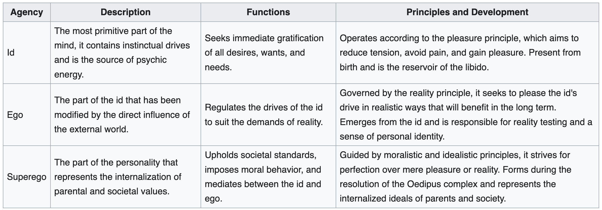
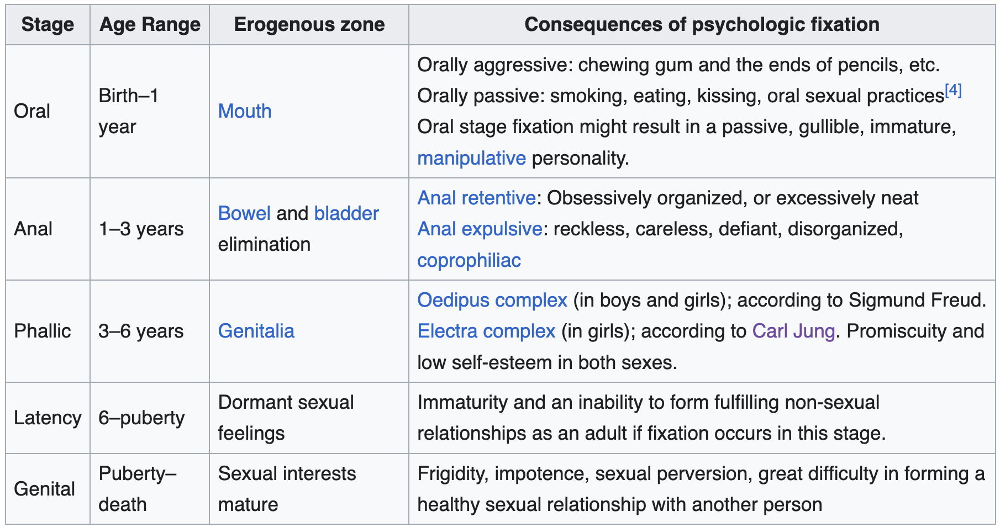

<!-- description:  -->

## Intro

Sigmund Freud, the father of psychoanalysis, introduced several influential concepts that have permeated various fields such as psychology, literature, and cultural studies. Among these are the pleasure principle, reality principle, and the structural model of the psyche, which includes the id, ego, and superego. Let's delve into each of these concepts to gain a deeper understanding of Freud's psychoanalytic theory.

_[Wikipedia](https://en.wikipedia.org/wiki/Psychosexual_development#Id,_Ego,_and_Superego)_

## The Id

> The **id** is entirely unconscious and contains the instincts and libido. Governed by the pleasure principle, the id seeks immediate pleasure and avoids pain to satisfy biological and psychological needs.
{:.prompt-info}

The id represents the unconscious part of the personality structure that contains a human's basic, instinctual drives. It is the source of our bodily needs, wants, desires, and impulses, particularly our sexual and aggressive drives. The id is amoral and egocentric, ruled by the hedonistic desire for immediate gratification of its desires, regardless of external realities or consequences.

The id operates on the pleasure principle, which is the idea that every wishful impulse should be satisfied immediately, regardless of the effects. The id seeks to avoid pain or displeasure aroused by increases in instinctual tension. For instance, if a person is hungry, the id wants to eat right away, without considering whether it's an appropriate time or setting to eat.

### The Pleasure Principle

> "In Freudian psychoanalysis, the **pleasure principle** is the instinctive seeking of pleasure and avoiding of pain to satisfy biological and psychological needs."  
> — [Wikipedia](https://en.wikipedia.org/wiki/Pleasure_principle_(psychology))
{:.prompt-info}

The pleasure principle refers to the driving force of the id that seeks immediate gratification of all desires, wants, and needs. If these needs are not satisfied immediately, the result is a state of anxiety or tension.

### Libido

> Originating from the Latin word for "desire" or "lust," **libido** refers to the instinctual energies and desires that drive individual behavior. It is defined as the psychic drive or energy primarily associated with sexual instincts, but it also encompasses other life instincts. 
{:.prompt-info}

Libido is the energy of the id and is crucial for the activation of pleasure-driven behaviors.

Libido is a central element in the theories of Freud. He believed that libido is a primary motivational energy of human life, driven by the urge to seek pleasure. According to Freud, the libido is what fuels the processes of growth, development, and pleasure, and it influences the dynamics of the human psyche. 

Freud described the libido as moving through different stages of psychosexual development from childhood to adulthood. Each stage is characterized by the pleasure centering on a different part of the body. During each psychosexual stage, the libido's focus and use change in a developmental process that significantly shapes personality. These stages include:

_[Wikipedia](https://en.wikipedia.org/wiki/Psychosexual_development#Freudian_psychosexual_development)_

Carl Jung, a contemporary and initially a follower of Freud, had a broader interpretation of libido. Jung disagreed with Freud's emphasis on the sexual nature of libido, arguing instead that it was a general life force, not just sexual energy. For Jung, libido was more about a general psychic energy or motivation, driving various aspects of human behavior such as spirituality, understanding, and creativity.

## The Ego

> The ego develops from the id and acts as a mediator between the unrealistic id and the external real world. It operates according to the reality principle, which weighs the costs and benefits of an action before deciding to act. 
{:.prompt-info}

The reality principle is the driving force of the ego, ensuring that the id's desires can be expressed in a manner acceptable in the real world. 

The ego has an executive role in the personality: it controls access to action and also serves to integrate the desires of the id with the prohibitions of the superego. It seeks to delay the discharge of the impulses until a suitable situation arises, thus ensuring that the satisfaction of these impulses leads to pleasure rather than pain.

### The Reality Principle

> The **reality principle** represents the ability of the mind to assess the external world and act upon it accordingly, rather than acting solely on the basis of internal drives and desires. It serves as a counterpoint to the pleasure principle. 
{:.prompt-info}

Essentially, the reality principle is the mechanism that guides the ego to navigate the real world pragmatically and appropriately, delaying gratification when necessary in order to function effectively and responsibly.

Development and Function:  
The reality principle develops as a child grows, gradually replacing the id's dominance of the pleasure principle. Initially, human behavior is primarily governed by the id, seeking immediate gratification of basic needs and desires. As a person matures, the ego evolves and learns to delay gratification, taking into account the realities of the situation, societal norms, and potential consequences. This principle helps the individual to make decisions that are not solely based on immediate pleasure but on what is practical and acceptable in the long run.

Interplay with the Pleasure Principle:  
While the pleasure principle is associated with the id’s demands for immediate satisfaction, the reality principle represents the ego’s management of these demands according to the situation in the external world. The ego uses realistic planning and foresight to satisfy the id’s desires in a manner that maintains both safety and societal norms. This balancing act is crucial for psychological health and social functioning.

Psychological Implications:  
Freud suggested that mental health issues could arise when the reality principle is too rigid or too lenient, leading to either overly constrained behaviors or impulsive actions. Psychoanalytic therapy often addresses these dynamics, helping individuals find a healthy balance between seeking pleasure and adhering to the reality of their circumstances.

## The Superego

> The **superego** represents the ethical component of the personality and provides the moral standards by which the ego operates. The superego's function is to control the id's impulses, especially those that society forbids, such as sex and aggression. It also aims to persuade the ego to turn to moralistic goals rather than merely realistic ones, striving for perfection in behavior and thought.
{:.prompt-info}

The superego incorporates the values and morals of society which are learned from one's parents and others. The superego develops during the phallic stage of psychosexual development (around the age of five), primarily through the resolution of the Oedipus complex in boys and the Electra complex in girls. It is formed by the internalization of parental and societal values. It consists of two systems:
- **The Conscience:** Which includes the rules and prohibitions that are internalized from one’s parents and society. It punishes the ego through feelings of guilt and shame when these rules are violated.
- **The Ego-Ideal:** Which includes the ideal behaviors for which a person strives. It represents an internalized image of oneself in a perfect state, often mirroring what is praised by parental figures and by society.

The superego works to suppress the urges of the id and tries to **make the ego act upon idealistic standards rather than upon realistic principles.** The superego's demands often oppose those of the id and compete with the ego's desires for satisfaction within the constraints of reality. This dynamic creates internal conflicts, which are central to Freudian psychoanalysis.

Psychological Health:  
- A well-balanced superego is essential for effective functioning and psychological health. 
- An overly strict superego may control the person with rigid morals and high standards, leading to feelings of inferiority, guilt, and anxiety. 
- On the other hand, a weak superego might result in a person who is more prone to unethical behavior, unable to control impulses effectively.

Cultural and Developmental Considerations:  
The content and strength of the superego vary significantly across different cultures and individual upbringing. Cultures that emphasize community and tradition might foster a more stringent superego, while more individualistic societies may develop a superego with a different set of ideals and values.