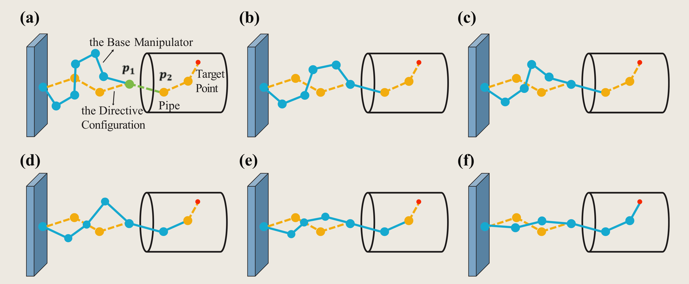

> Please be aware that the video accompanying this article may take some time to load, depending on the speed of your internet connection to GitHub.
{: .prompt-info}

## A snake-inspired path planning algorithm based on reinforcement learning and self-motion for hyper-redundant manipulators
SSCC = **S**winging **S**earch (self-motion for path planning) and **C**rawling **C**ontrol (crawling into the pipe like a snake)
> Self-motion is a special kind of motion for redundant manipulators. Given a fixed base and an end target, there can be more than one possible solution configuration due to its redundancy. Searching configurations (for a collision-free path) within these constraints (fixing both ends of a manipulator) can be likened to **a rope swinging in the air**.

Keywords:
- Redundant Manipulator
  - Path Planning
  - Control
- Reinforcement Learning

{:width="500"}

## [Videos](https://github.com/YueLin301/{{site.baseurl}}/tree/main/assets/my_paper/SSCC)

Crawling Control: a 16 DoF manipulator crawling into a simple pipe.

<video controls autoplay muted loop style="width: 100%;" src="{{ site.baseurl }}/assets/my_paper/SSCC/simple_16_2_speedup.mp4"></video>

## Resources
1. [PDF](https://journals.sagepub.com/doi/pdf/10.1177/17298806221110022)
2. [Videos](https://github.com/YueLin301/{{site.baseurl}}/tree/main/assets/my_paper/SSCC)
3. [Codes](https://github.com/YueLin301/Swinging-Search-Crawling-Control)
4. [Self-Motion demo](https://github.com/YueLin301/Swinging-Search-Crawling-Control)

<object data="{{ site.baseurl }}/assets/my_paper/SSCC/SSCC.pdf" type="application/pdf" width="100%" height="1000px">
</object>