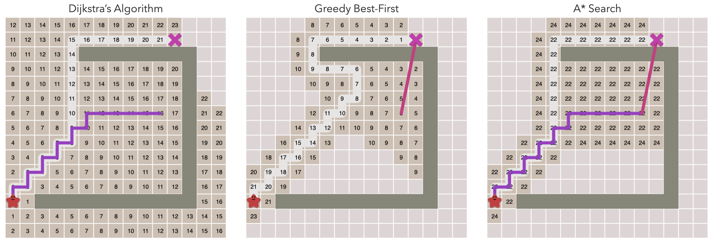
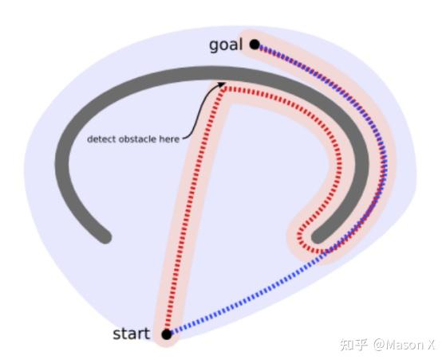
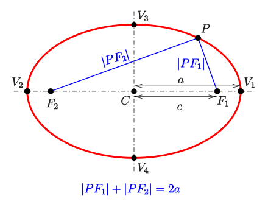

## Resources
- [Red Blob Games](https://www.redblobgames.com/pathfinding/a-star/introduction.html)
- [Dijkstra - Bilibili](https://www.bilibili.com/video/BV1uT4y1p7Jy/?share_source=copy_web&vd_source=73e1edf41b067063d2416b54c640ced4)
- Zhihu
    - https://zhuanlan.zhihu.com/p/13185307595
    - https://zhuanlan.zhihu.com/p/595716772

## Key Idea

- A* = BFS + priority queue
    - BFS: For each node, add all its child nodes to the search queue.
    - A*: There is an order for adding child nodes to the search queue.
- What is the order? By the estimated distance $f(x) = g(x) + h(x)$.
    - $x$ is the current child node.
    - $h(x)$ is the distance between the current node and the end node.
        - The greedy algorithm: $f(x) = h(x)$
        - This distance is estimated. Obstacles are not concerned yet.
    - $g(x)$ is the distance between the current node and the start node.
        - $g(x) = g(p(x)) + 1$ where $p(x)$ is the parent node of $x$.

## Example

### f

See an illustration of comparison between Dijstra, greedy, and A*. Example taken from [Red Blob Games](https://www.redblobgames.com/pathfinding/a-star/introduction.html):

{: width="500" height="500" }

### g

Taken from [Zhihu](https://zhuanlan.zhihu.com/p/595716772)

{: width="500" height="500" }

### My Intuition

- It may be related to the ellipse.
    - $f(x) = g(x) + h(x)$
    - Each end is a focus.
    - Find the smallest ellipse.
    - But: $h(x)$ is the standard one, while $g(x)$ is constructed by the BFS memory which is affected by obstacles.

Taken from [wiki](https://en.wikipedia.org/wiki/Ellipse)

{: width="500" height="500" }